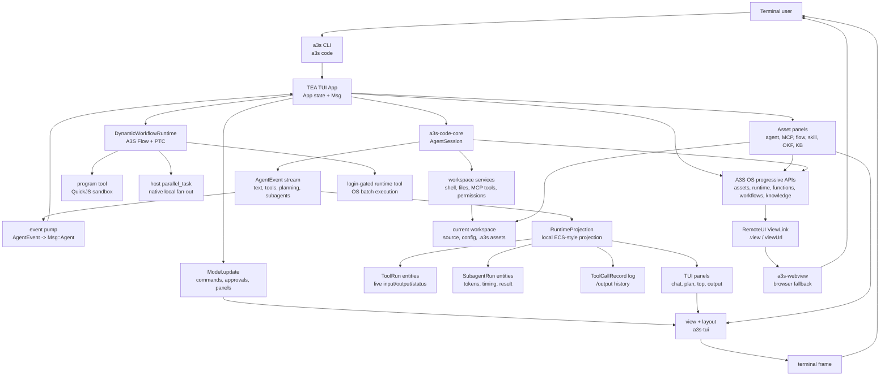

# a3s

The umbrella CLI for the [A3S](https://github.com/A3S-Lab) platform.

`a3s <tool> [args...]` runs the matching A3S tool. `a3s box ...` proxies to
`a3s-box ...` and bootstraps the Box runtime automatically if it is missing:

```
a3s code            # launch the A3S Code TUI
a3s code serve      # start the local A3S Code API + Shu Xiao'an web UI
a3s box ps          # → a3s-box ps (auto-installs a3s-box if needed)
a3s <tool> --help   # a tool's own help
a3s list            # list installed a3s-* tools
a3s --version
```

## Install

```sh
# from crates.io
cargo install a3s

# or from source
cargo install --git https://github.com/A3S-Lab/Cli

# or Homebrew
brew install A3S-Lab/tap/a3s
```

Then run the tools you need. `a3s box ...` installs `a3s-box` on first use.
The Homebrew `a3s` formula installs the native RemoteUI helper
`a3s-webview` automatically on macOS; if a source/cargo install is missing it,
`a3s code` falls back immediately to printing the browser URL.

## A3S Code TUI

`a3s code` launches the interactive A3S Code terminal UI in the current
workspace. On first launch it creates `~/.a3s/config.acl`; use `/config` to edit
models, provider credentials, and optional paths such as `flow_dir`,
`agent_dir`, `mcp_dir`, `skill_dir`, and memory/session storage.

A3S Code is a complete agentic workspace. It combines a coding-agent chat loop,
workspace editor, durable context, local asset development, OS asset publishing,
Runtime fan-out, RemoteUI views, and engineered automation loops in one terminal
surface.

Use this README as the TUI capability guide:

- [A3S Code CLI Command Examples](#a3s-code-cli-command-examples) shows
  copyable non-interactive command forms and how they map to TUI workflows.
- [Capability Overview](#capability-overview) maps the major product surfaces.
- [Everyday Capability Paths](#everyday-capability-paths) explains how those
  surfaces fit together during real work.
- [Inside The TUI](#inside-the-tui) explains the interactive transcript,
  input modes, panels, and keyboard model.
- [Startup, Sessions, And Safety](#startup-sessions-and-safety) covers launch,
  resume, confirmation, and smoke validation.
- [Effort Profiles](#effort-profiles) explains how `/effort` changes reasoning,
  tool rounds, continuations, and `ultracode`.
- [Dynamic Workflows](#dynamic-workflows) separates `DynamicWorkflowRuntime`
  from `/flow` OS Workflow as a Service.
- [OS, Runtime, and RemoteUI](#os-runtime-and-remoteui) shows what `/login`
  unlocks, including the login-gated `runtime` tool.
- [Core Command Reference](#core-command-reference) lists the everyday TUI
  commands that are not tied to an asset family.
- [Agents, Research, and Loops](#agents-research-and-loops) lists the detailed
  command forms for assets, DeepResearch, and engineered loops.

### A3S Code CLI Command Examples

`a3s code` is both the interactive TUI entry point and a small non-interactive
CLI for the same asset, model, knowledge, RemoteUI, and OS surfaces. The CLI
forms are useful in scripts, release checks, terminals without a full-screen UI,
and docs that need reproducible examples. Commands that read or mutate OS
resources require `a3s code login`; local discovery, config, memory, KB, review
prompts, and `view` URL opening keep working without an OS session.

Start, resume, and update the TUI:

```sh
a3s code                         # launch the TUI in the current workspace
a3s code serve                   # start local API and Shu Xiao'an web UI
a3s code resume                  # resume the newest saved TUI session here
a3s code resume 018f-session-id  # resume a specific saved session
a3s code update                  # upgrade the CLI and restart into this session
```

Start the local Web API and bundled 书小安 frontend:

```sh
a3s code serve
a3s code serve --workspace /path/to/project
a3s code serve --host 127.0.0.1 --port 29653
a3s code serve --api-only
```

The API is built with `a3s-boot` and reuses the same `config.acl` discovery as
the TUI. By default it serves the Rsbuild output from `apps/web/dist/workspace`; pass
`--web-dir` to serve a different frontend build.

Inspect and create `config.acl`:

```sh
a3s code config path                 # print the discovered config path
a3s code config init                 # create the preferred default config
a3s code config init .a3s/config.acl # create a project-local config
a3s code config cat                  # print the active config
a3s code config check                # summarize providers, models, and OS config
a3s code config edit                 # open VISUAL/EDITOR, or print the path
a3s code config dirs                 # print config, asset, memory, KB, and OKF dirs
a3s code dirs                        # shorthand for the same directory summary
```

Sign in to A3S OS and check account state:

```sh
a3s code login                 # open the configured OS OAuth login flow
a3s code login "$A3S_OS_TOKEN" # store an existing OS bearer token
a3s code auth status           # show OS endpoint, account, and expiry
a3s code auth login            # alias for interactive login
a3s code auth logout           # alias for logout
a3s code logout                # remove the stored OS session
```

List runtime-callable models:

```sh
a3s code models
a3s code model
a3s code model list
```

The model commands list `config.acl` models, local Claude/Codex account models,
and signed-in OS gateway models from the unified gateway. They are not the same
thing as digital asset repository entries whose category happens to be `model`.

Find local asset sources, clone repositories, and inspect OS assets:

```sh
a3s code agent local
a3s code agent local reviewer
a3s code agent clone https://github.com/acme/reviewer-agent.git
a3s code agent list reviewer
a3s code agent activity failed

a3s code mcp local weather
a3s code mcp clone https://github.com/acme/weather-mcp.git
a3s code mcp list weather
a3s code mcp activity running

a3s code skill local summarize
a3s code flow local release
a3s code okf local security
```

`local`, `clone`, and `review` are local developer conveniences. `list`,
`activity`, and every publish/deploy/open/log/status operation call OS APIs and
therefore need a configured `os = "https://..."` plus a valid login.

Run agent lifecycle commands:

```sh
a3s code agent review agents/reviewer
a3s code agent publish agentic agents/reviewer
a3s code agent publish application agents/portal
a3s code agent publish tool agents/sql-checker
a3s code agent run agents/reviewer
a3s code agent deploy agents/portal
a3s code agent open agentic agents/reviewer
a3s code agent logs tool agents/sql-checker
a3s code agent status application agents/portal
```

An Agent asset is a package directory. `agent.md`, `agent.yaml`, or
`agent.yml` is only the package entrypoint; passing the entry file still works
for compatibility, but publish/deploy uploads the whole package.

Run MCP lifecycle commands:

```sh
a3s code mcp review mcps/weather
a3s code mcp publish mcps/weather
a3s code mcp run mcps/weather
a3s code mcp test mcps/weather
a3s code mcp deploy mcps/weather
a3s code mcp open mcps/weather
a3s code mcp logs mcps/weather
a3s code mcp status mcps/weather
```

Run skill, workflow, and OKF lifecycle commands:

```sh
a3s code skill review skills/summarize/SKILL.md
a3s code skill publish skills/summarize/SKILL.md
a3s code skill deploy skills/summarize/SKILL.md
a3s code skill open skills/summarize/SKILL.md
a3s code skill status skills/summarize/SKILL.md

a3s code flow review flows/release-gate.json
a3s code flow publish flows/release-gate.json
a3s code flow run flows/release-gate.json
a3s code flow deploy flows/release-gate.json
a3s code flow open flows/release-gate.json
a3s code flow logs flows/release-gate.json
a3s code flow status flows/release-gate.json

a3s code okf review okf/security-playbook
a3s code okf publish okf/security-playbook
a3s code okf deploy okf/security-playbook
a3s code okf status okf/security-playbook
```

To run the gated real OS lifecycle smoke test, sign in first, then opt in
explicitly:

```sh
A3S_REAL_OS_LIFECYCLE=1 cargo test --test real_os_lifecycle -- --ignored --nocapture
```

The smoke test creates short-lived OS assets for agent, MCP, skill, workflow,
and OKF families, exercises their lifecycle commands, deletes the remote test
assets through OS, and verifies the timestamped test query returns `0 asset(s)`.

Manage local knowledge, context history, and memory:

```sh
a3s code kb stats
a3s code kb add "Release notes should mention the gateway model split."
a3s code kb import docs/
a3s code kb search "gateway model split"
a3s code kb vault

a3s code ctx search "RemoteUI view link"
a3s code ctx show 01HVEXAMPLEEVENT --window 8
a3s code ctx session 018f-session-id

a3s code memory list
a3s code memory list "database migration"
a3s code memory stats
a3s code memory dir
a3s code mem list "preference" # alias for memory
```

`/ctx <n>` attachment and `/ctx save <n>` memory promotion are interactive TUI
state, so the CLI exposes the durable `search`, `show`, and `session` forms
instead of pretending to attach context to a running transcript.

Inspect local process activity and open explicit RemoteUI URLs:

```sh
a3s code top
a3s code top --json
a3s code view "https://os.example.com/admin/assets/abc"
a3s code view "https://os.example.com/admin/assets/abc" --width 1280 --height 820
a3s code view "https://os.example.com/admin/assets/abc" --size 1280x820
```

Inside the TUI, the same surfaces are available through slash commands and
input prefixes:

```text
/help
/model
/effort
/config
/ide
/output
/login
/agent
/mcp
/skill
/flow
/okf
/loop init release-gate ci-sweeper
/loop run release-gate
? research how the OS gateway discovers runtime models
! cargo test --all-targets
@src/main.rs
```

### Capability Overview

| Area | What A3S Code TUI provides |
| --- | --- |
| Coding loop | Chat with the coding agent, stream tool calls, approve or deny tools, switch `/auto`, run direct shell turns with `!`, set a persistent `/goal`, ask background side-questions with `/btw`, and fork or clear sessions when needed. |
| Workspace UI | `/ide` opens a superfile-style file tree and editor, `/config` edits the config file in the same editor, `/output` shows every tool call with arguments/results, and file edits render bounded diffs through the shared `DiffView` component. |
| Models and effort | `/model` switches configured providers, OS gateway models, and signed-in account tabs. `/effort` scales thinking budget, tool-round budget, auto-continuation, and model-agnostic rigor guidance from `low` through `max` and `ultracode`. |
| Dynamic workflows | `ultracode` and `?` DeepResearch can use `DynamicWorkflowRuntime`, a local A3S Flow-backed workflow runner. It records workflow/step history while PTC scripts perform ordinary tool work. This is separate from `/flow`, which is OS Workflow as a Service for persisted workflow assets. |
| Local and remote parallelism | Local subagent fan-out uses the host-side `parallel_task` tool. QuickJS/PTC scripts do not call `parallel_task` directly; dynamic workflows schedule a Flow step named `parallel_task`, and the host executes it natively. After `/login`, the signed-in `runtime` tool is available to workflow steps and model turns for OS Runtime batch execution. |
| Deep research | Prefix a prompt with `?` to start DeepResearch. The TUI gathers evidence through a bounded, complexity-driven `DynamicWorkflowRuntime` loop: local `parallel_task` rounds run in parallel, summarize evidence, derive follow-up gaps/contradictions, and stop at the finite round cap or when no useful follow-up remains. OS Runtime tool-call fan-out is disabled until Function-as-a-Service support is available. After evidence collection, a report-phase gate only allows writes/edits under `.a3s/research/**`; the synthesis turn then produces a cited report and local Markdown/HTML RemoteUI artifacts, which are validated so internal workflow logs, raw tool transcripts, and reports that do not cite gathered evidence sources are not opened as final reports. If the model produces a clean, source-traceable `report.md` but stalls before writing `index.html`, the host can materialize and validate the HTML view. |
| Context and memory | The footer is the single context-fill display. Model-aware rolling compaction runs before an overflowing request and can re-arm repeatedly during long tasks. `/ctx` searches past sessions, `/ctx <n>` attaches a previous transcript window, `/ctx save <n>` promotes it to memory, `/sleep` consolidates the day, and `/memory` browses durable memories as an event/entity graph with aliases, tiers, relations, conflicts, and forget candidates. |
| Knowledge | `/kb` manages a local personal knowledge vault for notes, imports, search, browsing, and shared-confirm deletion. `/okf` manages shareable OKF knowledge-package assets under the visible `okf/` package root and publishes them to the OS Knowledge service when signed in. |
| Asset development | `/agent`, `/mcp`, `/skill`, and `/okf` enter local development modes with an active asset, review commands, clone/draft flows, and publish/deploy/status surfaces. `/flow` works differently: it selects or drafts workflow DAG assets and sends them to OS Workflow as a Service, without entering a persistent local dev mode. |
| Runtime activity | `/top` focuses local coding-agent process activity, including CPU/MEM trend sparklines in the shared process table. Asset-specific `activity` commands (`/agent activity`, `/mcp activity`, `/flow activity`, `/skill activity`, `/okf activity`) inspect OS Runtime jobs/runs for the selected asset. |
| Engineered loops | `/loop init`, `/loop run`, `/loop audit`, and `/loop logs` manage durable loops under `.a3s/loops`. Loops use maker/checker separation, reports, budgets, state files, and OS Runtime/RemoteUI evidence when enabled; inside `/agent` mode they stay local and target the active agent package. |
| OS and RemoteUI | `/login` enables OS capabilities. Shaped OS progressive responses (`.view` or `viewUrl`) surface an inline `Open view` action, using the native `a3s-webview` helper when available and browser fallback otherwise. |
| Operations | `/help` shows the full command guide, `/theme` cycles syntax themes, `/plugin` and `/reload` manage skills/plugins, `/update` upgrades and restarts, `/compact` summarizes context, and `/fork` branches a new session from the current transcript. |

### Everyday Capability Paths

A3S Code TUI is designed around work paths rather than isolated commands. Most
turns start as a normal chat prompt, then the TUI decides which context,
permissions, tools, panels, and follow-up evidence are needed.

| Work path | Typical flow | Useful surfaces |
| --- | --- | --- |
| Repository orientation | Start with `/init`, ask for a map of the codebase, attach files with `@`, and open `/ide` when you need to browse or edit directly. | `/init`, `/ide`, `@<path>`, `/ctx`, `/help` |
| Focused coding | Ask for a change, review streamed reads/searches/diffs, approve gated writes, and let the agent run focused checks before summarizing what changed. | Tool cards, approval overlay, `DiffView`, `/output`, `! <command>` |
| Debugging and verification | Let the model inspect logs, grep call sites, run shell or test commands, and keep the exact tool evidence visible in the transcript and output log. | `grep`, `read`, `bash`, `git`, `/output`, `/top` |
| Context carry-over | Search previous sessions, attach relevant transcript windows, save durable facts, and compact when the context meter gets high. | `/ctx <query>`, `/ctx <n>`, `/ctx save <n>`, `/memory`, `/sleep`, `/compact` |
| Deep work | Raise `/effort`, use `ultracode` for complex turns, and let the host decide whether planning, goal tracking, dynamic workflow execution, or parallel fan-out is justified. | `/effort`, `/goal`, `dynamic_workflow`, `task`, `parallel_task` |
| Research | Prefix with `?` so the host gathers evidence first, then asks the model to synthesize a cited answer and report artifact. | `? <question>`, `DynamicWorkflowRuntime`, signed-in `runtime`, local `parallel_task` fallback |
| Local asset development | Enter an asset mode, iterate on the selected local definition, review it, then publish or deploy only when the OS side is available and appropriate. | `/agent`, `/mcp`, `/skill`, `/okf`, `/flow`, `/loop` |
| Operations and recovery | Resume saved sessions, inspect local or OS activity, hot-reload plugins, and update the CLI without losing the session. | `a3s code resume`, `Open view`, `/top`, asset `activity`, `/plugin`, `/reload`, `/update` |

The key boundary is that local automation stays useful without an OS account,
while OS-backed actions become available only after `/login`. Local commands can
draft assets, run tools, build memory, use MCP, delegate to child agents, and
execute dynamic workflows. Signed-in commands add OS assets, Runtime batches,
RemoteUI ViewLinks, service activity, and publishing or deployment.

The TUI keeps these paths observable. A long turn can show a plan row,
reasoning deltas, live tool status, approval prompts, subagent progress,
dynamic-workflow artifacts, memory events, RemoteUI actions, and final
verification evidence in the same transcript instead of scattering state across
separate logs.

### Inside The TUI

The main screen is an event-driven transcript. User messages, model text,
reasoning deltas, tool starts, streamed tool output, approvals, subagent
progress, plans, memory events, and final summaries arrive as structured
`AgentEvent` values from `a3s-code-core` and are rendered incrementally through
`a3s-tui`.

| Surface | What you see and control |
| --- | --- |
| Transcript | Assistant text, reasoning, tool cards, diff summaries, task updates, memory recall/store notices, compaction notices, and RemoteUI action links stay in one scrollable history. Drag-select copies transcript text on release. |
| Input line | Type a normal prompt, use `Shift+Enter` for multiline input, prefix `!` for a direct shell turn, prefix `?` for DeepResearch, use `@<path>` to attach a workspace file through the clickable picker, or paste an image with `Ctrl+V`. |
| Slash menu | Press `/` or type a slash command to open a wheel-browsable, clickable command palette backed by the same command registry used by `/help`. Commands are grouped into model/config, workspace, context, OS, asset, and operations surfaces. |
| Approvals | Mutating tools pause in a confirmation overlay with arguments and result context. Default mode prompts, plan mode auto-approves read-only discovery, and auto mode approves later tool calls in the session. |
| Footer | The footer shows model/provider, effort, mode, context fill, active asset, login/runtime state, and session hints. Context warnings re-arm after compaction, clear, or model switch. |
| Tool output | Live tool status appears inline while running; `/output` opens a retained tool-log panel with every tool name, argument summary, output tail, status, and captured workflow or task document where available. |
| Workspace editor | `/ide` opens a full-screen file browser/editor. `/config` reuses the editor for the active ACL config. Both surfaces keep edits inside the workspace backend and normal permission path. |
| Memory and knowledge | `/memory` opens the durable memory graph. `/ctx` searches past sessions and can attach or save hits. `/kb` opens the local personal knowledge vault. `/okf` manages shareable knowledge packages. |
| Asset panels | `/agent`, `/mcp`, `/skill`, and `/okf` keep an active local asset visible while you iterate. `/flow` selects or drafts workflow DAG assets for OS Workflow as a Service rather than entering a persistent local dev mode. |
| Operations panels | `/model`, `/effort`, `/top`, `/loop`, `/plugin`, `/theme`, `/help`, and asset `activity` commands open focused panels without losing the current conversation. |

Key interactions:

| Key or input | Behavior |
| --- | --- |
| `Enter` | Send the prompt; when a turn is busy, queue the next message. |
| `Shift+Enter` | Insert a newline in the input. |
| `Shift+Tab` | Cycle run mode: default, plan, auto. |
| `Up` / `Down` | Recall input history or move through menus/panels. |
| `PgUp` / `PgDn` | Scroll the transcript or the active full-screen panel. |
| `Shift+End` | Jump to the latest transcript output. |
| `Esc` | Interrupt the running turn or close the active panel. |
| `Ctrl+C` twice | Quit the TUI after session persistence runs. |

### Startup, Sessions, And Safety

Launch the TUI from the repository or workspace the agent should inspect:

```sh
a3s code
a3s code resume <session-id>
a3s code resume
```

Config discovery checks `A3S_CONFIG_FILE`, then `.a3s/config.acl` while walking
upward from the current directory, then `~/.a3s/config.acl`. If none exists, the
first launch writes a starter `~/.a3s/config.acl` and opens it in the built-in
editor. Project-local config can set model/provider choices, OS endpoint,
`flow_dir`, `agent_dir`, `mcp_dir`, `skill_dir`, storage, memory, delegation,
and asset paths.

Sessions auto-save under `<workspace>/.a3s/tui-sessions`. Exiting prints the
exact resume command; `a3s code resume` without an id resumes the newest saved
session in that workspace. `/fork` copies the current transcript into a new
session id while keeping the original, and `/clear` starts a fresh conversation.

The TUI owns HITL confirmation for gated tools. In default mode, mutating tools
prompt through a wheel-browsable, clickable approval overlay; `a` or `/auto` approves later tool calls for
the session, while Shift+Tab cycles default, plan, and auto modes. Plan mode
auto-approves read-only discovery tools but still asks before writes. Tool
timeouts and confirmation timeouts are tracked separately so a human approval
pause does not consume the command runtime budget.

All local filesystem work stays under the active workspace services and A3S Code
permission policy. OS operations require `/login`; before login the TUI can
still author local assets, run local subagents, use local memory, and execute
DynamicWorkflowRuntime, but the OS `runtime` tool, RemoteUI ViewLinks, asset
publishing, and OS service activity panels are unavailable.

For CI or release probes, set `A3S_CODE_TUI_SMOKE=1` to exercise the same
`AgentSession::stream()` integration without taking over the terminal.

### Tool Runtime And Safety

A3S Code TUI exposes tools through the session registry, not by letting the
model run arbitrary host APIs. Each tool call carries a name, JSON arguments,
streamed output, timeout policy, permission decision, and traceable event id.
The TUI then turns those events into live status lines, retained output logs,
approval prompts, and RemoteUI action links.

| Tool family | TUI behavior |
| --- | --- |
| Workspace tools | `read`, `write`, `edit`, `patch`, `ls`, `glob`, `grep`, `bash`, `git`, `web_fetch`, and `web_search` run through workspace services, path boundaries, timeout handling, and confirmation policy. |
| Structured output | `generate_object` lets the model request schema-shaped JSON while keeping the result in the same tool event stream as normal tools. |
| MCP tools | Configured MCP servers are registered as `mcp__<server>__<tool>` names, appear in tool visibility, and use the same approval and output rendering path. |
| PTC scripts | The `program` tool runs sandboxed JavaScript-compatible scripts with a host-provided `ctx` object. It is useful for deterministic local glue, but recursive `program`, `dynamic_workflow`, and `parallel_task` calls are kept out of the default PTC allow-list. |
| Delegation | `task` launches one child agent. `parallel_task` launches multiple child agents on the native host runtime, preserves input order, emits subagent progress events, and respects `max_parallel_tasks`. |
| Dynamic workflow | `dynamic_workflow` is always registered in the TUI because `ultracode` and `?` DeepResearch use it. It records A3S Flow history and can schedule host steps such as `parallel_task`. |
| OS runtime | The `runtime` tool is registered only after `/login`. Once present, normal model turns and dynamic workflow PTC steps can call it for OS Function as a Service batch execution. |

### Effort Profiles

`/effort` is not just a UI label. It rebuilds the active session with a larger
reasoning budget, larger tool-round budget, longer auto-continuation allowance,
and stronger model-agnostic rigor guidance. Anthropic models receive the
thinking budget directly; GPT, GLM, OS Gateway, and account-backed models use
the same profile through prompt guidance, tool-round limits, and continuation
limits.

| Level | Thinking budget | Tool rounds | Continuations | Intended behavior |
| --- | ---: | ---: | ---: | --- |
| `low` | 1,024 | 120 | 2 | Fast, minimal changes with narrow verification. |
| `medium` | 4,096 | 200 | 3 | Balanced default behavior without extra depth steering. |
| `high` | 8,192 | 300 | 4 | More deliberate planning, relevant tests, and self-review. |
| `xhigh` | 16,384 | 400 | 6 | Compare alternatives, probe edge cases, and verify thoroughly. |
| `max` | 32,768 | 500 | 8 | Maximum rigor for correctness, adversarial checks, and completeness. |
| `ultracode` | 32,768 | 600 | 8 | Message-gated dynamic workflow mode: trivial turns stay direct; complex turns may use `dynamic_workflow`, A3S Flow replay, host-side `parallel_task`, and signed-in `runtime`. |

All effort levels keep local `task` and `parallel_task` available, with
`max_parallel_tasks` set to 8 for the TUI session. `ultracode` adds
`PlanningMode::Auto`, goal tracking, and dynamic-workflow guidance, but it still
lets the pre-analysis gate decide whether a turn actually needs planning or
fan-out.

### Dynamic Workflows

There are two workflow concepts, intentionally kept separate:

| Concept | Surface | Purpose |
| --- | --- | --- |
| `DynamicWorkflowRuntime` | Model-visible `dynamic_workflow` tool, used by `ultracode` and `?` DeepResearch | Per-turn dynamic orchestration. A sandboxed JavaScript PTC function returns A3S Flow commands such as `complete`, `fail`, `schedule_step`, or `schedule_steps`; A3S Flow records replayable workflow and step history. |
| OS Workflow as a Service | `/flow`, `/flow publish`, `/flow run`, `/flow deploy`, `/flow open`, `/flow logs`, `/flow status` | Durable workflow asset lifecycle. Local DAG JSON files are published as OS `workflow` assets with runtime-binding metadata and opened in the OS workflow designer/run surfaces. |

Dynamic workflow PTC steps can call ordinary tools such as `ctx.read`,
`ctx.grep`, or `ctx.tool("runtime", ...)` when `runtime` is registered after OS
login. They cannot call `parallel_task` directly. To fan out local subagents,
the workflow schedules a Flow step with `step_name: "parallel_task"`; the TUI
host then runs the native `parallel_task` implementation outside QuickJS.

Minimal dynamic workflow scripts return Flow commands from a default exported
function. If you author the script in TypeScript locally, transpile it first:
the source passed to the TUI runtime must be JavaScript-compatible for the
QuickJS PTC sandbox.

```javascript
export default async function run(ctx, inputs) {
  if (inputs.kind === "workflow") {
    return {
      type: "schedule_steps",
      steps: [
        {
          step_id: "inspect",
          step_name: "inspect_workspace",
          input: { query: inputs.input.query }
        },
        {
          step_id: "fanout",
          step_name: "parallel_task",
          input: {
            tasks: [
              {
                task_id: "tests",
                agent: "explore",
                description: "Find test coverage",
                prompt: "Inspect relevant tests and coverage gaps."
              },
              {
                task_id: "risk",
                agent: "review",
                description: "Review risk",
                prompt: "Review the approach for regressions."
              }
            ]
          }
        }
      ]
    };
  }

  if (inputs.step_name === "inspect_workspace") {
    const hits = await ctx.grep(inputs.input.query, { glob: "*.rs" });
    return { hits };
  }

  return { ok: true };
}
```

### Architecture

A3S Code is a TEA-style terminal application: terminal events and agent stream
events become `Msg` values, `Model.update` mutates one session model, and view
functions render the current state through `a3s-tui`. Runtime-heavy state is
kept as a small ECS-style projection: tool runs, subagent runs, Runtime activity
records, RemoteUI links, and retained tool logs are updated by stable event ids
and queried by panels instead of coupling every panel to the streaming protocol.

The command palette, asset selectors, approval overlay, `/model` account picker,
`/plugin` skill toggles, detail panels, tool status lines, transcript gutters
and user bubbles, input prompt chrome, live reasoning, live and completed tool
output, pinned plan rows, task summaries, file-edit diffs, SPF/IDE file
metadata, `/loop` details, compaction progress, the live activity shimmer,
effort overlay, `/top` header and process table, and footer status rows use
shared `a3s-tui` components such as
`MenuPanel`, `ChoicePrompt`, `TabbedMenuPanel`, `DetailPanel`, `Timeline`,
`ActivityBlock`,
`SectionHeader`, `ToolStatusLine`, `GutterBlock`, `InlineAction`, `Alert`,
`TextOverlay`, `Toast`,
`InputBorder`, `PromptLine`, `OutputBlock`, `Badge`, `Checklist`, `CursorLine`,
`DiffView`, `Divider`, `PanelFrame`, `Breadcrumb`, `Progress`, `Confirm`,
`Paragraph`, `PreviewPanel`, `TreePicker`, `ShimmerText`, `LevelSlider`,
`Scrollbar`, `Sparkline`, `KeyValue`, `DataTable`, `WrappedPrefixBlock`,
`SessionStatus`, `ModeLine`, and the `Meter` context fill rendered inside the
footer status row. Reusable menu scrolling, selection, slash command wheel
browsing and click-to-run, approval overlay wheel browsing and click-to-approve
or deny, `/model` account tab mouse switching, `/effort` wheel/click adjustment,
`/theme` wheel preview and click-to-apply, `@` file picker wheel browsing and
click-to-insert, `/agent` picker wheel browsing and click-to-develop,
`/mcp` picker wheel browsing and click-to-develop, `/skill` picker wheel
browsing and click-to-develop, `/okf` picker wheel browsing and click-to-develop,
`/flow` picker wheel browsing and click-to-open, `/plugin` wheel browsing and
click-to-toggle, `/top` process table wheel browsing and click row selection,
approval choices, RemoteUI and jump-to-latest action links, tool status
truncation, shared alert rows for OS login/configuration warnings, overlay
composition for menus and prompts, IDE flash footer notifications, live tool
activity/output tails, `/top` status header actions and CPU/MEM trend sparklines,
`/loop` key-value summaries, `/kb` delete confirmations, transcript gutters and
input bubbles, prompt continuation alignment, input border labels, shared
display-width wrapping for live reasoning and detail text, completed output tail
previews, pinned plan checklists, task status summaries, compaction progress
bars, pinned memory importance bars, transcript scrollbars, IDE cursor rows,
panel dividers, activity output tails, diff wrapping, framed panels, breadcrumbs,
detail-row layout, activity shimmer, `/model` tab hit-testing, `/effort` slider
hit-testing, slash command palette hit-testing, approval overlay hit-testing,
`/theme` preview hit-testing, `@` file picker hit-testing, `/agent` picker
hit-testing, `/mcp` picker hit-testing, `/skill` picker hit-testing, `/flow`
picker hit-testing, `/plugin` overlay hit-testing, `/top` process table
hit-testing, and width-bounding fixes are exercised directly by `a3s code`.



### OS, Runtime, and RemoteUI

Add an OS endpoint to `config.acl`, then sign in:

```hcl
os = "https://os.example.com"
```

```sh
a3s code
# then inside the TUI:
/login
```

After login, A3S Code can use OS capabilities directly from the TUI:

| Command | What it does |
| --- | --- |
| `/flow` | Select a local workflow DAG JSON, publish it as an OS workflow asset, and open the OS workflow designer; `/flow <description>` drafts a new DAG first. `/flow` is OS Workflow as a Service, not the per-turn dynamic workflow runtime. |
| Asset `activity` subcommands | Browse asset-related Runtime activity through `/agent activity`, `/mcp activity`, `/flow activity`, `/skill activity`, or `/okf activity`; when a local asset is not active, A3S Code opens the matching selection panel first. |
| `/mcp publish/run/test` | Publish the active local MCP asset as an OS `mcp` asset, then run or batch-test it through OS Function as a Service. |
| `runtime` tool | Registered only after `/login`. It resolves a tool-kind worker asset by UUID or name, submits independent inputs to OS Function as a Service batch execution, streams progress, and returns aggregated results. |

Signed-out behavior is intentionally useful but local: chat, file editing,
tools, MCP, local asset drafting, memory, `/ctx`, `/kb`, `task`,
`parallel_task`, `dynamic_workflow`, DeepResearch fallback, and local loops keep
working. Signed-in behavior adds OS assets, Function as a Service, Workflow as a
Service, Knowledge service deployment, RemoteUI ViewLinks, asset activity
panels, and the `runtime` tool.

| Capability | Signed out | Signed in after `/login` |
| --- | --- | --- |
| Coding chat and workspace tools | Available with local permission checks and HITL approval. | Available with the same local safety path. |
| Context, memory, and local knowledge | `/ctx`, `/memory`, `/sleep`, and `/kb` use local stores. | Local stores remain available; OS-backed reports can also return RemoteUI views. |
| Dynamic workflows | `DynamicWorkflowRuntime` can run local Flow-backed orchestration and host-side `parallel_task` fallback. | Workflow PTC steps may also call the registered `runtime` tool for OS batch work. |
| Asset authoring | `/agent`, `/mcp`, `/skill`, `/flow <description>`, and `/okf` can draft and review local assets. | Publish, deploy, run, open, logs, status, list, and activity commands can use OS services. |
| RemoteUI | Unavailable except for existing browser URLs printed by local tools. | `.view` and `viewUrl` responses become inline `Open view` actions. |
| Runtime activity | `/top` observes local processes. | Asset `activity` commands inspect OS Runtime jobs, runs, invocations, indexing, and workflow activity. |
| Updates and recovery | `/update`, `/fork`, `/clear`, and `a3s code resume` remain local. | Same behavior; saved sessions keep OS login-derived capability state separate from secrets. |

### OS Service Mapping

| OS mechanism | A3S Code TUI path |
| --- | --- |
| Agent as a Service | `/agent publish agentic`, `/agent publish application`, `/agent run`, and `/agent deploy` use OS `agent` assets with `agentKind=agentic` or `agentKind=application`. Publish commits package source at the asset repository root and keeps the package visible; `.a3s/` is reserved for `asset.acl` only. OS agent-config and runtime-binding endpoints are synced from the ACL metadata when available. Run/deploy first discover the current OS operation through progressive capabilities with `shaped=true`, then fall back to REST probes and the OS asset view. `/agent open` and `/agent logs` inspect existing assets and prefer progressive ViewLinks before static OS views. |
| Function as a Service | Tool-kind agents and MCP tool calls stay Runtime workers. `/agent publish tool` uses OS `agent` assets with `agentKind=tool` and a Function as a Service runtime binding; `/mcp publish`, `/mcp run`, `/mcp deploy`, and `/mcp test` use OS `mcp` assets with serving metadata from `.a3s/asset.acl`; `/skill publish` and `/skill deploy` use OS `skill` assets with serving Function as a Service binding intent. These assets keep source at the repository root and do not generate family-specific JSON config files. MCP run/test require a real OS MCP runner/test capability discovered through progressive capabilities; if OS does not expose one yet, the command fails clearly instead of pretending an MCP asset is a Runtime Function. Skill deploy/open paths first try OS progressive capabilities with `shaped=true` so `.view`/`viewUrl` survives as a ViewLink, then fall back to safe asset views. The `runtime` tool sends parallel batches to OS Function as a Service only for real runtime function/tool workers; OS resolves the runnable kind server-side. |
| Workflow as a Service | `/flow`, `/flow publish`, `/flow run`, and `/flow deploy` create or update OS `workflow` assets, commit the visible DAG source as `flow.json`, write `.a3s/asset.acl`, then sync the runtime-binding endpoint when available. Run/deploy first try OS progressive capabilities with `shaped=true` for a workflow designer ViewLink and fall back to the standalone workflow designer for edit and run. `/flow open`, `/flow logs`, and `/flow status` inspect the asset, logs, and runtime binding without mutating it. |
| Knowledge service | `/okf` selects local OKF packages. `/okf publish` creates or updates an OS `knowledge` asset, uploads the visible package sources plus `.a3s/asset.acl`, and syncs the runtime-binding endpoint when available. `/okf deploy` publishes the package first, then tries OS progressive knowledge-service deployment with `shaped=true`; if no matching operation exists, the Knowledge service view opens. `/okf status` checks the OS asset and runtime binding without mutating it. `/kb vault` remains the local personal knowledge-base browser. Without OS, deploy stays local and reports the blocked knowledge-service inputs. |

### AI-Native Asset Lifecycle

A3S Code treats agents, MCP servers, skills, OKF knowledge packages, and
workflow flows as team digital assets and shared context. Each asset family
uses the same lifecycle vocabulary in the TUI and OS, while exposing only the
commands backed by real local or OS surfaces:

| Stage | TUI responsibility | OS responsibility |
| --- | --- | --- |
| Create | Draft a local asset package or definition from natural language. | Create a private/team asset workspace with typed metadata. |
| Develop | Agents, MCP servers, skills, and OKF packages enter local multi-turn asset-development mode with a visible active asset and an exit path. Workflow flows use local DAG editing plus the OS workflow designer instead of a persistent local mode. | Keep asset source, metadata, secrets, and collaboration history as shared context. |
| Run/test | Run local smoke checks first; expose direct run/test commands only when the asset family has a real service surface. | MCP servers use Function as a Service run/test calls. Agentic agents are exercised through `/agent run`, workflow flows through `/flow run`, application agents through `/agent deploy`, and tool agents, skills, and OKF packages do not expose direct TUI run commands. |
| Publish | Commit source, entrypoints, examples, tests, and `.a3s/asset.acl`. | Validate ACL-derived config/runtime binding intent, package the asset, record release gates, and expose team discovery. |
| Deploy | Trigger only the production deployment shape that matches the asset type. | Launch long-running applications only when needed; prefer serving Function as a Service for stateless tools and MCP calls. |
| Inspect | Open read-only asset views, status, logs, or runtime-binding checks only when that asset family exposes the surface. | Provide asset metadata, binding validation, service views, package state, and RemoteUI evidence without mutating assets. |
| Activity | Browse asset-scoped Runtime activity instead of using a top-level process or run manager. | Provide function invocations, batches, workflow runs, indexing/evaluation jobs, and agent runs filtered to the selected asset. |

RemoteUI views are captured from OS progressive responses (`.view`/`viewUrl`).
The TUI remembers the latest view and surfaces ViewLinks returned by
asset-scoped actions that return OS views. Report-oriented autonomous work such
as DeepResearch and OS-enabled loops expects fan-out evidence (`dynamic_workflow`,
`runtime`, or host-side `parallel_task`) plus a shaped `.view`/`viewUrl` report
response; when either part is missing, autonomous runs spend the next loop turn
on a targeted Runtime-evidence retry before accepting a final answer.

### Core Command Reference

These commands are available outside the asset-specific flows:

| Command | Capability |
| --- | --- |
| `/help` | Open the full command guide with slash commands, command forms, input modes, keys, panels, and resume help. |
| `/model` | Switch among configured ACL models, OS gateway models, and signed-in account-backed model tabs when available. |
| `/effort` | Change the active effort profile from `low` to `ultracode`, with keyboard, wheel, and click adjustment before confirmation rebuilds the session with matching budgets and prompt guidance. |
| `/init` | Analyze the workspace and generate an `AGENTS.md` instruction file. |
| `/config` | Edit the active ACL config in the built-in editor. |
| `/theme` | Cycle syntax highlighting themes. |
| `/login` / `/logout` | Sign in or out of the configured OS account; login registers OS capabilities and the `runtime` tool. |
| `/output` | Inspect retained tool calls for the current session. |
| `/top` | Inspect local agent process activity with keyboard, wheel, or click row selection. |
| `/ide` | Open the workspace file browser and editor. |
| `/memory` | Browse durable memory as an event/entity graph with tiers, aliases, relations, conflicts, and forget candidates. |
| `/ctx <query>` | Search past ctx-indexed sessions. |
| `/ctx <n>` | Attach a previous search result to the next message. |
| `/ctx save <n>` | Promote a previous session hit into durable memory. |
| `/sleep` | Consolidate the day's work into memory, including experience, preferences, and knowledge. |
| `/kb` / `/kb add` / `/kb import` / `/kb search` / `/kb vault` | Manage the local personal knowledge base. |
| `/btw <question>` | Ask a background side-question outside the main chat path. |
| `/goal <text>` | Set a persistent goal for the current session or active asset mode. |
| `/compact` | Summarize and shrink the active conversation context. |
| `/clear` | Start a fresh conversation in the current session surface. |
| `/fork` | Branch the current transcript into a new session id. |
| `/auto` | Switch the session into auto-approve mode. |
| `/plugin` / `/reload` | Manage and hot-reload skills/plugins, including wheel browsing and click-to-toggle skill state in the TUI. |
| `/update` | Upgrade the CLI and restart back into the saved session. |
| `/exit` | Quit `a3s code` after session persistence runs. |

A3S Code auto-discovers `SKILL.md` skills from project and user roots:
`.a3s/skills`, `.agents/skills`, `.codex/skills`, `.claude/skills`, plus
plugin-bundled `plugins/**/skills` directories under `.agents`, `.codex`, and
`.claude`. Discovered skills appear in `/plugin` and are selected on demand by
the skill matcher for the current request.

### Agents, Research, and Loops

| Command | What it does |
| --- | --- |
| `/agent` | Select a local agent package from `agent_dir` with keyboard, wheel, or click, then enter local multi-turn agent-development mode. The TUI shows the active agent; press Esc or run `/agent off` to return to normal mode. While active, `/goal` becomes an agent-scoped development goal and `/loop` runs local agent-scoped loop engineering. No OS WebIDE or RemoteUI is opened for this local VibeCoding flow. |
| `/agent <description>` | Draft a package directory with a Markdown/YAML agent entrypoint under `agent_dir`, then use `/agent` to iterate on it. |
| `/agent clone <git-url>` | Clone an existing agent asset source into `agent_dir`, then use `/agent` to select it. |
| `/agent list [query]` | Browse OS agent assets through the asset-scoped list panel. |
| `/agent activity [query]` | Inspect Runtime activity, jobs, and runs for the selected local agent; when no agent is active, A3S Code opens the agent selection panel first. |
| `/agent review` | Review the active local agent. If no agent is active, A3S Code opens the agent selection panel first, enters agent-development mode, then reviews the selected agent. |
| `/agent publish agentic` | Publish the active local agent package as an OS `agent` asset with `agentKind=agentic`. The package source, entrypoint, manifest, runtime binding intent, and machine-readable agent config are saved with the asset source, then synced to OS agent-config and runtime-binding endpoints when available. |
| `/agent publish application` | Publish the active local agent package as an OS `agent` asset with `agentKind=application`, ready for OS-side application-agent deployment. The same manifest, runtime binding intent, agent-config sync, and runtime-binding sync are applied. |
| `/agent publish tool` | Publish the active local agent package as an OS `agent` asset with `agentKind=tool` and a Function as a Service runtime binding. The package source, entrypoint, config metadata, and runtime binding intent are committed; runtime-binding sync is attempted when available. |
| `/agent run` | Publish or update the active local agent as an agentic asset, then ask OS Agent as a Service to start a run through progressive capabilities. If the deployed OS does not expose a compatible operation yet, the TUI opens the OS asset view instead. |
| `/agent deploy` | Publish or update the active local agent as an application asset, sync agent config, read the latest asset source revision, trigger the OS application-agent build, and launch it into the selected/default Runtime namespace when package and namespace metadata are available. Otherwise the OS asset view opens for the missing input. |
| `/agent open [agentic\|application\|tool]` / `/agent logs [agentic\|application\|tool]` | Observe the existing OS asset or Runtime log view for the active local agent without creating or uploading it; progressive ViewLinks are preferred when available. |
| `/agent status [agentic\|application\|tool]` | Check whether the active local agent has a matching OS asset, valid config/runtime binding, and service-specific binding without creating, uploading, running, or deploying anything. |
| `/mcp` | Select a local MCP server asset from `mcp_dir` with keyboard, wheel, or click, then enter local MCP-development mode. The TUI shows the active MCP asset; press Esc or run `/mcp off` to return to normal mode. |
| `/mcp <description>` | Draft a local MCP server asset with metadata prepared for OS Function as a Service. |
| `/mcp clone <git-url>` | Clone an existing MCP asset source into `mcp_dir`, then use `/mcp` to select it. |
| `/mcp list [query]` | Browse OS MCP assets through the asset-scoped list panel. |
| `/mcp activity [query]` | Inspect Runtime activity, jobs, and tool invocations for the selected MCP asset; when no MCP is active, A3S Code opens the MCP selection panel first. |
| `/mcp review` | Review the active local MCP asset. If no MCP is active, A3S Code opens the MCP selector first, enters MCP-development mode, then reviews the selected MCP asset. |
| `/mcp publish` | Publish the active local MCP asset as an OS `mcp` asset, commit source at the asset root plus `.a3s/asset.acl`, then sync the OS runtime-binding endpoint when available. |
| `/mcp deploy` | Publish the active MCP asset and sync its serving Function as a Service runtime binding. |
| `/mcp run` | Publish the active MCP asset, then run it through a real OS MCP runner capability discovered with progressive capabilities and `shaped=true`. If OS has not exposed that MCP runner capability, the command fails with a clear capability-gap message. |
| `/mcp test` | Publish the active MCP asset, then batch-test MCP tools through a real OS MCP test capability discovered with progressive capabilities and `shaped=true`. If OS has not exposed that MCP test capability, the command fails with a clear capability-gap message. |
| `/mcp open` / `/mcp logs` / `/mcp status` | Inspect the OS MCP asset, logs, or runtime-binding status without mutating the asset; open/logs prefer progressive Function as a Service ViewLinks when available. |
| `/flow` | Select a local workflow DAG JSON from `flow_dir` with keyboard, wheel, or click, publish it as an OS `workflow` asset with a manifest and Workflow as a Service runtime binding, sync the runtime-binding endpoint when available, and open the workflow designer through a progressive ViewLink or standalone designer fallback. |
| `/flow <description>` | Draft a local workflow DAG JSON, then use `/flow` to publish and iterate through OS Workflow as a Service. This is an OS asset workflow, not `DynamicWorkflowRuntime`. |
| `/flow clone <git-url>` | Clone an existing workflow asset source into `flow_dir`; workflow DAG source should live at the visible asset root as `flow.json`, with `.a3s/` reserved for `asset.acl` metadata. |
| `/flow list [query]` | Browse OS workflow assets through the asset-scoped list panel. |
| `/flow activity [query]` | Inspect Runtime activity and workflow runs for a selected workflow asset. |
| `/flow review [file]` | Review a local workflow DAG without publishing it. |
| `/flow publish` / `/flow run` / `/flow deploy` | Open the workflow selection panel, publish the selected DAG as an OS workflow asset, sync Workflow as a Service runtime-binding intent, then open the asset view or Workflow as a Service designer/run surface. |
| `/flow open` / `/flow logs` / `/flow status` | Open the existing OS workflow designer, Workflow as a Service logs, or runtime-binding status without mutating the selected workflow asset. |
| `/skill` | Select a local skill asset from `skill_dir` with keyboard, wheel, or click, then enter local multi-turn skill-development mode. The TUI shows the active skill; press Esc or run `/skill off` to return to normal mode. |
| `/skill <description>` | Draft a local skill asset prototype with `SKILL.md`, examples, tests, and Function as a Service binding intent. |
| `/skill clone <git-url>` | Clone an existing skill asset source into `skill_dir`, then use `/skill` to select it. |
| `/skill list [query]` | Browse OS skill assets through the asset-scoped list panel. |
| `/skill activity [query]` | Inspect related Function as a Service activity for the selected skill asset. |
| `/skill review` | Review the selected local skill asset. If no skill is active, A3S Code opens the skill selection panel first and enters skill-development mode. |
| `/skill publish` | Publish the selected skill as an OS `skill` asset backed by Function as a Service, committing source plus `.a3s/asset.acl`. |
| `/skill deploy` | Publish the selected skill, sync its serving Function as a Service runtime binding, then prefer an OS progressive shaped deployment ViewLink before falling back to the asset view. |
| `/skill open` / `/skill status` | Inspect the OS skill asset or runtime-binding status without mutating the asset; open prefers progressive Function as a Service ViewLinks when available. |
| `/kb` | Open the local personal knowledge base for notes, imports, search, and vault browsing. |
| `/kb add/import/search/vault` | Capture a note, preview/import files or folders, search local knowledge sources, or browse the local `.a3s/kb` vault. |
| `/okf` | Select a local OKF knowledge package from the visible `okf/` package root with keyboard, wheel, or click, then enter local package-development mode. The TUI shows the active package; press Esc or run `/okf off` to return to normal mode. |
| `/okf <description>` | Draft a local OKF package prototype with sources, wiki concepts, eval notes, and OS knowledge asset metadata. |
| `/okf clone <git-url>` | Clone an existing OKF package source into `okf/`, then use `/okf` to select it. |
| `/okf list [query]` | Browse OS knowledge package assets through the asset-scoped list panel. |
| `/okf activity [query]` | Inspect related Runtime indexing/evaluation activity for the selected knowledge package; when no package is active, A3S Code opens the OKF selection panel first. |
| `/okf review` | Review the selected local OKF package. If no package is active, A3S Code opens the OKF selection panel first and enters OKF-development mode. |
| `/okf publish` / `/okf deploy` | Publish the selected OKF package as an OS `knowledge` asset, sync Knowledge service runtime-binding intent, then deploy through progressive knowledge-service capabilities or open the Knowledge service view. Without OS, A3S Code performs local validation and reports blocked deployment inputs. |
| `/okf status` | Check the existing OS knowledge asset and runtime-binding status without mutating the selected package. |
| `? <question>` | Starts DeepResearch. The host first runs `DynamicWorkflowRuntime` as a finite recursive retrieval-summary loop: round 1 fans out independent local research tracks, later rounds target unresolved gaps/contradictions, and the loop stops early or at its complexity-derived cap. The synthesis turn is tool-gated to report artifact writes/edits, then produces a cited answer plus local Markdown/HTML report artifacts for RemoteUI; artifact validation rejects fallback drafts, raw workflow JSON, leaked tool logs, artifact-operation narration, and reports that fail to cite gathered evidence sources. A clean, source-traceable Markdown report can be completed into HTML by the host if the model stalls before finishing the view file. |
| `/loop` | Opens the engineered-loop dashboard for persisted loops under `.a3s/loops/`. |
| `/loop init [name] [pattern]` | Creates a durable loop spec, `STATE.md`, `RUN_LOG.md`, budget file, skills, and reports folder. Built-in patterns include `daily-triage`, `ci-sweeper`, `pr-babysitter`, `dependency-sweeper`, `changelog-drafter`, and `agent-dev`. |
| `/loop run <name>` | Runs a loop with maker/checker separation. With OS signed in and `os_runtime = true`, normal workspace loops require Runtime/parallel fan-out, Markdown/HTML reports, RemoteUI report view data, and asset-scoped Runtime activity visibility. Inside `/agent` mode, the same command stays local and targets the active agent package. |
| `/loop audit <name>` / `/loop logs <name>` | Check loop readiness or open the append-only run log. |
| `/loop <task>` | Runs an autonomous quick loop until the task reports completion or you stop it. |

## Account Models

In `a3s code`, `/model` lists configured `config.acl` models plus signed-in
account tabs. When Claude Code is logged in (`claude /login`), the Claude Code
tab can switch the current session to Claude models using the local Claude Code
OAuth credentials, including Claude Code's macOS Keychain entry.
`CLAUDE_CODE_OAUTH_TOKEN` or `ANTHROPIC_AUTH_TOKEN` can also provide the account
token for non-standard environments. If Anthropic rejects the raw OAuth Messages
API bridge with a rate-limit or authentication error, a3s falls back to the
installed `claude` CLI in safe streaming mode; Claude Code's own tools stay
disabled while a3s host tools are requested through an adapter protocol and
still execute inside a3s-code. The adapter accepts Claude Code-style
`<function_calls>` output and tool names such as `Read` or `Bash`, normalizes
common argument aliases like `path` to a3s's `file_path`, and feeds tool results
back into the next Claude turn as structured history.

When Codex CLI is logged in (`codex login`), the Codex tab can switch the
current session to Codex account models using `$CODEX_HOME/auth.json` or
`~/.codex/auth.json`. Codex auth can also be used as a normal config provider:

```acl
default_model = "codex/model-slug"

providers "codex" {
  models "model-slug" {
    name = "Codex model"
    toolCall = true
  }
}
```

## Testing

```sh
cargo test --all-targets
cargo test --test box_command_soak -- --ignored
cargo test --test ctx_compact_real_llm -- --ignored   # hits the configured LLM
```

The ignored soak test repeats `a3s box` after a fake first-use install and
verifies later runs reuse the installed `a3s-box`. The ignored
`ctx_compact_real_llm` test drives the configured model (`~/.a3s/config.acl`)
until the context crosses the auto-compact threshold and asserts streaming
usage is reported, compaction shrinks the history, and the next prompt drops —
the machinery behind the TUI's ctx%, fill warnings, and auto-compaction.

## Updating

In the TUI, **`/update`** upgrades to the latest release and restarts into your
session. Homebrew installs refresh the A3S tap, upgrade or reinstall
`a3s-lab/tap/a3s`, and verify both `PATH` and the Homebrew prefix binary.
Standalone installs download the matching GitHub release archive, find the
`a3s` binary inside it, swap the current binary, and verify the target version
before treating the update as successful. If restart fails after a successful
upgrade, the TUI prints the exact `a3s code resume <id>` command for the saved
session.

If you're on an **older build (≤ 0.5.4)** whose `/update` was broken, it can't
upgrade itself, and `brew upgrade a3s` alone won't see the new version (Homebrew
doesn't re-sync a tap on `upgrade`). Bootstrap onto a current build once with:

```sh
brew update && brew upgrade a3s     # or: brew untap a3s-lab/tap && brew tap a3s-lab/tap && brew upgrade a3s
a3s --version
```

From 0.5.5 onward, `/update` handles the tap refresh itself, so this manual step
isn't needed again.

## License

MIT
