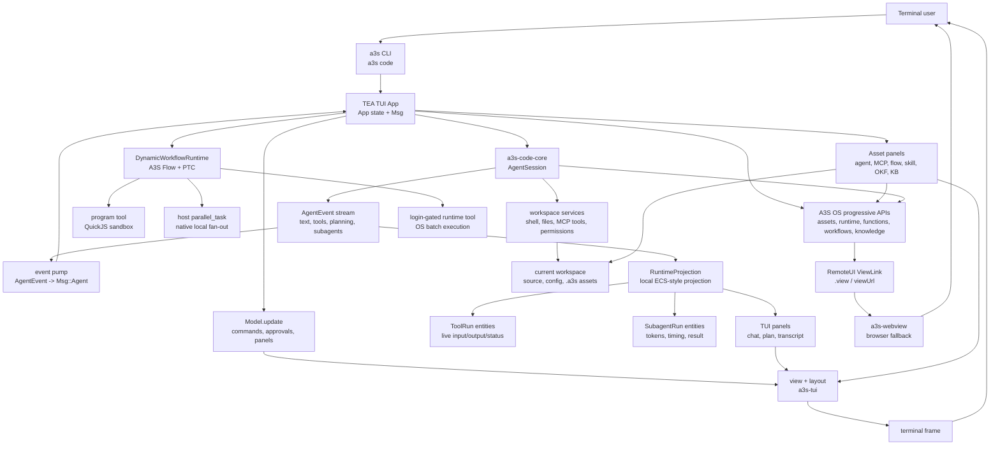

# a3s

The umbrella CLI for the [A3S](https://github.com/A3S-Lab) platform.

`a3s <tool> [args...]` runs the matching A3S product. Code is included in the
main `a3s` installation. Box, Bench, Search, and Use are separately released
components. Box and Use may be installed visibly on first real use; every
optional component can also be prepared explicitly.

```
a3s code                       # launch the included A3S Code TUI
a3s web -d                     # start A3S Web in the background
a3s box ps                     # run Box, installing it on first real use
a3s up -d                      # converge the local Compose application with Box
a3s ps                         # list services in the local Compose application
a3s compose exec api -- sh     # use the complete Box Compose command namespace
a3s bench run ./tasks/smoke --agent codex
a3s search doctor              # run the registered Search product
a3s use browser open https://example.com
a3s use box compose up -d      # route through Use to the one managed Box
a3s list                       # list registered components and external tools
a3s install use                # install or repair a registered component
a3s upgrade use                # upgrade one managed component
a3s uninstall use              # remove component-owned files
a3s --version
```

Headless search browsers are execution dependencies of the embedded
`a3s-search` library and have their own lifecycle commands:

```bash
a3s search engines
a3s search browser install chrome
a3s search browser update chrome
a3s search browser repair lightpanda
```

Managed downloads remain under `~/.a3s/chromium/` and
`~/.a3s/lightpanda/`. `a3s search doctor` reads the same project-local or
user-global `config.acl` selected by `a3s code`, reports enabled headless
engines, and returns an actionable install command when the configured backend
is unavailable.

## Install

```sh
# from crates.io
cargo install a3s

# or from source
cargo install --git https://github.com/A3S-Lab/Cli

# or Homebrew
brew install A3S-Lab/tap/a3s
```

The initial installation always contains the umbrella CLI and A3S Code. It does
not download Box, Bench, Search, or Use. This keeps a Code-only installation
small, while every product still has one public entry point under `a3s`.

The Homebrew `a3s` formula also installs the native RemoteUI helper
`a3s-webview` on macOS. If a source or Cargo installation does not have that
helper, `a3s code` falls back immediately to printing the browser URL.

### Components and delayed installation

The built-in catalog registers `code`, `box`, `bench`, `search`, and `use`.
Browser and Office are delegated child capabilities owned by Use:

| Component | Installed with `a3s` | Public command | Installation behavior |
| --- | --- | --- | --- |
| Code | Yes | `a3s code ...` | Runs directly from the main `a3s` installation. |
| Box | No | `a3s box ...` | Installs Box on first use, then forwards the arguments to it. |
| Bench | No | `a3s bench ...` | Requires an explicit compatible Bench installation. |
| Search | No | `a3s search ...` | Requires an explicit compatible Search installation. |
| Use | No | `a3s use ...` | Installs Use on first real use, then forwards native Browser, Office, Box, or extension arguments. |
| Use/Browser | With Use | `a3s use browser ...` | Reports Browser provider readiness through Use; it is not a second product archive. |
| Use/Office | With Use | `a3s use office ...` | Delegates OfficeCLI readiness and explicit installation through Use. |

First-use installation for opted-in components is persistent and user-wide. After a component has been
installed, subsequent commands reuse it; changing projects does not download it
again. Bench validates a downloaded bundle before switching its active-version
record, so a failed Bench download or validation is not reported as installed.
Run `a3s list` at any time to inspect local state without installing or updating
anything.

Help and version probes are read-only as well. If Box or Bench is missing,
`a3s box --help`, `a3s bench --help`, their nested `--help` forms, and
`--version` report wrapper/component status without triggering delayed
installation. The missing-component Bench help still shows its four normal
commands and explicit local-path rule. Once installed, those arguments are
forwarded to the component for command-specific help.

For example, a new user can start Code immediately and let the other products
arrive only when needed:

```sh
a3s code
a3s box ps
a3s install bench
a3s bench run ./tasks/smoke --agent codex
```

The first `a3s box ...` command resolves or installs Box. Bench and Search
require explicit installation so an evaluation or search command never starts
an unplanned download. Users still type `a3s bench`; its private executable is
not installed as another public command on `PATH`.

### Compose applications

`a3s compose` is the canonical multi-service application namespace. It resolves
the registered Box component and forwards the remaining arguments without a
shell or a second Compose parser:

```sh
a3s compose config                  # discovers compose.acl first
a3s compose up -d
a3s compose exec api -- sh
a3s compose down --volumes
a3s compose -f compose.yaml config # explicit YAML remains supported
```

The everyday project commands also have concise top-level forms:

```sh
a3s up -d
a3s ps
a3s logs --follow api
a3s down --volumes
```

These are exact routes to `a3s-box compose up|ps|logs|down`; project discovery,
service state, networks, volumes, health checks, and rollback remain owned by
Box. The global `-C/--directory` option selects the Compose project directory.
Because the route is transparent, newly shipped Box Compose subcommands become
available under `a3s compose` without a matching umbrella CLI release. The
canonical `compose.acl` schema, validation, environment resolution, and YAML
compatibility are all implemented once by Box.

The Bench control component compiles and locks tasks, plans trials, coordinates
evaluation, and produces scores and reports. It does not execute an Agent.
Candidate and Judge Agent Assets are both executed by A3S OS Runtime, which is
the sole Agent execution layer. This keeps sandboxing, credentials, model
access, resource limits, and execution evidence in the shared OS Runtime rather
than duplicating execution infrastructure in the control component.

### Explicit component installation

Use `a3s install` to prepare a component before its first use, for example on a
CI runner or before going offline:

```sh
a3s install code
a3s install box
a3s install bench
a3s install search
a3s install use
a3s install use/browser
a3s install use/office
```

Installation is idempotent. If the requested component is already healthy,
`a3s` reports the available local version and location metadata instead of
downloading it again.

`a3s install code` reconciles the Code component already delivered by the
running `a3s` executable; it does not create a second `a3s-code` installation.
The very first installation of `a3s` itself must still be performed with Cargo,
Homebrew, or another supported system installer as shown above.

`a3s install box` performs the same installation that `a3s box ...` would
trigger automatically. `a3s install bench` downloads and validates the private
Bench control component without running a benchmark. This is the preferred
preparation step for machines whose benchmark run will not have network access.

The Bench repository currently publishes the canonical design and fixtures but
not a compatible control-component release. Until that release exists,
`a3s install bench` and direct `a3s bench ...` use fail with an explicit
diagnostic that the control component is not published and do not create an
installed-component record. Bench does not opt into first-use installation.

### Listing installed components

```sh
a3s list
```

The list distinguishes bundled Code, optional product components, delegated
Use capabilities, and explicitly installed external Use domains. It reports
whether each entry is installed, missing, disabled, or broken. For
an installed component it includes version metadata when it can be read without
executing the component, plus its source and executable location. A Box found
on `PATH` can therefore show `-` for version: `a3s list` deliberately does not
run third-party commands just to probe them. Other executable `a3s-*` tools
found on `PATH` remain visible as additional tools; they are not treated as
managed A3S product components.

`a3s list` is a local inspection command. It does not contact a release server,
install a missing component, or update an installed one.

### Bench control-component files and project state

The Bench control component and benchmark project data have different lifetimes
and must not be mixed:

```text
~/.a3s/components/bench/   user-wide, versioned Bench control component
<project>/.a3s/bench/      locks, plans, attempts, evidence, and reports for one project
```

The global `~/.a3s/components/bench/` directory is owned by the component
manager and shared by every workspace. It contains validated versioned payloads
and the active-version record used by `a3s bench`. Set `A3S_COMPONENTS_DIR` when
the user-wide component root must live elsewhere; the `bench/` component remains
under that root.

The project-local `.a3s/bench/` directory is owned by the benchmark workflow.
It contains reproducibility locks and run state for that project, not the Bench
control component. Archiving or removing a project's `.a3s/bench/` state does
not uninstall Bench, and updating the global control component does not rewrite
a project's locked task, agent, plan, evidence, or report data. Benchmark
project state always uses `.a3s/bench/`; no separate top-level benchmark state
directory is created.

## Components And A3S Use

The umbrella CLI owns the catalog and delegates domain-specific runtimes to
their parent component:

```sh
a3s list --json
a3s install use
a3s install use/browser
a3s install use/office
a3s uninstall use/office

a3s use capabilities --json
a3s use browser render https://example.com
a3s use browser open https://example.com --session research
a3s use browser snapshot --session research --json
a3s use browser close --session research
a3s use box compose up --detach
a3s use extension disable acme/slack --json
a3s use extension enable acme/slack --json
a3s use extension watch --after-generation 3 --timeout-ms 30000 --json
```

Browser and Office are built-in Use domains. Independently implemented domains
can be explicitly installed from A3S ACL packages that declare native CLI,
standard MCP, and/or `SKILL.md` surfaces. A3S does not define an extension
JSON-RPC protocol; `--json` remains a one-command CLI result.

When an already-ready Use component is present, both `a3s code` and `a3s web`
consume its unified capability snapshot and keep one watcher for the process.
Browser, Office, and enabled external MCP/Skill surfaces are projected into
every active Code session. Code registers a dedicated `use` worker that can
invoke only `mcp__use_*` tools; workspace, shell, unrelated MCP, and recursive
delegation tools are denied. The worker's current capability IDs and purpose are
published in the live `task` and `parallel_task` definitions, so the parent
model can select it without a hard-coded prompt. Application failures do not
fall back to another execution surface, and an Office
`use.office.outcome_unknown` result is never retried automatically. A session
rebuild replays the current surfaces, and a Web process shares the watcher
across all concurrent sessions. Starting Code never installs Use as a side
effect.

The TUI derives capability lifecycle labels only from standard MCP progress
emitted by the dedicated `use` worker: Browser progress appears as
`Using Browser` while live and `Used Browser` after completion. Multiple routes
remain ordered and deduplicated, restored task snapshots preserve the same
identity, and raw MCP tool names do not replace the user-facing worker label.

### Platform support

macOS and Linux are the supported runtime and managed-artifact targets for the
current component platform. Windows remains a roadmap target: the CLI and
protocol types should continue to compile there, but managed component
archives, Browser persistent-session lifecycle, and full file-lock conformance
are not part of the current runtime support claim.

`a3s install` manages registered A3S components; it is not a universal frontend
for Homebrew, APT, DNF, Pacman, Winget, npm, pip, Cargo, or arbitrary package
names. Native package-manager adapters remain ownership-preserving and will be
added only for a registered component with release artifacts and conformance
tests.

## A3S Code TUI

`a3s code` launches the interactive A3S Code terminal UI in the current
workspace. On first launch it creates `~/.a3s/config.acl`; use `/config` to edit
models, provider credentials, and optional paths such as `flow_dir`,
`agent_dir`, `mcp_dir`, `skill_dir`, and memory/session storage.

A3S Code is a complete agentic workspace. It combines a coding-agent chat loop,
workspace editor, durable context, local asset development, OS asset publishing,
Runtime fan-out, RemoteUI views, and engineered automation loops in one terminal
surface.

Use this README as the TUI capability guide:

- [A3S Code CLI Command Examples](#a3s-code-cli-command-examples) shows
  copyable non-interactive command forms and how they map to TUI workflows.
- [Capability Overview](#capability-overview) maps the major product surfaces.
- [Everyday Capability Paths](#everyday-capability-paths) explains how those
  surfaces fit together during real work.
- [Inside The TUI](#inside-the-tui) explains the interactive transcript,
  input modes, panels, and keyboard model.
- [Code Intelligence](docs/code-intelligence.md) documents saved-file symbols,
  navigation, diagnostics, language prerequisites, and the shared TUI/Web
  behavior.
- [Startup, Sessions, And Safety](#startup-sessions-and-safety) covers launch,
  resume, confirmation, and smoke validation.
- [Effort Profiles](#effort-profiles) explains how `/effort` changes reasoning,
  tool rounds, continuations, and `ultracode`.
- [Dynamic Workflows](#dynamic-workflows) separates `DynamicWorkflowRuntime`
  from `/flow` OS Workflow as a Service.
- [OS, Runtime, and RemoteUI](#os-runtime-and-remoteui) shows what `/login`
  unlocks, including the login-gated `runtime` tool.
- [Core Command Reference](#core-command-reference) lists the everyday TUI
  commands that are not tied to an asset family.
- [Agents, Research, and Loops](#agents-research-and-loops) lists the detailed
  command forms for assets, DeepResearch, and engineered loops.

### A3S Code CLI Command Examples

`a3s code` is both the interactive TUI entry point and a small non-interactive
CLI for the same asset, model, knowledge, research, and OS surfaces. The CLI
forms are useful in scripts, release checks, terminals without a full-screen UI,
and docs that need reproducible examples. Commands that read or mutate OS
resources require `a3s auth login os`; local discovery, config, memory, KB, and
review prompts keep working without an OS session. Root-owned reads support
`--output json`; use JSON rather than scraping human tables.

Start, resume, and update the TUI:

```sh
a3s code                         # launch the TUI in the current workspace
a3s code resume                  # resume the newest saved TUI session here
a3s code resume 018f-session-id  # resume a specific saved session
a3s self update                  # update the a3s executable
```

Run one non-interactive coding task:

```sh
a3s code exec --mode auto "Update the focused test and verify it"
a3s --output json code exec --mode auto --prompt-file ./task.md
```

Auto mode runs bounded workspace reads and edits without hidden prompts while
retaining the shared safety floor. Operations that still require human
approval, such as unbounded shell commands, terminate immediately in this
non-interactive surface with a nonzero `approval.required` result. Default and
plan modes never silently approve workspace mutations.

Start the local Web API and bundled 书小安 frontend:

```sh
a3s web start
a3s web start --detach
a3s -C /path/to/project web start
a3s web start --host 127.0.0.1 --port 29653
a3s web start --api-only
```

The API is built with `a3s-boot` and reuses the same `config.acl` discovery as
the TUI. By default it serves the Rsbuild output from `apps/web/dist/workspace`; pass
`--web-dir` to serve a different frontend build. Background mode returns only
after the service binds successfully and prints its PID, URL, and log path
(`~/.a3s/logs/web.log` by default).

Web tasks, visible messages, titles, goals, effort, model selection, and
execution mode are saved under `~/.a3s/code-web` and restored before the API
starts accepting requests. Set `A3S_CODE_WEB_STATE_DIR` to isolate that store.
Default mode allows read-only tools and pauses mutating tools for Web HITL
approval; plan mode denies mutations, while auto mode runs without approval.

Code Web sessions auto-save Core snapshots under `~/.a3s/code-web/sessions`
and restore when `a3s code serve` starts again. Browser-only metadata such as
titles and a bounded recent UI transcript stays beside them under
`~/.a3s/code-web/metadata`. The projection preserves Web-only `/help`, shell,
fork, and structured-event records without adding them to model context;
neither directory is created in the selected workspace. Set
`A3S_CODE_WEB_DATA_DIR` to relocate this dedicated data root.

The browser uses the versioned Kernel session endpoints under
`/api/v1/kernel/sessions`. `POST .../{session_id}/messages/stream` returns the
core `AgentEvent` contract as Server-Sent Events; adjacent actions cancel an
active run or resolve a pending tool confirmation. A3S OS authorization remains
owned by the CLI through `/api/v1/os/login/browser`, so tokens never enter
browser storage. Code Web exposes one A3S Code agent and disables the Core
`task` / `parallel_task` delegation tools. Its default permission mode allows
read-only tools and asks before writes or command execution; `auto` is the
explicit no-confirmation mode. The default listener and OAuth callback are
loopback-only.

Workspace Explorer file creation uses a dedicated atomic endpoint. It creates
missing parent directories, returns a conflict for an existing path, and never
truncates an existing file; ordinary saves continue through the separate write
endpoint.

Text reads and successful writes return a SHA-256 content revision. A write may
send either `expectedRevision` or `expectedContent`; the service checks the
precondition immediately before writing and returns HTTP 412 without changing
the file when it no longer matches. Supplying both preconditions is invalid.
Omitting both is reserved for an explicit unconditional overwrite. Every write
must still provide string `content`; malformed requests cannot default to an
empty write.

Web file Quick Open reads the same watched workspace manifest used by native
search and Code Intelligence instead of starting another directory traversal.
It returns canonical and workspace-relative paths, preserves binary metadata,
ranks exact names before path and fuzzy matches, and caps each response at 500
items. The Changes view is backed by real per-file index/worktree status and
complete staged or unstaged file content for Monaco diff tabs. Stage, unstage,
and commit use validated workspace-relative path arguments, support unborn
repositories, and keep a nested workspace scoped to its own repository prefix.

The TUI `/ide` editor and the Web Monaco editor share native Code Intelligence
for saved-file symbols, definitions, declarations, references,
implementations, and diagnostics. Dirty editors remain local and explicitly
label semantic results as based on the saved version. The agent receives the
same read-only capability through `code_symbols`, `code_navigation`, and
`code_diagnostics`; existing `read`, `grep`, `edit`, and `patch` tools remain
the only source and mutation paths. See the
[Code Intelligence guide](docs/code-intelligence.md) for commands, keyboard
actions, language executables, and the typed local HTTP routes.

Inspect and create `config.acl`:

```sh
a3s config path                       # print the active config path
a3s config init                       # create the user config
a3s config init --scope workspace     # create .a3s/config.acl
a3s config show                       # print a redacted effective summary
a3s config validate                   # validate the effective A3S ACL
a3s config edit --scope workspace     # open VISUAL/EDITOR, or print the path
a3s config paths                      # print config, asset, memory, KB, and OKF paths
```

Sign in to A3S OS and check account state:

```sh
a3s auth login os              # open the configured OS OAuth login flow
printf '%s' "$A3S_OS_TOKEN" | a3s auth login os --token-stdin
a3s auth status os             # show OS endpoint, account, and expiry
a3s auth logout os             # remove the stored OS session
```

Inspect managed and externally owned account sources without copying OAuth
credentials into `config.acl`:

```sh
a3s auth list
```

Claude Code, Codex, Kimi, and WorkBuddy continue to own their login flows and
local credential stores. The A3S CLI only reports whether those accounts are
available; `a3s auth login/logout` manages the configured A3S OS session.

Model routes use one catalog shared by the root CLI and the Code TUI. Custom
provider models come from `config.acl`; Claude Code, Codex, Kimi, WorkBuddy,
and A3S OS models remain bound to their product-owned credentials:

Inside `/model`, each provider tab uses its corresponding brand color. The
active tab uses that color as its background, while inactive tabs keep it as
their label color.

```sh
a3s model list
a3s model current
a3s model use openai/my-model
a3s model use claude-code/claude-opus-4-6
a3s model use codex/gpt-5.2-codex
a3s model use kimi/k3-agent
a3s model use workbuddy/glm-5.1
a3s model use a3s-os/my-model
a3s model use openai/gpt-5 --scope workspace
a3s model reset --scope user
```

`a3s model use` validates the route and updates `default_model` in the selected
A3S ACL layer while preserving unrelated ACL text. `--config` always targets
that explicit file; otherwise `--scope user|workspace` selects the layer. No
Claude, Codex, Kimi, WorkBuddy, or A3S OS token is copied. Selecting a route
probes only that credential source; `model list` refreshes independent account
catalogs concurrently.

List runtime-callable models:

```sh
a3s model list
a3s model current
```

The model commands list `config.acl` models, local Claude/Codex/Kimi/WorkBuddy
account models, and signed-in OS gateway models from the unified gateway.
Codex uses its current account catalog with its cache as an offline fallback;
Kimi discovers models from Kimi Desktop or Kimi Code account state, and
WorkBuddy discovery uses its installed CodeBuddy CLI. These runtime routes are
not digital asset repository entries whose category happens to be `model`.

Find local asset sources, clone repositories, and inspect OS assets:

```sh
a3s code agent list --location local
a3s code agent list --location local reviewer
a3s code agent clone https://github.com/acme/reviewer-agent.git
a3s code agent list --location os reviewer
a3s code agent activity failed

a3s code mcp list --location local weather
a3s code mcp clone https://github.com/acme/weather-mcp.git
a3s code mcp list --location os weather
a3s code mcp activity running

a3s code skill list --location local summarize
a3s code flow list --location local release
a3s code okf list --location local security

# One versioned JSON document; relative ACL asset roots resolve from -C.
a3s -C /path/to/project --output json code agent list --location local
```

`list --location local`, `clone`, and `review` are local developer operations.
`list --location os`, `activity`, and every publish/deploy/open/log/status
operation call OS APIs and therefore need a configured `os = "https://..."`
plus a valid login. `list --location all` returns local and OS results together
and fails explicitly when the OS side is unavailable.

Clone URLs must not embed credentials, query strings, or fragments. Use an SSH
remote or the platform Git credential manager for private repositories so
tokens never enter argv or machine output.

Run agent lifecycle commands:

```sh
a3s code agent review agents/reviewer
a3s code agent publish agents/reviewer --kind agentic
a3s code agent publish agents/portal --kind application
a3s code agent publish agents/sql-checker --kind tool
a3s code agent run agents/reviewer
a3s code agent deploy agents/portal
a3s code agent open agents/reviewer --kind agentic
a3s code agent logs agents/sql-checker --kind tool
a3s code agent status agents/portal --kind application
```

An Agent asset is a package directory. `agent.md`, `agent.yaml`, or
`agent.yml` is only the package entrypoint; passing the entry file still works
for compatibility, but publish/deploy uploads the whole package.

Run MCP lifecycle commands:

```sh
a3s code mcp review mcps/weather
a3s code mcp publish mcps/weather
a3s code mcp run mcps/weather
a3s code mcp test mcps/weather
a3s code mcp deploy mcps/weather
a3s code mcp open mcps/weather
a3s code mcp logs mcps/weather
a3s code mcp status mcps/weather
```

Run skill, workflow, and OKF lifecycle commands:

```sh
a3s code skill review skills/summarize/SKILL.md
a3s code skill publish skills/summarize/SKILL.md
a3s code skill deploy skills/summarize/SKILL.md
a3s code skill open skills/summarize/SKILL.md
a3s code skill status skills/summarize/SKILL.md

a3s code flow review flows/release-gate.json
a3s code flow publish flows/release-gate.json
a3s code flow run flows/release-gate.json
a3s code flow deploy flows/release-gate.json
a3s code flow open flows/release-gate.json
a3s code flow logs flows/release-gate.json
a3s code flow status flows/release-gate.json

a3s code okf review okf/security-playbook
a3s code okf publish okf/security-playbook
a3s code okf deploy okf/security-playbook
a3s code okf status okf/security-playbook
```

To run the gated real OS lifecycle smoke test, sign in first, then opt in
explicitly:

```sh
A3S_REAL_OS_LIFECYCLE=1 cargo test --test real_os_lifecycle -- --ignored --nocapture
```

The smoke test creates short-lived OS assets for agent, MCP, skill, workflow,
and OKF families, exercises their lifecycle commands, deletes the remote test
assets through OS, and verifies the timestamped test query returns `0 asset(s)`.

Manage local knowledge, context history, and memory:

```sh
a3s code kb stats
a3s code kb add "Release notes should mention the gateway model split."
a3s code kb import docs/
a3s code kb search "gateway model split"
a3s code kb vault

a3s code ctx search "RemoteUI view link"
a3s code ctx show 01HVEXAMPLEEVENT --window 8
a3s code ctx session 018f-session-id

a3s code memory list
a3s code memory list "database migration"
a3s code memory stats
a3s code memory dir
a3s code mem list "preference" # alias for memory
```

`/ctx <n>` attachment and `/ctx save <n>` memory promotion are interactive TUI
state, so the CLI exposes the durable `search`, `show`, and `session` forms
instead of pretending to attach context to a running transcript.

Inspect local process activity:

```sh
a3s code top
a3s code top --json
```

Run bounded DeepResearch without opening the TUI:

```sh
a3s code deepresearch --web "compare Tokio and async-std"
a3s code deepresearch --local-only "summarize the repository architecture"
```

RemoteUI and local research reports open from the inline `Open view` action in
the TUI. There is no separate `a3s code view` command.

Inside the TUI, the same surfaces are available through slash commands and
input prefixes:

```text
/help
/model
/effort
/config
/ide
/login
/agent
/mcp
/skill
/flow
/okf
/relay
/loop init release-gate ci-sweeper
/loop run release-gate
? research how the OS gateway discovers runtime models
! cargo test --all-targets
@src/main.rs
```

### Capability Overview

| Area | What A3S Code TUI provides |
| --- | --- |
| Coding loop | Chat with the coding agent, stream semantic tool cards, approve or deny tools, switch `/auto`, run direct shell turns with `!`, run a durable Ultracode `/goal`, and fork or clear sessions when needed. `/relay` pins the current session, searches a bounded 64-row catalog per source, preserves semantic selection across refreshes, shows saved state, model, age, unfinished runs, and live background-agent counts, or hands the latest task from a workspace-scoped external transcript to the active session. |
| Workspace UI | `/ide` opens a superfile-style tree and editor with terminal-stable file marks, `/config` edits the active config in the same editor, `Ctrl+T` opens the complete semantic transcript, and file edits render bounded diffs through the shared `DiffView` component. Diff headers use green `+N` and red `-N` counts; Markdown uses Codex-spaced section headings, responsive tables, syntax highlighting, and terminal hyperlinks. |
| Models and effort | `/model` switches configured providers, OS gateway models, and signed-in account tabs. Codex account discovery delegates refresh and entitlement checks to the installed Codex CLI, so an expired identity token does not hide models while reusable account access remains. WorkBuddy `hy3` tagged calls are converted into native tool events without exposing protocol markup in streamed messages. `/effort` scales thinking budget, tool-round budget, auto-continuation, and model-agnostic rigor guidance from `low` through `max` and `ultracode`. A3S Code 5.2.4 structured calls use native JSON Schema or forced-tool output only when the active client advertises that capability; unknown custom OpenAI-compatible endpoints retain the bounded prompt fallback instead of receiving an assumed `tool_choice`. |
| Dynamic workflows | `ultracode` and `?` DeepResearch can use `DynamicWorkflowRuntime`, a local A3S Flow-backed workflow runner. It records workflow/step history while PTC scripts perform ordinary tool work. This is separate from `/flow`, which is OS Workflow as a Service for persisted workflow assets. |
| Local and remote parallelism | Local subagent fan-out uses the host-side `parallel_task` tool. QuickJS/PTC scripts do not call `parallel_task` directly; dynamic workflows schedule a Flow step named `parallel_task`, and the host executes it natively. After `/login`, the signed-in `runtime` tool is available to workflow steps and model turns for OS Runtime batch execution. |
| Deep research | Prefix a prompt with `?` to start an adaptive, event-sourced research loop. One A3S Code 5.3.5 schema-constrained planner call chooses the title, phases, independent evidence tracks, queries, stable seed URLs, observable stop conditions, route, and independent budgets. Plans may use `direct_only`, `direct_then_review`, `direct_then_maker`, or `maker_first`; no topic classifier, keyword count, query length, or task template overrides that LLM decision. Public-source routes run query-aware searches and fetches concurrently through `batch`, preserve source anchors and typed partial failures, and give every planned query a fetch opportunity before spending capacity on seed URLs. The LLM may select up to four searches and eight parallel fetches for a substantive investigation, while narrow questions retain smaller budgets. When unconfigured built-in engines return no results, one bounded Bing China + Brave fallback runs; caller-selected or ACL-configured engines remain authoritative. `direct_then_review` closes a bounded web investigation without a redundant no-tool maker turn; `direct_then_maker` seeds adaptive multi-step evidence collection before the independent checker. The checker routes missing public benchmarks, maintenance facts, excerpts, and migration documentation to one focused direct follow-up, reserving makers for genuine evidence production or required local/non-web work. Planner, retrieval, maker, checker, report, and wall-clock deadlines are independent, while the workflow fuse still bounds collection. The committed event snapshot, rather than display text, is authoritative at the report boundary; the checker receives bounded retained source facts instead of title-sized excerpts, so completed evidence cannot be demoted into Recovery or trigger a redundant search pass. Accepted source facts and checker decisions drive an answer-first structured report: every semantic plan track must be answered or explicitly bounded, with findings connected to interpretation, implication, and uncertainty. The same call locks a content-driven `report-master` narrative mode, visual archetype, palette, density, hero, stance, and an exact H2-bound section rhythm/composition plan; its identity test ties those choices to the dominant information relationship and reader use instead of palette-only variation. Statement covers omit decorative counts, split covers expose the reading path, and metrics covers are reserved for a useful evidence profile. Before atomic publication, the host rejects unaccepted citations and any threshold, range, version, date, multiplier, or approximate magnitude absent from the query or retained source facts. Reportable evidence survives checker timeout as an explicit qualified report; only runs without traceable evidence become Recovery artifacts. |
| Context and memory | The bottom status bar is the single context-fill indicator. Auto-compaction uses the active model's real window, runs before an overflowing request, and re-arms after every cycle so long sessions continue through repeated compactions. `/ctx` searches past sessions, `/ctx <n>` attaches a previous transcript window, `/ctx save <n>` promotes it to memory, `/sleep` consolidates the day, and `/memory` browses durable memories as an event/entity graph with aliases, tiers, relations, conflicts, and forget candidates. |
| Knowledge | `/kb` manages a local personal knowledge vault for notes, imports, search, browsing, and shared-confirm deletion. `/okf` manages shareable OKF knowledge-package assets under the visible `okf/` package root and publishes them to the OS Knowledge service when signed in. |
| Asset development | `/agent`, `/mcp`, `/skill`, and `/okf` enter local development modes with an active asset, review commands, clone/draft flows, and publish/deploy/status surfaces. `/flow` works differently: it selects or drafts workflow DAG assets and sends them to OS Workflow as a Service, without entering a persistent local dev mode. |
| Runtime activity | Asset-specific `activity` commands (`/agent activity`, `/mcp activity`, `/flow activity`, `/skill activity`, `/okf activity`) inspect OS Runtime jobs/runs for the selected asset. Use the standalone `a3s top` command for local process activity. |
| Engineered loops | `/loop init`, `/loop run`, `/loop audit`, and `/loop logs` manage durable loops under `.a3s/loops`. Loops use maker/checker separation, reports, budgets, state files, and OS Runtime/RemoteUI evidence when enabled; inside `/agent` mode they stay local and target the active agent package. |
| OS and RemoteUI | `/login` enables OS capabilities. Shaped OS progressive responses (`.view` or `viewUrl`) surface an inline `Open view` action, using the native `a3s-webview` helper when available and browser fallback otherwise. |
| Operations | `/help` shows the full command guide, `/theme` cycles syntax themes, `/plugin` and `/reload` manage skills/plugins, `/update` upgrades and restarts, `/compact` summarizes context, and `/fork` branches a new session from the current transcript. |

A terminal DeepResearch report view opens only after every child task observed
for that research run has reached a terminal state. Unused live branches are
cancelled before auto mode is restored, so the bottom subagent tracker cannot
outlive a completed parent report. Esc interruption follows the same scoped
settlement path without opening an incomplete report, and stale tracker
snapshots cannot restore already-settled rows. `/exit` and confirmed Ctrl+C
close the session and settle the active stream before the process exits.

`a3s code deepresearch` and the TUI `?` path use one shared workflow source,
planner contract, evidence gate, checker, timeout policy, and report pipeline;
there is no second CLI research implementation. Planner, direct retrieval,
maker children, checker, synthesis, and finalization keep independent deadlines,
and terminal publication waits for every observed child to settle. The CLI emits
`completed`, `qualified`, or `degraded` explicitly. Synthesis returns one
schema-validated object and never writes long files: host code validates track
coverage, accepted citations, and quantitative grounding, then atomically
materializes `report.md` and `index.html`. It has no subject classifier,
topic-specific collector, source allowlist, report template, or keyword-based
freshness cache; each invocation gathers current evidence. Insufficient or
untraceable evidence produces an explicit degraded Recovery report and a
nonzero result.

### Everyday Capability Paths

A3S Code TUI is designed around work paths rather than isolated commands. Most
turns start as a normal chat prompt, then the TUI decides which context,
permissions, tools, panels, and follow-up evidence are needed.

| Work path | Typical flow | Useful surfaces |
| --- | --- | --- |
| Repository orientation | Start with `/init`, ask for a map of the codebase, attach files with `@`, and open `/ide` when you need to browse or edit directly. | `/init`, `/ide`, `@<path>`, `/ctx`, `/help` |
| Focused coding | Ask for a change, review streamed reads/searches/diffs, approve gated writes, and let the agent run focused checks before summarizing what changed. | Tool cards, approval overlay, `DiffView`, `Ctrl+T`, `! <command>` |
| Debugging and verification | Let the model inspect logs, grep call sites, run shell or test commands, and keep the exact tool evidence visible in the semantic transcript. | `grep`, `read`, `bash`, `git`, `Ctrl+T`, `a3s top` |
| Context carry-over | Search previous sessions, attach relevant transcript windows, save durable facts, and compact when the context meter gets high. | `/ctx <query>`, `/ctx <n>`, `/ctx save <n>`, `/memory`, `/sleep`, `/compact` |
| Deep work | Raise `/effort`, use `ultracode` for complex turns, and let the host decide whether planning, goal tracking, dynamic workflow execution, or parallel fan-out is justified. | `/effort`, `/goal`, `dynamic_workflow`, `task`, `parallel_task` |
| Research | Prefix with `?` so the host gathers evidence first, then asks the model to synthesize a cited answer and report artifact. | `? <question>`, `web_search`, `web_fetch`, `DynamicWorkflowRuntime`, `parallel_task` |
| Local asset development | Enter an asset mode, iterate on the selected local definition, review it, then publish or deploy only when the OS side is available and appropriate. | `/agent`, `/mcp`, `/skill`, `/okf`, `/flow`, `/loop` |
| Operations and recovery | Resume saved sessions, inspect local or OS activity, hot-reload plugins, and update the CLI without losing the session. | `a3s code resume`, `Open view`, `a3s top`, asset `activity`, `/plugin`, `/reload`, `/update` |

The key boundary is that local automation stays useful without an OS account,
while OS-backed actions become available only after `/login`. Local commands can
draft assets, run tools, build memory, use MCP, delegate to child agents, and
execute dynamic workflows. Signed-in commands add OS assets, Runtime batches,
RemoteUI ViewLinks, service activity, and publishing or deployment.

The TUI keeps these paths observable. A long turn can show a plan row,
reasoning deltas, live tool status, approval prompts, subagent progress,
dynamic-workflow artifacts, memory events, RemoteUI actions, and final
verification evidence in the same transcript instead of scattering state across
separate logs.

### Inside The TUI

The main screen is an event-driven transcript. User messages, model text,
reasoning deltas, tool starts, streamed tool output, approvals, subagent
progress, plans, memory events, and final summaries arrive as structured
`AgentEvent` values from `a3s-code-core` and are rendered incrementally through
`a3s-tui`.

Tool calls occupy a stable transcript position from preparation through
approval, execution, and completion, so interleaved calls cannot swap order.
After a terminal model event, the TUI keeps new input queue-only until the
stream worker finishes persistence and releases the session's single-flight
lease; synthesis, loop, DeepResearch, and queued continuations cannot overlap
the previous operation.
When Core restarts an interrupted response stream, it reuses the same LLM turn
and message snapshot. A repeated `TurnStart` for that turn restores the TUI's
pre-attempt transcript, reasoning, Markdown, and tool projection before the
replacement stream arrives, so retries never append another user message or
leave duplicated partial output.
Pending host turns are scheduled by `a3s_lane::PriorityQueue`: explicit user
input has priority over host-generated continuations, while equal-priority
messages remain FIFO. A queue item is committed only after Core admits its
stream; `SessionBusy` and admission timeouts restore the same priority and FIFO
position. Esc cancels and settles the active worker before consuming exactly
one queued successor. The bottom queue strip contains pending turns only and
removes a message as soon as Lane claims it for execution.
The transcript uses Codex-style `•` headers with `└` detail and `│` command
continuations, groups adjacent reads/lists/searches into one Explore cell, and
reflows semantic arguments, output, diffs, and Markdown after a resize. User
surfaces and assistant Markdown each own a blank row above and below their
content; streaming and finalized assistant cells keep the same vertical rhythm
while adjacent tool activity remains compact. Streamed Markdown commits only
complete lines, paces stable rows with adaptive catch-up, keeps active tables in
a replaceable tail, and provisionally completes a candidate table before
painting it so raw pipe rows never flash or move the scrollbar. Tables use
compact rounded cards with a soft header surface and a stacked narrow-screen
fallback while preserving code, URLs, Unicode graphemes, headings, and every
cell value. Tail-only updates reuse the already-wrapped transcript prefix
instead of rebuilding the full viewport.

| Surface | What you see and control |
| --- | --- |
| Transcript | Assistant text, reasoning, tool cards, diff summaries, task updates, memory recall/store notices, compaction notices, and RemoteUI action links stay in one scrollable history. Drag-select copies transcript text on release. |
| Input line | Type a normal prompt, use `Shift+Enter` for multiline input, prefix `!` for a direct shell turn, prefix `?` for DeepResearch, use `@<path>` to attach a workspace file through the clickable picker, or paste an image with `Ctrl+V`. |
| Slash menu | Press `/` or type a slash command to open a wheel-browsable, clickable command palette backed by the same command registry used by `/help`. Commands are grouped into model/config, workspace, context, OS, asset, and operations surfaces. |
| Approvals | Mutating tools pause in a confirmation overlay with arguments and result context. Default mode prompts, plan mode auto-approves read-only discovery, and auto mode approves later tool calls in the session. |
| Footer | The footer shows model/provider, effort, mode, context fill, active asset, login/runtime state, and session hints. Context warnings re-arm after compaction, clear, or model switch. |
| Tool calls | Live tool status appears inline while running. Inline `program` calls summarize structured intent, research scope, workflow phase, and completed nested-call results instead of repeating JavaScript wrapper source. |
| Semantic transcript | `Ctrl+T` opens the complete live session transcript in a dedicated full-width viewport, preserving user-surface, tool-state, and diff colors while showing reasoning, plans, every tool lifecycle and full output, subagent state, and the current live Markdown tail. |
| Workspace editor | `/ide` opens a full-screen file browser/editor. `/config` reuses the editor for the active ACL config. Both surfaces use terminal-safe, type-aware file and folder sigils, semantic icon colors, aligned disclosure rows, icon-bearing breadcrumbs, and a ruled line-number gutter while keeping edits inside the workspace backend and normal permission path. |
| Memory and knowledge | `/memory` opens the durable memory graph. `/ctx` searches past sessions and can attach or save hits. `/kb` opens the local personal knowledge vault. `/okf` manages shareable knowledge packages. |
| Asset panels | `/agent`, `/mcp`, `/skill`, and `/okf` keep an active local asset visible while you iterate. `/flow` selects or drafts workflow DAG assets for OS Workflow as a Service rather than entering a persistent local dev mode. |
| Operations panels | `/model`, `/effort`, `/loop`, `/plugin`, `/theme`, `/help`, and asset `activity` commands open focused panels without losing the current conversation. |

Key interactions:

| Key or input | Behavior |
| --- | --- |
| `Enter` | Send the prompt; when a turn is busy, queue the next message. |
| `Shift+Enter` | Insert a newline in the input. |
| `Shift+Tab` | Cycle run mode: default, plan, auto. |
| `Up` / `Down` | Recall input history or move through menus/panels. |
| `PgUp` / `PgDn` | Scroll the transcript or the active full-screen panel. |
| `Shift+End` | Jump to the latest transcript output. |
| `Ctrl+T` | Open the complete live semantic session transcript, including full tool output and the current streaming tail. |
| `Esc` | Interrupt the running turn or close the active panel. |
| `Ctrl+C` twice | Quit the TUI after session persistence runs. |

### Startup, Sessions, And Safety

Launch the TUI from the repository or workspace the agent should inspect:

```sh
a3s code
a3s code resume <session-id>
a3s code resume
```

Config discovery checks `A3S_CONFIG_FILE`, then `.a3s/config.acl` while walking
upward from the current directory, then `~/.a3s/config.acl`. If none exists, the
first launch writes a starter `~/.a3s/config.acl` and opens it in the built-in
editor. Project-local config can set model/provider choices, OS endpoint,
`flow_dir`, `agent_dir`, `mcp_dir`, `skill_dir`, storage, memory, delegation,
and asset paths.

Core session snapshots auto-save under
`<workspace>/.a3s/tui/sessions/v1/sessions`; TUI-owned per-session state is
stored under `<workspace>/.a3s/tui/session-state/v1`. Exiting prints the exact
`a3s code resume <session-id>` command and highlights the command when color
output is enabled. `a3s code resume` without an id resumes the newest saved
session in that workspace. Resume restores the selected model and credential
source, effort profile, execution mode (`default`, `plan`, or `auto`), and syntax
theme instead of resetting them to launch defaults. `/fork` copies the current
transcript into a new session id while keeping the original, and `/clear` starts
a fresh conversation.

If exit interrupts a durable `/goal`, the goal is saved as paused. The resumed
TUI opens a startup picker with `Resume goal` and `Leave paused`. The first
choice continues the next goal iteration without changing the restored execution
mode; the second enters the session with the goal still paused, where
`/goal resume` can continue it later.

The TUI owns HITL confirmation for gated tools. In default mode, mutating tools
prompt through a wheel-browsable, clickable approval overlay; `a` or `/auto` approves later tool calls for
the session, while Shift+Tab cycles default, plan, and auto modes. Plan mode
auto-approves read-only discovery tools but still asks before writes. Auto mode
silently approves every operation that reaches HITL; hard permission denials
remain non-bypassable and never enter the confirmation overlay. Tool
timeouts and confirmation timeouts are tracked separately so a human approval
pause does not consume the command runtime budget.

All local filesystem work stays under the active workspace services and A3S Code
permission policy. OS operations require `/login`; before login the TUI can
still author local assets, run local subagents, use local memory, and execute
DynamicWorkflowRuntime, but the OS `runtime` tool, RemoteUI ViewLinks, asset
publishing, and OS service activity panels are unavailable.

For CI or release probes, set `A3S_CODE_TUI_SMOKE=1` to exercise the same
`AgentSession::stream()` integration without taking over the terminal.

### Tool Runtime And Safety

A3S Code TUI exposes tools through the session registry, not by letting the
model run arbitrary host APIs. Each tool call carries a name, JSON arguments,
streamed output, timeout policy, permission decision, and traceable event id.
The TUI then turns those events into live status lines, retained output logs,
approval prompts, and RemoteUI action links.

| Tool family | TUI behavior |
| --- | --- |
| Workspace tools | `read`, `ls`, `glob`, and `grep` coalesce into Explore cells; shell/git calls use Running/Ran command cells; writes and edits show Added/Edited/Deleted diffs only after successful execution. A3S Code v5.2.2 also supports resumable `write` calls with `mode = "append"` and a UTF-8 `expected_offset`, so long ordinary files can continue idempotently without resending prior content. All operations still run through workspace services, path boundaries, timeout handling, cancellation settlement, and confirmation policy. |
| Structured output | `generate_object` uses `Generating/Generated object` cards and keeps schema-shaped JSON in the same bounded tool event stream as normal tools. |
| MCP tools | Configured `mcp__<server>__<tool>` calls render as `Calling/Called server.tool({...})` while retaining the same approval, output, and error path. |
| PTC scripts | The `program` tool runs sandboxed JavaScript-compatible scripts with a host-provided `ctx` object and summarizes its structured nested-call metadata. Recursive `program`, `dynamic_workflow`, and `parallel_task` calls are kept out of the default PTC allow-list. |
| Delegation | `task` launches one child agent. `parallel_task` launches multiple child agents on the native host runtime, preserves input order, emits subagent progress events, and respects `max_parallel_tasks`. |
| Dynamic workflow | `dynamic_workflow` is always registered because `ultracode` and `?` DeepResearch use it. Its cell shows the run id and structured step status instead of raw workflow metadata; durable history lives under `.a3s/workflow`. |
| OS runtime | The `runtime` tool is registered only after `/login`. Once present, normal model turns and dynamic workflow PTC steps can call it for OS Function as a Service batch execution. |
| Dynamic tools | Agent-directory and host-registered tools without a dedicated renderer fall back to bounded Codex-style `Calling/Called tool(args)` cards instead of exposing an unformatted tool name. |

### Effort Profiles

`/effort` is not just a UI label. It rebuilds the active session with a larger
reasoning budget, larger tool-round budget, longer auto-continuation allowance,
and stronger model-agnostic rigor guidance. These host-side budgets continue to
apply for every provider. Anthropic models also receive the thinking budget
directly; signed-in Codex models receive their catalog-supported native level as
`reasoning.effort`; other GPT, GLM, OS Gateway, and account-backed models use the
profile through prompt guidance and host limits.

These changes use an asynchronous atomic session replacement: the current
session remains live if the new configuration cannot be built, and is closed
only after the replacement is ready with the same persisted identity.

| Level | Thinking budget | Tool rounds | Continuations | Parallel tasks | Intended behavior |
| --- | ---: | ---: | ---: | ---: | --- |
| `low` | 2,048 | 240 | 4 | 4 | Fast, minimal changes with narrow verification. |
| `medium` | 8,192 | 800 | 8 | 8 | Balanced default behavior without extra depth steering. |
| `high` | 16,384 | 1,200 | 12 | 8 | More deliberate planning, relevant tests, and self-review. |
| `xhigh` | 32,768 | 1,800 | 16 | 8 | Compare alternatives, probe edge cases, and verify thoroughly. |
| `max` | 65,536 | 2,400 | 24 | 8 | Maximum rigor for correctness, adversarial checks, and completeness. |
| `ultracode` | 65,536 | 3,200 | 32 | 8 | Message-gated dynamic workflow mode: trivial turns stay direct; complex turns may use `dynamic_workflow`, A3S Flow replay, host-side `parallel_task`, and signed-in `runtime`. |

For signed-in Codex models, `low`, `medium`, `high`, `xhigh`, and `max` request
the same-named native reasoning effort. `ultracode` remains an A3S orchestration
profile and uses Codex's maximum wire effort: `max` for Sol, Terra, and Luna,
and `xhigh` for older GPT models. The account catalog's product-level `ultra`
label is never sent as `reasoning.effort`; like native Codex, A3S maps it to
`max` and supplies multi-agent orchestration separately. When a requested level
is unavailable, A3S clamps it downward and shows the effective level in the TUI.

All effort levels keep local `task` and `parallel_task` available with the
profile-specific limits shown above. Runtime-driven automatic delegation is
disabled for `low` through `max`; those levels continue to control native Codex
reasoning independently. `ultracode` enables automatic delegation alongside
`PlanningMode::Auto`, goal tracking, and dynamic-workflow guidance, while the
pre-analysis gate still decides whether a turn actually needs planning or
fan-out. The eight-task value is a shared provider-admission window, not a cap
on total goal work: larger investigations run in bounded waves without bursting
one signed-in account. Final-answer synthesis continuations never start another
delegation wave.

### Dynamic Workflows

There are two workflow concepts, intentionally kept separate:

| Concept | Surface | Purpose |
| --- | --- | --- |
| `DynamicWorkflowRuntime` | Model-visible `dynamic_workflow` tool, used by `ultracode` and `?` DeepResearch | Per-turn dynamic orchestration. A sandboxed JavaScript PTC function returns A3S Flow commands such as `complete`, `fail`, `schedule_step`, or `schedule_steps`; A3S Flow records replayable workflow and step history. |
| OS Workflow as a Service | `/flow`, `/flow publish`, `/flow run`, `/flow deploy`, `/flow open`, `/flow logs`, `/flow status` | Durable workflow asset lifecycle. Local DAG JSON files are published as OS `workflow` assets with runtime-binding metadata and opened in the OS workflow designer/run surfaces. |

Dynamic workflow PTC steps can call ordinary tools such as `ctx.read`,
`ctx.grep`, or `ctx.tool("runtime", ...)` when `runtime` is registered after OS
login. They cannot call `parallel_task` directly. To fan out local subagents,
the workflow schedules a Flow step with `step_name: "parallel_task"`; the TUI
host then runs the native `parallel_task` implementation outside QuickJS.

Minimal dynamic workflow scripts return Flow commands from a default exported
function. If you author the script in TypeScript locally, transpile it first:
the source passed to the TUI runtime must be JavaScript-compatible for the
QuickJS PTC sandbox.

```javascript
export default async function run(ctx, inputs) {
  if (inputs.kind === "workflow") {
    return {
      type: "schedule_steps",
      steps: [
        {
          step_id: "inspect",
          step_name: "inspect_workspace",
          input: { query: inputs.input.query }
        },
        {
          step_id: "fanout",
          step_name: "parallel_task",
          input: {
            tasks: [
              {
                task_id: "tests",
                agent: "explore",
                description: "Find test coverage",
                prompt: "Inspect relevant tests and coverage gaps."
              },
              {
                task_id: "risk",
                agent: "review",
                description: "Review risk",
                prompt: "Review the approach for regressions."
              }
            ]
          }
        }
      ]
    };
  }

  if (inputs.step_name === "inspect_workspace") {
    const hits = await ctx.grep(inputs.input.query, { glob: "*.rs" });
    return { hits };
  }

  return { ok: true };
}
```

### Architecture

A3S Code is a TEA-style terminal application: terminal events and agent stream
events become `Msg` values, `Model.update` mutates one session model, and view
functions render the current state through `a3s-tui`. Runtime-heavy state is
kept as a small ECS-style projection: tool runs, subagent runs, Runtime activity
records, and RemoteUI links are updated by stable event ids and queried by
panels instead of coupling every panel to the streaming protocol.

The command palette, asset selectors, approval overlay, `/model` account picker,
`/plugin` skill toggles, detail panels, tool status lines, transcript gutters
and user bubbles, input prompt chrome, live reasoning, live and completed tool
output, pinned plan rows, task summaries, file-edit diffs, SPF/IDE file
metadata, `/loop` details, compaction progress, the live activity shimmer,
effort overlay, and footer status rows use
shared `a3s-tui` components such as
`MenuPanel`, `ChoicePrompt`, `TabbedMenuPanel`, `DetailPanel`, `Timeline`,
`ActivityBlock`,
`SectionHeader`, `ToolStatusLine`, `GutterBlock`, `InlineAction`, `Alert`,
`TextOverlay`, `Toast`,
`InputBorder`, `PromptLine`, `OutputBlock`, `Badge`, `Checklist`, `CursorLine`,
`DiffView`, `Divider`, `PanelFrame`, `Breadcrumb`, `Progress`, `Confirm`,
`Paragraph`, `PreviewPanel`, `TreePicker`, `ShimmerText`, `LevelSlider`,
`Scrollbar`, `Sparkline`, `KeyValue`, `DataTable`, `WrappedPrefixBlock`,
`SessionStatus`, `ModeLine`, and the `Meter` context fill rendered inside the
footer status row. Reusable menu scrolling, selection, slash command wheel
browsing and click-to-run, approval overlay wheel browsing and click-to-approve
or deny, `/model` account tab mouse switching, `/effort` wheel/click adjustment,
`/theme` wheel preview and click-to-apply, `@` file picker wheel browsing and
click-to-insert, `/agent` picker wheel browsing and click-to-develop,
`/mcp` picker wheel browsing and click-to-develop, `/skill` picker wheel
browsing and click-to-develop, `/okf` picker wheel browsing and click-to-develop,
`/flow` picker wheel browsing and click-to-open, `/plugin` wheel browsing and
click-to-toggle, approval choices, RemoteUI and jump-to-latest action links, tool status
truncation, shared alert rows for OS login/configuration warnings, overlay
composition for menus and prompts, IDE flash footer notifications, live tool
activity/output tails,
`/loop` key-value summaries, `/kb` delete confirmations, transcript gutters and
input bubbles, prompt continuation alignment, input border labels, shared
display-width wrapping for live reasoning and detail text, completed output tail
previews, pinned plan checklists, task status summaries, compaction progress
bars, pinned memory importance bars, transcript scrollbars, IDE cursor rows,
panel dividers, activity output tails, diff wrapping, framed panels, breadcrumbs,
detail-row layout, activity shimmer, `/model` tab hit-testing, `/effort` slider
hit-testing, slash command palette hit-testing, approval overlay hit-testing,
`/theme` preview hit-testing, `@` file picker hit-testing, `/agent` picker
hit-testing, `/mcp` picker hit-testing, `/skill` picker hit-testing, `/flow`
picker hit-testing, `/plugin` overlay hit-testing, and width-bounding fixes are
exercised directly by `a3s code`.



### OS, Runtime, and RemoteUI

Add an OS endpoint to `config.acl`, then sign in:

```acl
os = "https://os.example.com"
```

```sh
a3s code
# then inside the TUI:
/login
```

After login, A3S Code can use OS capabilities directly from the TUI:

| Command | What it does |
| --- | --- |
| `/flow` | Select a local workflow DAG JSON, publish it as an OS workflow asset, and open the OS workflow designer; `/flow <description>` drafts a new DAG first. `/flow` is OS Workflow as a Service, not the per-turn dynamic workflow runtime. |
| Asset `activity` subcommands | Browse asset-related Runtime activity through `/agent activity`, `/mcp activity`, `/flow activity`, `/skill activity`, or `/okf activity`; when a local asset is not active, A3S Code opens the matching selection panel first. |
| `/mcp publish/run/test` | Publish the active local MCP asset as an OS `mcp` asset, then run or batch-test it through OS Function as a Service. |
| `runtime` tool | Registered only after `/login`. It resolves a tool-kind worker asset by UUID or name, submits independent inputs to OS Function as a Service batch execution, streams progress, and returns aggregated results. |

Signed-out behavior is intentionally useful but local: chat, file editing,
tools, MCP, local asset drafting, memory, `/ctx`, `/kb`, `task`,
`parallel_task`, `dynamic_workflow`, full local DeepResearch, and local loops keep
working. Signed-in behavior adds OS assets, Function as a Service, Workflow as a
Service, Knowledge service deployment, RemoteUI ViewLinks, asset activity
panels, and the `runtime` tool.

| Capability | Signed out | Signed in after `/login` |
| --- | --- | --- |
| Coding chat and workspace tools | Available with local permission checks and HITL approval. | Available with the same local safety path. |
| Context, memory, and local knowledge | `/ctx`, `/memory`, `/sleep`, and `/kb` use local stores. | Local stores remain available; OS-backed reports can also return RemoteUI views. |
| Dynamic workflows | `DynamicWorkflowRuntime` can run local Flow-backed orchestration and host-side `parallel_task` fallback. | Workflow PTC steps may also call the registered `runtime` tool for OS batch work. |
| Asset authoring | `/agent`, `/mcp`, `/skill`, `/flow <description>`, and `/okf` can draft and review local assets. | Publish, deploy, run, open, logs, status, list, and activity commands can use OS services. |
| RemoteUI | Validated local DeepResearch HTML opens through the loopback report viewer; OS `.view`/`viewUrl` responses are unavailable. | Local reports remain available, and OS `.view`/`viewUrl` responses also become inline `Open view` actions. |
| Runtime activity | Use the standalone `a3s top` command for local processes. | Asset `activity` commands inspect OS Runtime jobs, runs, invocations, indexing, and workflow activity. |
| Updates and recovery | `/update`, `/fork`, `/clear`, and `a3s code resume` remain local. | Same behavior; saved sessions keep OS login-derived capability state separate from secrets. |

### OS Service Mapping

| OS mechanism | A3S Code TUI path |
| --- | --- |
| Agent as a Service | `/agent publish agentic`, `/agent publish application`, `/agent run`, and `/agent deploy` use OS `agent` assets with `agentKind=agentic` or `agentKind=application`. Publish commits package source at the asset repository root and keeps the package visible; `.a3s/` is reserved for `asset.acl` only. OS agent-config and runtime-binding endpoints are synced from the ACL metadata when available. Run/deploy first discover the current OS operation through progressive capabilities with `shaped=true`, then fall back to REST probes and the OS asset view. `/agent open` and `/agent logs` inspect existing assets and prefer progressive ViewLinks before static OS views. |
| Function as a Service | Tool-kind agents and MCP tool calls stay Runtime workers. `/agent publish tool` uses OS `agent` assets with `agentKind=tool` and a Function as a Service runtime binding; `/mcp publish`, `/mcp run`, `/mcp deploy`, and `/mcp test` use OS `mcp` assets with serving metadata from `.a3s/asset.acl`; `/skill publish` and `/skill deploy` use OS `skill` assets with serving Function as a Service binding intent. These assets keep source at the repository root and do not generate family-specific JSON config files. MCP run/test require a real OS MCP runner/test capability discovered through progressive capabilities; if OS does not expose one yet, the command fails clearly instead of pretending an MCP asset is a Runtime Function. Skill deploy/open paths first try OS progressive capabilities with `shaped=true` so `.view`/`viewUrl` survives as a ViewLink, then fall back to safe asset views. The `runtime` tool sends parallel batches to OS Function as a Service only for real runtime function/tool workers; OS resolves the runnable kind server-side. |
| Workflow as a Service | `/flow`, `/flow publish`, `/flow run`, and `/flow deploy` create or update OS `workflow` assets, commit the visible DAG source as `flow.json`, write `.a3s/asset.acl`, then sync the runtime-binding endpoint when available. Run/deploy first try OS progressive capabilities with `shaped=true` for a workflow designer ViewLink and fall back to the standalone workflow designer for edit and run. `/flow open`, `/flow logs`, and `/flow status` inspect the asset, logs, and runtime binding without mutating it. |
| Knowledge service | `/okf` selects local OKF packages. `/okf publish` creates or updates an OS `knowledge` asset, uploads the visible package sources plus `.a3s/asset.acl`, and syncs the runtime-binding endpoint when available. `/okf deploy` publishes the package first, then tries OS progressive knowledge-service deployment with `shaped=true`; if no matching operation exists, the Knowledge service view opens. `/okf status` checks the OS asset and runtime binding without mutating it. `/kb vault` remains the local personal knowledge-base browser. Without OS, deploy stays local and reports the blocked knowledge-service inputs. |

### AI-Native Asset Lifecycle

A3S Code treats agents, MCP servers, skills, OKF knowledge packages, and
workflow flows as team digital assets and shared context. Each asset family
uses the same lifecycle vocabulary in the TUI and OS, while exposing only the
commands backed by real local or OS surfaces:

| Stage | TUI responsibility | OS responsibility |
| --- | --- | --- |
| Create | Draft a local asset package or definition from natural language. | Create a private/team asset workspace with typed metadata. |
| Develop | Agents, MCP servers, skills, and OKF packages enter local multi-turn asset-development mode with a visible active asset and an exit path. Workflow flows use local DAG editing plus the OS workflow designer instead of a persistent local mode. | Keep asset source, metadata, secrets, and collaboration history as shared context. |
| Run/test | Run local smoke checks first; expose direct run/test commands only when the asset family has a real service surface. | MCP servers use Function as a Service run/test calls. Agentic agents are exercised through `/agent run`, workflow flows through `/flow run`, application agents through `/agent deploy`, and tool agents, skills, and OKF packages do not expose direct TUI run commands. |
| Publish | Commit source, entrypoints, examples, tests, and `.a3s/asset.acl`. | Validate ACL-derived config/runtime binding intent, package the asset, record release gates, and expose team discovery. |
| Deploy | Trigger only the production deployment shape that matches the asset type. | Launch long-running applications only when needed; prefer serving Function as a Service for stateless tools and MCP calls. |
| Inspect | Open read-only asset views, status, logs, or runtime-binding checks only when that asset family exposes the surface. | Provide asset metadata, binding validation, service views, package state, and RemoteUI evidence without mutating assets. |
| Activity | Browse asset-scoped Runtime activity instead of using a top-level process or run manager. | Provide function invocations, batches, workflow runs, indexing/evaluation jobs, and agent runs filtered to the selected asset. |

OS RemoteUI views are captured from progressive responses (`.view`/`viewUrl`).
The TUI remembers the latest OS view and surfaces ViewLinks returned by
asset-scoped actions. DeepResearch uses a separate path: it validates a local,
source-traceable HTML report and serves it through the loopback viewer without
injecting OS credentials. OS-enabled loops may still require fan-out evidence
plus a shaped `.view`/`viewUrl`; when either part is missing, they spend the next
loop turn on a targeted Runtime-evidence retry before accepting a final answer.

### Core Command Reference

These commands are available outside the asset-specific flows:

| Command | Capability |
| --- | --- |
| `/help` | Open the full command guide with slash commands, command forms, input modes, keys, panels, and resume help. |
| `/model` | Switch among configured ACL models, OS gateway models, and signed-in account-backed model tabs when available. |
| `/effort` | Change the active effort profile from `low` to `ultracode`, with keyboard, wheel, and click adjustment before confirmation rebuilds the session with matching budgets and prompt guidance. |
| `/init` | Analyze the workspace and generate an `AGENTS.md` instruction file. |
| `/config` | Edit the active ACL config in the built-in editor. |
| `/theme` | Cycle syntax highlighting themes. |
| `/login` / `/logout` | Sign in or out of the configured OS account; login registers OS capabilities and the `runtime` tool. |
| `/ide` | Open the workspace file browser and editor. |
| `/memory` | Browse durable memory as an event/entity graph with tiers, aliases, relations, conflicts, and forget candidates. |
| `/ctx <query>` | Search past ctx-indexed sessions. |
| `/ctx <n>` | Attach a previous search result to the next message. |
| `/ctx save <n>` | Promote a previous session hit into durable memory. |
| `/sleep` | Consolidate the day's work into memory, including experience, preferences, and knowledge. |
| `/kb` / `/kb add` / `/kb import` / `/kb search` / `/kb vault` | Manage the local personal knowledge base. |
| `/goal <text>` | Start a durable goal run: switch to `ultracode`, create `.a3s/loops/goal-*` with state/log/budget and maker/verifier skills, force a dependency-ordered maker → verifier plan, and continue until Core emits a matching verified `GoalAchieved`. Independent read-only work may fan out inside a phase, while progress is persisted only at five-percent checkpoints. Esc or `/goal clear` cancels the run and invalidates pending retries. |
| `/goal resume` | Continue a durable goal that was left paused during session resume. |
| `/compact` | Summarize and shrink the active conversation context. |
| `/clear` | Start a fresh conversation in the current session surface. |
| `/fork` | Branch the current transcript into a new session id. |
| `/relay` | Open the multi-session/background-work dashboard. Press `/` to filter by task, status, model, session id, or source path; `Space` toggles a compact task peek; `R` refreshes immediately, and the panel also refreshes every 15 seconds while retaining a selected session that is still present. Native resume restores model, effort, execution mode, theme, and paused goal. |
| `/auto` | Switch the session into auto-approve mode. |
| `/plugin` / `/reload` | Manage and hot-reload skills/plugins, including wheel browsing and click-to-toggle skill state in the TUI. |
| `/update` | Upgrade the CLI and restart back into the saved session. |
| `/exit` | Quit `a3s code` after session persistence runs. |

A3S Code auto-discovers `SKILL.md` skills from project and user roots:
`.a3s/skills`, `.agents/skills`, `.codex/skills`, `.claude/skills`, plus
plugin-bundled `plugins/**/skills` directories under `.agents`, `.codex`, and
`.claude`. Discovered skills appear in `/plugin` and are selected on demand by
the skill matcher for the current request.

### Agents, Research, and Loops

| Command | What it does |
| --- | --- |
| `/agent` | Select a local agent package from `agent_dir` with keyboard, wheel, or click, then enter local multi-turn agent-development mode. The TUI shows the active agent; press Esc or run `/agent off` to return to normal mode. While active, `/goal` becomes an agent-scoped durable goal loop and `/loop` runs local agent-scoped loop engineering. No OS WebIDE or RemoteUI is opened for this local VibeCoding flow. |
| `/agent <description>` | Draft a package directory with a Markdown/YAML agent entrypoint under `agent_dir`, then use `/agent` to iterate on it. |
| `/agent clone <git-url>` | Clone an existing agent asset source into `agent_dir`, then use `/agent` to select it. |
| `/agent list [query]` | Browse OS agent assets through the asset-scoped list panel. |
| `/agent activity [query]` | Inspect Runtime activity, jobs, and runs for the selected local agent; when no agent is active, A3S Code opens the agent selection panel first. |
| `/agent review` | Review the active local agent. If no agent is active, A3S Code opens the agent selection panel first, enters agent-development mode, then reviews the selected agent. |
| `/agent publish agentic` | Publish the active local agent package as an OS `agent` asset with `agentKind=agentic`. The package source, entrypoint, manifest, runtime binding intent, and machine-readable agent config are saved with the asset source, then synced to OS agent-config and runtime-binding endpoints when available. |
| `/agent publish application` | Publish the active local agent package as an OS `agent` asset with `agentKind=application`, ready for OS-side application-agent deployment. The same manifest, runtime binding intent, agent-config sync, and runtime-binding sync are applied. |
| `/agent publish tool` | Publish the active local agent package as an OS `agent` asset with `agentKind=tool` and a Function as a Service runtime binding. The package source, entrypoint, config metadata, and runtime binding intent are committed; runtime-binding sync is attempted when available. |
| `/agent run` | Publish or update the active local agent as an agentic asset, then ask OS Agent as a Service to start a run through progressive capabilities. If the deployed OS does not expose a compatible operation yet, the TUI opens the OS asset view instead. |
| `/agent deploy` | Publish or update the active local agent as an application asset, sync agent config, read the latest asset source revision, trigger the OS application-agent build, and launch it into the selected/default Runtime namespace when package and namespace metadata are available. Otherwise the OS asset view opens for the missing input. |
| `/agent open [agentic\|application\|tool]` / `/agent logs [agentic\|application\|tool]` | Observe the existing OS asset or Runtime log view for the active local agent without creating or uploading it; progressive ViewLinks are preferred when available. |
| `/agent status [agentic\|application\|tool]` | Check whether the active local agent has a matching OS asset, valid config/runtime binding, and service-specific binding without creating, uploading, running, or deploying anything. |
| `/mcp` | Select a local MCP server asset from `mcp_dir` with keyboard, wheel, or click, then enter local MCP-development mode. The TUI shows the active MCP asset; press Esc or run `/mcp off` to return to normal mode. |
| `/mcp <description>` | Draft a local MCP server asset with metadata prepared for OS Function as a Service. |
| `/mcp clone <git-url>` | Clone an existing MCP asset source into `mcp_dir`, then use `/mcp` to select it. |
| `/mcp list [query]` | Browse OS MCP assets through the asset-scoped list panel. |
| `/mcp activity [query]` | Inspect Runtime activity, jobs, and tool invocations for the selected MCP asset; when no MCP is active, A3S Code opens the MCP selection panel first. |
| `/mcp review` | Review the active local MCP asset. If no MCP is active, A3S Code opens the MCP selector first, enters MCP-development mode, then reviews the selected MCP asset. |
| `/mcp publish` | Publish the active local MCP asset as an OS `mcp` asset, commit source at the asset root plus `.a3s/asset.acl`, then sync the OS runtime-binding endpoint when available. |
| `/mcp deploy` | Publish the active MCP asset and sync its serving Function as a Service runtime binding. |
| `/mcp run` | Publish the active MCP asset, then run it through a real OS MCP runner capability discovered with progressive capabilities and `shaped=true`. If OS has not exposed that MCP runner capability, the command fails with a clear capability-gap message. |
| `/mcp test` | Publish the active MCP asset, then batch-test MCP tools through a real OS MCP test capability discovered with progressive capabilities and `shaped=true`. If OS has not exposed that MCP test capability, the command fails with a clear capability-gap message. |
| `/mcp open` / `/mcp logs` / `/mcp status` | Inspect the OS MCP asset, logs, or runtime-binding status without mutating the asset; open/logs prefer progressive Function as a Service ViewLinks when available. |
| `/flow` | Select a local workflow DAG JSON from `flow_dir` with keyboard, wheel, or click, publish it as an OS `workflow` asset with a manifest and Workflow as a Service runtime binding, sync the runtime-binding endpoint when available, and open the workflow designer through a progressive ViewLink or standalone designer fallback. |
| `/flow <description>` | Draft a local workflow DAG JSON, then use `/flow` to publish and iterate through OS Workflow as a Service. This is an OS asset workflow, not `DynamicWorkflowRuntime`. |
| `/flow clone <git-url>` | Clone an existing workflow asset source into `flow_dir`; workflow DAG source should live at the visible asset root as `flow.json`, with `.a3s/` reserved for `asset.acl` metadata. |
| `/flow list [query]` | Browse OS workflow assets through the asset-scoped list panel. |
| `/flow activity [query]` | Inspect Runtime activity and workflow runs for a selected workflow asset. |
| `/flow review [file]` | Review a local workflow DAG without publishing it. |
| `/flow publish` / `/flow run` / `/flow deploy` | Open the workflow selection panel, publish the selected DAG as an OS workflow asset, sync Workflow as a Service runtime-binding intent, then open the asset view or Workflow as a Service designer/run surface. |
| `/flow open` / `/flow logs` / `/flow status` | Open the existing OS workflow designer, Workflow as a Service logs, or runtime-binding status without mutating the selected workflow asset. |
| `/skill` | Select a local skill asset from `skill_dir` with keyboard, wheel, or click, then enter local multi-turn skill-development mode. The TUI shows the active skill; press Esc or run `/skill off` to return to normal mode. |
| `/skill <description>` | Draft a local skill asset prototype with `SKILL.md`, examples, tests, and Function as a Service binding intent. |
| `/skill clone <git-url>` | Clone an existing skill asset source into `skill_dir`, then use `/skill` to select it. |
| `/skill list [query]` | Browse OS skill assets through the asset-scoped list panel. |
| `/skill activity [query]` | Inspect related Function as a Service activity for the selected skill asset. |
| `/skill review` | Review the selected local skill asset. If no skill is active, A3S Code opens the skill selection panel first and enters skill-development mode. |
| `/skill publish` | Publish the selected skill as an OS `skill` asset backed by Function as a Service, committing source plus `.a3s/asset.acl`. |
| `/skill deploy` | Publish the selected skill, sync its serving Function as a Service runtime binding, then prefer an OS progressive shaped deployment ViewLink before falling back to the asset view. |
| `/skill open` / `/skill status` | Inspect the OS skill asset or runtime-binding status without mutating the asset; open prefers progressive Function as a Service ViewLinks when available. |
| `/kb` | Open the local personal knowledge base for notes, imports, search, and vault browsing. |
| `/kb add/import/search/vault` | Capture a note, preview/import files or folders, search local knowledge sources, or browse the local `.a3s/kb` vault. |
| `/okf` | Select a local OKF knowledge package from the visible `okf/` package root with keyboard, wheel, or click, then enter local package-development mode. The TUI shows the active package; press Esc or run `/okf off` to return to normal mode. |
| `/okf <description>` | Draft a local OKF package prototype with sources, wiki concepts, eval notes, and OS knowledge asset metadata. |
| `/okf clone <git-url>` | Clone an existing OKF package source into `okf/`, then use `/okf` to select it. |
| `/okf list [query]` | Browse OS knowledge package assets through the asset-scoped list panel. |
| `/okf activity [query]` | Inspect related Runtime indexing/evaluation activity for the selected knowledge package; when no package is active, A3S Code opens the OKF selection panel first. |
| `/okf review` | Review the selected local OKF package. If no package is active, A3S Code opens the OKF selection panel first and enters OKF-development mode. |
| `/okf publish` / `/okf deploy` | Publish the selected OKF package as an OS `knowledge` asset, sync Knowledge service runtime-binding intent, then deploy through progressive knowledge-service capabilities or open the Knowledge service view. Without OS, A3S Code performs local validation and reports blocked deployment inputs. |
| `/okf status` | Check the existing OS knowledge asset and runtime-binding status without mutating the selected package. |
| `? <question>` | Starts bounded DeepResearch. Collection is read-only and scope-aware; delegated tracks reserve a structured-finalization turn. The independent checker must assess every planned track and stop condition against accepted source anchors; the host rejects a model `finalize` whenever an assessment is bounded/uncovered, a material gap remains, or a cited source is outside the accepted package. Once collection closes, synthesis sees no tools and only accepted source facts plus supported assessments become checked findings. It returns one typed report object containing final Markdown, a private per-track depth map, and a private `report-master` presentation lock. Host publication rejects invented quantitative claims as well as omitted plan tracks, shallow investigation treatments, stale paths, fallback drafts, leaked tool logs, unsafe links, untraceable citations, and broken Markdown/HTML pairs. Failed collection terminates with an explicit degraded report instead of retrying retrieval. |
| `/loop` | Opens the engineered-loop dashboard for persisted loops under `.a3s/loops/`. |
| `/loop init [name] [pattern]` | Creates a durable loop spec, `STATE.md`, `RUN_LOG.md`, budget file, skills, and reports folder. Built-in patterns include `daily-triage`, `ci-sweeper`, `pr-babysitter`, `dependency-sweeper`, `changelog-drafter`, and `agent-dev`. |
| `/loop run <name>` | Runs a loop with maker/checker separation. With OS signed in and `os_runtime = true`, normal workspace loops require Runtime/parallel fan-out, Markdown/HTML reports, RemoteUI report view data, and asset-scoped Runtime activity visibility. Inside `/agent` mode, the same command stays local and targets the active agent package. |
| `/loop audit <name>` / `/loop logs <name>` | Check loop readiness or open the append-only run log. |
| `/loop <task>` | Runs an autonomous quick loop until the task reports completion or you stop it. |

## Account Models

In `a3s code`, `/model` lists configured `config.acl` models plus signed-in
account tabs. When Claude Code is logged in (`claude /login`), the Claude Code
tab can switch the current session to Claude models using the local Claude Code
OAuth credentials, including Claude Code's macOS Keychain entry.
`CLAUDE_CODE_OAUTH_TOKEN` or `ANTHROPIC_AUTH_TOKEN` can also provide the account
token for non-standard environments. If Anthropic rejects the raw OAuth Messages
API bridge with a rate-limit or authentication error, a3s falls back to the
installed `claude` CLI in safe streaming mode; Claude Code's own tools stay
disabled while a3s host tools are requested through an adapter protocol and
still execute inside a3s-code. The adapter accepts Claude Code-style
`<function_calls>` output and tool names such as `Read` or `Bash`, normalizes
common argument aliases like `path` to a3s's `file_path`, and feeds tool results
back into the next Claude turn as structured history.

When Codex CLI is logged in (`codex login`), the Codex tab can switch the
current session to Codex account models using `$CODEX_HOME/auth.json` or
`~/.codex/auth.json`.

Codex account requests start with the native Responses WebSocket transport.
HTTP 403/426 during the upgrade switches the same request immediately to HTTPS
SSE; other connection failures receive two bounded WebSocket retries before the
same fallback. HTTPS retries only transient statuses, and the selected fallback
remains sticky across turns in that session while a new or child session probes
WebSocket again. A stream interruption replays the turn over HTTPS without
committing its provisional deltas. Both transports honor `HTTP_PROXY`,
`HTTPS_PROXY`, `ALL_PROXY`, `NO_PROXY`, macOS system/PAC proxy settings, platform
root certificates, and `CODEX_CA_CERTIFICATE` (with `SSL_CERT_FILE` as the
fallback). Only allowlisted Cloudflare infrastructure cookies are shared between
the transports. On HTTP 401, A3S first reloads a token rotated by Codex CLI and
then performs one OAuth refresh and one request retry if necessary.

When Kimi Desktop or Kimi Code is signed in, the Kimi tab exposes the models
enabled for that account as `kimi/<model>`. A3S prefers Kimi Desktop's local
Daimon model configuration and coding API key, then falls back to Kimi Code
OAuth state under `~/.kimi-code` or `~/.kimi`. Credentials are read only when
needed to authenticate requests; they are never copied into A3S configuration,
command output, or logs. Expired OAuth state is refreshed under a file lock and
atomically rotated in Kimi's own credential store.

When WorkBuddy is installed and signed in, the WorkBuddy tab locates its
bundled CodeBuddy CLI (or `codebuddy`/`cbc` on `PATH`), reuses the account state
under `~/.workbuddy`, and refreshes the models entitled to that account. A3S
does not read or copy WorkBuddy tokens. `A3S_CODEBUDDY_CLI` can select a
non-standard CLI installation. WorkBuddy's streamed tagged tool calls are
normalized into native A3S host-tool events so execution remains inside A3S.

The A3S Web task Composer consumes the same account-model discovery and client
routing as the TUI. Account-backed entries are source-qualified as
`claude-code/<model>`, `codex/<model>`, `kimi/<model>`, or
`workbuddy/<model>` and never expose local credentials to the browser.

Codex auth can also be used as a normal config provider:

```acl
default_model = "codex/model-slug"

providers "codex" {
  models "model-slug" {
    name = "Codex model"
    toolCall = true
  }
}
```
The Codex tab refreshes the model
catalog through `codex debug models` and exposes every picker-visible model
available to that ChatGPT account. This includes GPT-5.6 Sol, Terra, and Luna
when the account is entitled to them; internal hidden entries are not shown.
The catalog's context windows and Responses Lite transport metadata are applied
when switching models, and `$CODEX_HOME` is honored for Codex auth and cache
files. Its native reasoning-effort metadata also drives `/effort`: A3S sends the
resolved level as `reasoning.effort`, clamps unsupported requests downward, and
normalizes the product-only `ultra` label to the Responses wire value `max`.
The selected profile's host-side budgets and orchestration remain active. If
live refresh is unavailable, the last local catalog remains usable.

When the WorkBuddy desktop app is installed and signed in, the WorkBuddy tab
uses the app's bundled CodeBuddy CLI and `~/.workbuddy` account state. A3S does
not read, copy, persist, or log WorkBuddy's private tokens. Opening the tab
refreshes the model ids currently enabled for the account; `a3s model list` and
`a3s code models` use the same discovery path. The app bundle is detected
automatically on macOS, installed `codebuddy` and `cbc` commands are supported
on `PATH`, and `A3S_CODEBUDDY_CLI` can select a non-standard installation.

Claude Code and WorkBuddy share the account-CLI stream and A3S host-tool bridge.
Their own CLI tools are disabled, provider tool-call output is normalized into
native A3S tool-use events, and tool results return as structured conversation
history. Codex and Kimi keep direct account transports but use the same account
provider registry for availability, model selection, persistence, and restore.

## Testing

```sh
cargo test --all-targets
cargo test --test box_command_soak -- --ignored
cargo build --manifest-path ../box/src/Cargo.toml -p a3s-box-cli --bin a3s-box
A3S_BOX_E2E_BIN=../box/src/target/debug/a3s-box cargo test --test compose_acl_e2e -- --ignored --nocapture
# From the monorepo root; isolates Cargo output from concurrent component builds.
just use-hotplug-e2e
cargo test --test ctx_compact_real_llm -- --ignored   # hits the configured LLM
A3S_TEST_WORKBUDDY_REAL=1 cargo test real_workbuddy_account_completes_an_a3s_tool_round
```

The ignored soak test repeats `a3s box` after a fake first-use install and
verifies later runs reuse the installed `a3s-box`. The ignored
`compose_acl_e2e` test crosses the real `a3s` and `a3s-box` process boundary,
checks canonical ACL discovery over conflicting YAML, environment resolution,
closed-schema rejection, convergent `up`, `ps`, `logs`, `exec`, `down`, and
post-shutdown storage cleanup against a real MicroVM runtime. The ignored
Use hot-plug E2E builds the independently released `a3s-use` binary in an
isolated target directory, then crosses its public process/JSON boundary to
verify installation, MCP invocation, version replacement, TUI session replay,
disable, and re-enable convergence. The ignored
`ctx_compact_real_llm` test drives the configured model (`~/.a3s/config.acl`)
with matched compressed and uncompressed seeded histories. It asserts that
streaming usage is reported, compaction shrinks the history, the provider sees
a smaller prompt than the uncompressed baseline, and the reduction survives a
session restore — the machinery behind the TUI's bottom status indicator, fill
warnings, and auto-compaction.

## Updating

Update one component at a time:

```sh
a3s update          # update Code; compatibility alias for `a3s update code`
a3s update code     # update the main a3s executable and included Code component
a3s update box      # update an installed Box component
a3s update bench    # update an installed Bench control component
```

The accepted form is `a3s update [code|box|bench]`. Omitting the component keeps
the established self-update behavior and selects `code`. There is no implicit
"update everything" mode: an explicit component update cannot unexpectedly
download or replace either of the other components.

`a3s update box` and `a3s update bench` require that component to be installed.
If it is missing, the command stops with the corresponding `a3s install box` or
`a3s install bench` instruction. Use `a3s list` before an update when a script
needs to distinguish "not installed" from "already up to date". Normal use of
`a3s box ...` or `a3s bench ...` remains the simplest way to install a missing
optional component lazily.

For Code, `a3s code update` and the TUI's **`/update`** remain aliases of the
Code update. The TUI saves the current session, upgrades the main executable,
and restarts into that session. Neither form updates Box or Bench.

Homebrew-managed Code installations refresh the A3S tap, upgrade or reinstall
`a3s-lab/tap/a3s`, and verify both `PATH` and the Homebrew prefix binary.
Standalone Code installations download the matching GitHub release archive,
find the `a3s` binary inside it, swap the current binary, and verify the target
version before treating the update as successful. If restart fails after a
successful upgrade, the TUI prints the exact `a3s code resume <id>` command for
the saved session.

Box retains its complete runtime bundle during installation and update. Bench
downloads into a staging area, verifies the release checksum, component
manifest, target, required files, and CLI protocol, and only then activates the
new version under `~/.a3s/components/bench/`. A failed Bench update leaves the
previous active control component available.

If you're on an **older build (≤ 0.5.4)** whose `/update` was broken, it can't
upgrade itself, and `brew upgrade a3s` alone won't see the new version (Homebrew
doesn't re-sync a tap on `upgrade`). Bootstrap onto a current build once with:

```sh
brew update && brew upgrade a3s     # or: brew untap a3s-lab/tap && brew tap a3s-lab/tap && brew upgrade a3s
a3s --version
```

From 0.5.5 onward, `/update` handles the tap refresh itself, so this manual step
isn't needed again.

## License

MIT
