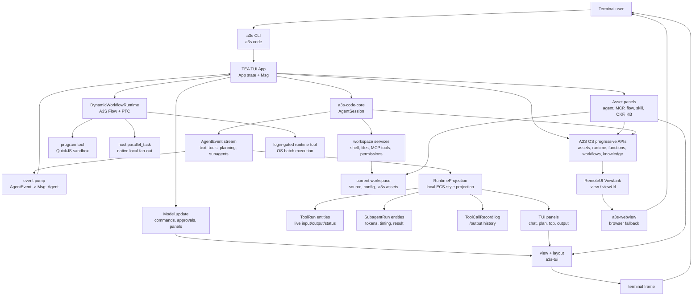

# a3s

The umbrella CLI for the [A3S](https://github.com/A3S-Lab) platform.

`a3s <tool> [args...]` runs the matching A3S tool. `a3s box ...` proxies to
`a3s-box ...` and bootstraps the Box runtime automatically if it is missing:

```
a3s code            # launch the A3S Code TUI
a3s box ps          # → a3s-box ps (auto-installs a3s-box if needed)
a3s <tool> --help   # a tool's own help
a3s list            # list installed a3s-* tools
a3s --version
```

## Install

```sh
# from source
cargo install a3s

# or from source
cargo install --git https://github.com/A3S-Lab/Cli

# or Homebrew
brew install A3S-Lab/tap/a3s
```

Then run the tools you need. `a3s box ...` installs `a3s-box` on first use.
The Homebrew `a3s` formula installs the native RemoteUI helper
`a3s-webview` automatically on macOS; if a source/cargo install is missing it,
`a3s code` falls back immediately to printing the browser URL.

## A3S Code TUI

`a3s code` launches the interactive A3S Code terminal UI in the current
workspace. On first launch it creates `~/.a3s/config.acl`; use `/config` to edit
models, provider credentials, and optional paths such as `flow_dir`,
`agent_dir`, `mcp_dir`, `skill_dir`, and memory/session storage.

A3S Code is a complete agentic workspace. It combines a coding-agent chat loop,
workspace editor, durable context, local asset development, OS asset publishing,
Runtime fan-out, RemoteUI views, and engineered automation loops in one terminal
surface.

### Capability Overview

| Area | What A3S Code TUI provides |
| --- | --- |
| Coding loop | Chat with the coding agent, stream tool calls, approve or deny tools, switch `/auto`, run direct shell turns with `!`, set a persistent `/goal`, ask background side-questions with `/btw`, and fork or clear sessions when needed. |
| Workspace UI | `/ide` opens a superfile-style file tree and editor, `/config` edits the config file in the same editor, `/output` shows every tool call with arguments/results, and file edits render bounded diffs through the shared `DiffView` component. |
| Models and effort | `/model` switches configured providers, OS gateway models, and signed-in account tabs. `/effort` scales thinking budget, tool-round budget, auto-continuation, and model-agnostic rigor guidance from `low` through `max` and `ultracode`. |
| Dynamic workflows | `ultracode` and `?` DeepResearch can use `DynamicWorkflowRuntime`, a local A3S Flow-backed workflow runner. It records workflow/step history while PTC scripts perform ordinary tool work. This is separate from `/flow`, which is OS Workflow as a Service for persisted workflow assets. |
| Local and remote parallelism | Local subagent fan-out uses the host-side `parallel_task` tool. QuickJS/PTC scripts do not call `parallel_task` directly; dynamic workflows schedule a Flow step named `parallel_task`, and the host executes it natively. After `/login`, the signed-in `runtime` tool is available to workflow steps and model turns for OS Runtime batch execution. |
| Deep research | Prefix a prompt with `?` to start DeepResearch. The TUI first gathers evidence through `DynamicWorkflowRuntime`; when signed in it tries OS `runtime`, falls back to local host-side `parallel_task` when needed, then asks the model to synthesize a cited report and RemoteUI/local artifacts. |
| Context and memory | The status bar tracks context fill and auto-compaction. `/ctx` searches past sessions, `/ctx <n>` attaches a previous transcript window, `/ctx save <n>` promotes it to memory, `/sleep` consolidates the day, and `/memory` browses durable memories as an event/entity graph with aliases, tiers, relations, conflicts, and forget candidates. |
| Knowledge | `/kb` manages a local personal knowledge vault for notes, imports, search, and browsing. `/okf` manages shareable OKF knowledge-package assets under `.a3s/okf` and publishes them to the OS Knowledge service when signed in. |
| Asset development | `/agent`, `/mcp`, `/skill`, and `/okf` enter local development modes with an active asset, review commands, clone/draft flows, and publish/deploy/status surfaces. `/flow` works differently: it selects or drafts workflow DAG assets and sends them to OS Workflow as a Service, without entering a persistent local dev mode. |
| Runtime activity | `/top` focuses local coding-agent process activity. Asset-specific `activity` commands (`/agent activity`, `/mcp activity`, `/flow activity`, `/skill activity`, `/okf activity`) inspect OS Runtime jobs/runs for the selected asset. |
| Engineered loops | `/loop init`, `/loop run`, `/loop audit`, and `/loop logs` manage durable loops under `.a3s/loops`. Loops use maker/checker separation, reports, budgets, state files, and OS Runtime/RemoteUI evidence when enabled; inside `/agent` mode they stay local and target the active agent definition. |
| OS and RemoteUI | `/login` enables OS capabilities. `/view` reopens the latest RemoteUI ViewLink captured from shaped OS progressive responses (`.view` or `viewUrl`), using the native `a3s-webview` helper when available and browser fallback otherwise. |
| Operations | `/help` shows the full command guide, `/theme` cycles syntax themes, `/plugin` and `/reload` manage skills/plugins, `/update` upgrades and restarts, `/compact` summarizes context, and `/fork` branches a new session from the current transcript. |

### Dynamic Workflows

There are two workflow concepts, intentionally kept separate:

| Concept | Surface | Purpose |
| --- | --- | --- |
| `DynamicWorkflowRuntime` | Model-visible `dynamic_workflow` tool, used by `ultracode` and `?` DeepResearch | Per-turn dynamic orchestration. A sandboxed JavaScript PTC function returns A3S Flow commands such as `complete`, `fail`, `schedule_step`, or `schedule_steps`; A3S Flow records replayable workflow and step history. |
| OS Workflow as a Service | `/flow`, `/flow publish`, `/flow run`, `/flow deploy`, `/flow open`, `/flow logs`, `/flow status` | Durable workflow asset lifecycle. Local DAG JSON files are published as OS `workflow` assets with runtime-binding metadata and opened in the OS workflow designer/run surfaces. |

Dynamic workflow PTC steps can call ordinary tools such as `ctx.read`,
`ctx.grep`, or `ctx.tool("runtime", ...)` when `runtime` is registered after OS
login. They cannot call `parallel_task` directly. To fan out local subagents,
the workflow schedules a Flow step with `step_name: "parallel_task"`; the TUI
host then runs the native `parallel_task` implementation outside QuickJS.

### Architecture

A3S Code is a TEA-style terminal application: terminal events and agent stream
events become `Msg` values, `Model.update` mutates one session model, and view
functions render the current state through `a3s-tui`. Runtime-heavy state is
kept as a small ECS-style projection: tool runs, subagent runs, Runtime activity
records, RemoteUI links, and retained tool logs are updated by stable event ids
and queried by panels instead of coupling every panel to the streaming protocol.

The command palette, asset selectors, `/model` account picker, detail panels,
tool status lines, transcript gutters and user bubbles, input prompt chrome,
live and completed tool output, task summaries, file-edit diffs, SPF/IDE file
metadata, effort overlay, and footer status rows use shared `a3s-tui`
components such as `MenuPanel`, `TabbedMenuPanel`, `DetailPanel`, `Timeline`,
`SectionHeader`, `ToolStatusLine`, `GutterBlock`, `InputBorder`, `PromptLine`,
`ConnectorBlock`, `DiffView`, `PanelFrame`, `Breadcrumb`, `LevelSlider`,
`ShimmerText`, `SessionStatus`, and `ModeLine`. Reusable menu scrolling,
selection, tool status truncation, transcript gutters and input bubbles, prompt
continuation alignment, input border labels, connector rows, diff wrapping,
framed panels, breadcrumbs, detail-row layout, shimmer, and width-bounding fixes
are exercised directly by `a3s code`.



### OS, Runtime, and RemoteUI

Add an OS endpoint to `config.acl`, then sign in:

```hcl
os = "https://os.example.com"
```

```sh
a3s code
# then inside the TUI:
/login
```

After login, A3S Code can use OS capabilities directly from the TUI:

| Command | What it does |
| --- | --- |
| `/view` | Reopen the latest OS RemoteUI view captured from a tool response. |
| `/flow` | Select a local workflow DAG JSON, publish it as an OS workflow asset, and open the OS workflow designer; `/flow <description>` drafts a new DAG first. `/flow` is OS Workflow as a Service, not the per-turn dynamic workflow runtime. |
| Asset `activity` subcommands | Browse asset-related Runtime activity through `/agent activity`, `/mcp activity`, `/flow activity`, `/skill activity`, or `/okf activity`; when a local asset is not active, A3S Code opens the matching selection panel first. |
| `/mcp publish/debug/test` | Publish the active local MCP asset as an OS `mcp` asset, then debug or batch-test it through OS Function as a Service. |
| `runtime` tool | Registered only after `/login`. It resolves a tool-kind worker asset by UUID or name, submits independent inputs to OS Function as a Service batch execution, streams progress, and returns aggregated results. |

### OS Service Mapping

| OS mechanism | A3S Code TUI path |
| --- | --- |
| Agent as a Service | `/agent publish agentic`, `/agent publish application`, `/agent run`, and `/agent deploy` use OS `agent` assets with `agentKind=agentic` or `agentKind=application`. Publish commits the local definition, `.a3s/agent.asset.json`, `.a3s/agent.config.json`, and `.a3s/agent.runtime-binding.json`, then syncs OS agent-config and runtime-binding endpoints when available. Run/deploy first discover the current OS operation through progressive capabilities with `shaped=true`, then fall back to REST probes and the OS asset view. `/agent open` and `/agent logs` inspect existing assets and prefer progressive ViewLinks before static OS views. |
| Function as a Service | Tool-kind agents and MCP tool calls stay Runtime workers. `/agent publish tool` uses OS `agent` assets with `agentKind=tool` and a Function as a Service runtime binding; `/mcp publish`, `/mcp deploy`, `/mcp debug`, and `/mcp test` use OS `mcp` assets with `runtimeBinding.kind=mcp`, `isolation=serving`, and `agentKind=tool`; `/skill publish` and `/skill deploy` use OS `skill` assets with serving Function as a Service binding intent. MCP debug/test and skill deploy paths first try OS progressive capabilities with `shaped=true` so `.view`/`viewUrl` survives as a ViewLink, then fall back to Function invoke, batch, or asset views. The `runtime` tool sends parallel batches to `/api/v1/functions/<worker>/batch` with `agentKind=tool`. |
| Workflow as a Service | `/flow`, `/flow publish`, `/flow run`, and `/flow deploy` create or update OS `workflow` assets, commit `.a3s/workflows/main.design.json`, `.a3s/workflow.asset.json`, and `.a3s/workflow.runtime-binding.json`, then sync the runtime-binding endpoint when available. Run/deploy first try OS progressive capabilities with `shaped=true` for a workflow designer ViewLink and fall back to the standalone workflow designer for edit and run. `/flow open`, `/flow logs`, and `/flow status` inspect the asset, logs, and runtime binding without mutating it. |
| Knowledge service | `/okf` selects local OKF packages. `/okf publish` creates or updates an OS `knowledge` asset, uploads package sources plus `.a3s/knowledge.asset.json` and `.a3s/knowledge.runtime-binding.json`, and syncs the runtime-binding endpoint when available. `/okf deploy` publishes the package first, then tries OS progressive knowledge-service deployment with `shaped=true`; if no matching operation exists, the Knowledge service view opens. `/okf status` checks the OS asset and runtime binding without mutating it. `/kb vault` remains the local personal knowledge-base browser. Without OS, deploy stays local and reports the blocked knowledge-service inputs. |

### AI-Native Asset Lifecycle

A3S Code treats agents, MCP servers, skills, OKF knowledge packages, and
workflow flows as team digital assets and shared context. Each asset family
uses the same lifecycle vocabulary in the TUI and OS, while exposing only the
commands backed by real local or OS surfaces:

| Stage | TUI responsibility | OS responsibility |
| --- | --- | --- |
| Create | Draft a local asset or definition from natural language. | Create a private/team asset workspace with typed metadata. |
| Develop | Agents, MCP servers, skills, and OKF packages enter local multi-turn asset-development mode with a visible active asset and an exit path. Workflow flows use local DAG editing plus the OS workflow designer instead of a persistent local mode. | Keep asset source, metadata, secrets, and collaboration history as shared context. |
| Debug/test | Run local smoke checks first; expose direct debug/test commands only when the asset family has a real service surface. | MCP servers use Function as a Service debug/test calls. Agentic agents are exercised through `/agent run`, workflow flows through `/flow run`, application agents through `/agent deploy`, and tool agents, skills, and OKF packages do not expose direct TUI run/debug commands. |
| Publish | Commit source, manifest, config, runtime binding, examples, and tests. | Validate config/runtime binding, package the asset, record release gates, and expose team discovery. |
| Deploy | Trigger only the deployment shape that matches the asset type. | Launch long-running applications only when needed; prefer serving Function as a Service for stateless tools and MCP calls. |
| Inspect | Open read-only asset views, status, logs, or runtime-binding checks only when that asset family exposes the surface. | Provide asset metadata, binding validation, service views, package state, and RemoteUI evidence without mutating assets. |
| Activity | Browse asset-scoped Runtime activity instead of using a top-level process or run manager. | Provide function invocations, batches, workflow runs, indexing/evaluation jobs, and agent runs filtered to the selected asset. |

RemoteUI views are captured from OS progressive responses (`.view`/`viewUrl`).
The TUI remembers the latest view and surfaces ViewLinks returned by
asset-scoped actions that return OS views. Report-oriented autonomous work such
as DeepResearch and OS-enabled loops expects fan-out evidence (`dynamic_workflow`,
`runtime`, or host-side `parallel_task`) plus a shaped `.view`/`viewUrl` report
response; when either part is missing, autonomous runs spend the next loop turn
on a targeted Runtime-evidence retry before accepting a final answer.

### Agents, Research, and Loops

| Command | What it does |
| --- | --- |
| `/agent` | Select a local agent definition from `agent_dir` and enter local multi-turn agent-development mode. The TUI shows the active agent; press Esc or run `/agent off` to return to normal mode. While active, `/goal` becomes an agent-scoped development goal and `/loop` runs local agent-scoped loop engineering. No OS WebIDE or RemoteUI is opened for this local VibeCoding flow. |
| `/agent <description>` | Draft a Markdown agent definition with YAML frontmatter under `agent_dir`, then use `/agent` to iterate on it. |
| `/agent clone <git-url>` | Clone an existing agent asset source into `agent_dir`, then use `/agent` to select it. |
| `/agent list [query]` | Browse OS agent assets through the asset-scoped list panel. |
| `/agent activity [query]` | Inspect Runtime activity, jobs, and runs for the selected local agent; when no agent is active, A3S Code opens the agent selection panel first. |
| `/agent review` | Review the active local agent. If no agent is active, A3S Code opens the agent selection panel first, enters agent-development mode, then reviews the selected agent. |
| `/agent publish agentic` | Publish the active local agent definition as an OS `agent` asset with `agentKind=agentic`. The definition, manifest, runtime binding intent, and machine-readable agent config are saved with the asset source, then synced to OS agent-config and runtime-binding endpoints when available. |
| `/agent publish application` | Publish the active local agent definition as an OS `agent` asset with `agentKind=application`, ready for OS-side application-agent deployment. The same manifest, runtime binding intent, agent-config sync, and runtime-binding sync are applied. |
| `/agent publish tool` | Publish the active local agent definition as an OS `agent` asset with `agentKind=tool` and a Function as a Service runtime binding. The definition, manifest, config metadata, and runtime binding intent are committed; runtime-binding sync is attempted when available. |
| `/agent run` | Publish or update the active local agent as an agentic asset, then ask OS Agent as a Service to start a run through progressive capabilities. If the deployed OS does not expose a compatible operation yet, the TUI opens the OS asset view instead. |
| `/agent deploy` | Publish or update the active local agent as an application asset, sync agent config, read the latest asset source revision, trigger the OS application-agent build, and launch it into the selected/default Runtime namespace when package and namespace metadata are available. Otherwise the OS asset view opens for the missing input. |
| `/agent open [agentic\|application\|tool]` / `/agent logs [agentic\|application\|tool]` | Observe the existing OS asset or Runtime log view for the active local agent without creating or uploading it; progressive ViewLinks are preferred when available. |
| `/agent status [agentic\|application\|tool]` | Check whether the active local agent has a matching OS asset, valid config/runtime binding, and service-specific binding without creating, uploading, running, or deploying anything. |
| `/mcp` | Select a local MCP server asset from `mcp_dir` and enter local MCP-development mode. The TUI shows the active MCP asset; press Esc or run `/mcp off` to return to normal mode. |
| `/mcp <description>` | Draft a local MCP server asset with metadata prepared for OS Function as a Service. |
| `/mcp clone <git-url>` | Clone an existing MCP asset source into `mcp_dir`, then use `/mcp` to select it. |
| `/mcp list [query]` | Browse OS MCP assets through the asset-scoped list panel. |
| `/mcp activity [query]` | Inspect Runtime activity, jobs, and tool invocations for the selected MCP asset; when no MCP is active, A3S Code opens the MCP selection panel first. |
| `/mcp review` | Review the active local MCP asset. If no MCP is active, A3S Code opens the MCP selector first, enters MCP-development mode, then reviews the selected MCP asset. |
| `/mcp publish` | Publish the active local MCP asset as an OS `mcp` asset, commit source plus `.a3s/mcp.asset.json`, `.a3s/mcp.server.json`, and `.a3s/mcp.runtime-binding.json`, then sync the OS runtime-binding endpoint when available. |
| `/mcp deploy` | Publish the active MCP asset and sync its serving Function as a Service runtime binding. |
| `/mcp debug` | Publish the active MCP asset, then invoke OS Function as a Service through progressive capabilities with `shaped=true`, falling back to `/api/v1/functions/<mcp-asset>/invoke` with `agentKind=tool`. |
| `/mcp test` | Publish the active MCP asset, then batch-test MCP tools through progressive capabilities with `shaped=true`, falling back to `/api/v1/functions/<mcp-asset>/batch` when needed. |
| `/mcp open` / `/mcp logs` / `/mcp status` | Inspect the OS MCP asset, logs, or runtime-binding status without mutating the asset; open/logs prefer progressive Function as a Service ViewLinks when available. |
| `/flow` | Select a local workflow DAG JSON from `flow_dir`, publish it as an OS `workflow` asset with a manifest and Workflow as a Service runtime binding, sync the runtime-binding endpoint when available, and open the workflow designer through a progressive ViewLink or standalone designer fallback. |
| `/flow <description>` | Draft a local workflow DAG JSON, then use `/flow` to publish and iterate through OS Workflow as a Service. This is an OS asset workflow, not `DynamicWorkflowRuntime`. |
| `/flow clone <git-url>` | Clone an existing workflow asset source into `flow_dir`; cloned OS designer documents under `.a3s/workflows/main.design.json` are discoverable by `/flow`. |
| `/flow list [query]` | Browse OS workflow assets through the asset-scoped list panel. |
| `/flow activity [query]` | Inspect Runtime activity and workflow runs for a selected workflow asset. |
| `/flow review [file]` | Review a local workflow DAG without publishing it. |
| `/flow publish` / `/flow run` / `/flow deploy` | Open the workflow selection panel, publish the selected DAG as an OS workflow asset, sync Workflow as a Service runtime-binding intent, then open the asset view or Workflow as a Service designer/run surface. |
| `/flow open` / `/flow logs` / `/flow status` | Open the existing OS workflow designer, Workflow as a Service logs, or runtime-binding status without mutating the selected workflow asset. |
| `/skill` | Select a local skill asset from `skill_dir` and enter local multi-turn skill-development mode. The TUI shows the active skill; press Esc or run `/skill off` to return to normal mode. |
| `/skill <description>` | Draft a local skill asset prototype with `SKILL.md`, examples, tests, and Function as a Service binding intent. |
| `/skill clone <git-url>` | Clone an existing skill asset source into `skill_dir`, then use `/skill` to select it. |
| `/skill list [query]` | Browse OS skill assets through the asset-scoped list panel. |
| `/skill activity [query]` | Inspect related Function as a Service activity for the selected skill asset. |
| `/skill review` | Review the selected local skill asset. If no skill is active, A3S Code opens the skill selection panel first and enters skill-development mode. |
| `/skill publish` | Publish the selected skill as an OS `skill` asset backed by Function as a Service, committing source, `.a3s/skill.asset.json`, and `.a3s/skill.runtime-binding.json`. |
| `/skill deploy` | Publish the selected skill, sync its serving Function as a Service runtime binding, then prefer an OS progressive shaped deployment ViewLink before falling back to the asset view. |
| `/skill open` / `/skill status` | Inspect the OS skill asset or runtime-binding status without mutating the asset; open prefers progressive Function as a Service ViewLinks when available. |
| `/kb` | Open the local personal knowledge base for notes, imports, search, and vault browsing. |
| `/kb add/import/search/vault` | Capture a note, preview/import files or folders, search local knowledge sources, or browse the local `.a3s/kb` vault. |
| `/okf` | Select a local OKF knowledge package from `.a3s/okf` and enter local package-development mode. The TUI shows the active package; press Esc or run `/okf off` to return to normal mode. |
| `/okf <description>` | Draft a local OKF package prototype with sources, wiki concepts, eval notes, and OS knowledge asset metadata. |
| `/okf clone <git-url>` | Clone an existing OKF package source into `.a3s/okf`, then use `/okf` to select it. |
| `/okf list [query]` | Browse OS knowledge package assets through the asset-scoped list panel. |
| `/okf activity [query]` | Inspect related Runtime indexing/evaluation activity for the selected knowledge package; when no package is active, A3S Code opens the OKF selection panel first. |
| `/okf review` | Review the selected local OKF package. If no package is active, A3S Code opens the OKF selection panel first and enters OKF-development mode. |
| `/okf publish` / `/okf deploy` | Publish the selected OKF package as an OS `knowledge` asset, sync Knowledge service runtime-binding intent, then deploy through progressive knowledge-service capabilities or open the Knowledge service view. Without OS, A3S Code performs local validation and reports blocked deployment inputs. |
| `/okf status` | Check the existing OS knowledge asset and runtime-binding status without mutating the selected package. |
| `? <question>` | Starts DeepResearch. The host first runs `DynamicWorkflowRuntime` to gather evidence. When OS is signed in, the workflow step may call `runtime`; if OS Runtime fails, it falls back to local host-side `parallel_task`. The synthesis turn then produces a cited answer plus RemoteUI or local Markdown/HTML report artifacts. |
| `/loop` | Opens the engineered-loop dashboard for persisted loops under `.a3s/loops/`. |
| `/loop init [name] [pattern]` | Creates a durable loop spec, `STATE.md`, `RUN_LOG.md`, budget file, skills, and reports folder. Built-in patterns include `daily-triage`, `ci-sweeper`, `pr-babysitter`, `dependency-sweeper`, `changelog-drafter`, and `agent-dev`. |
| `/loop run <name>` | Runs a loop with maker/checker separation. With OS signed in and `os_runtime = true`, normal workspace loops require Runtime/parallel fan-out, Markdown/HTML reports, RemoteUI report view data, and asset-scoped Runtime activity visibility. Inside `/agent` mode, the same command stays local and targets the active agent definition. |
| `/loop audit <name>` / `/loop logs <name>` | Check loop readiness or open the append-only run log. |
| `/loop <task>` | Runs an autonomous quick loop until the task reports completion or you stop it. |

## Account Models

In `a3s code`, `/model` lists configured `config.acl` models plus signed-in
account tabs. When Claude Code is logged in (`claude /login`), the Claude Code
tab can switch the current session to Claude models using the local Claude Code
OAuth credentials, including Claude Code's macOS Keychain entry.
`CLAUDE_CODE_OAUTH_TOKEN` or `ANTHROPIC_AUTH_TOKEN` can also provide the account
token for non-standard environments. If Anthropic rejects the raw OAuth Messages
API bridge with a rate-limit or authentication error, a3s falls back to the
installed `claude` CLI in safe streaming mode; Claude Code's own tools stay
disabled while a3s host tools are requested through an adapter protocol and
still execute inside a3s-code. The adapter accepts Claude Code-style
`<function_calls>` output and tool names such as `Read` or `Bash`, normalizes
common argument aliases like `path` to a3s's `file_path`, and feeds tool results
back into the next Claude turn as structured history.

## Testing

```sh
cargo test --all-targets
cargo test --test box_command_soak -- --ignored
cargo test --test ctx_compact_real_llm -- --ignored   # hits the configured LLM
```

The ignored soak test repeats `a3s box` after a fake first-use install and
verifies later runs reuse the installed `a3s-box`. The ignored
`ctx_compact_real_llm` test drives the configured model (`~/.a3s/config.acl`)
until the context crosses the auto-compact threshold and asserts streaming
usage is reported, compaction shrinks the history, and the next prompt drops —
the machinery behind the TUI's ctx%, fill warnings, and auto-compaction.

## Updating

In the TUI, **`/update`** upgrades to the latest release and restarts into your
session. Homebrew installs refresh the A3S tap, upgrade or reinstall
`a3s-lab/tap/a3s`, and verify both `PATH` and the Homebrew prefix binary.
Standalone installs download the matching GitHub release archive, find the
`a3s` binary inside it, swap the current binary, and verify the target version
before treating the update as successful. If restart fails after a successful
upgrade, the TUI prints the exact `a3s code resume <id>` command for the saved
session.

If you're on an **older build (≤ 0.5.4)** whose `/update` was broken, it can't
upgrade itself, and `brew upgrade a3s` alone won't see the new version (Homebrew
doesn't re-sync a tap on `upgrade`). Bootstrap onto a current build once with:

```sh
brew update && brew upgrade a3s     # or: brew untap a3s-lab/tap && brew tap a3s-lab/tap && brew upgrade a3s
a3s --version
```

From 0.5.5 onward, `/update` handles the tap refresh itself, so this manual step
isn't needed again.

## License

MIT
