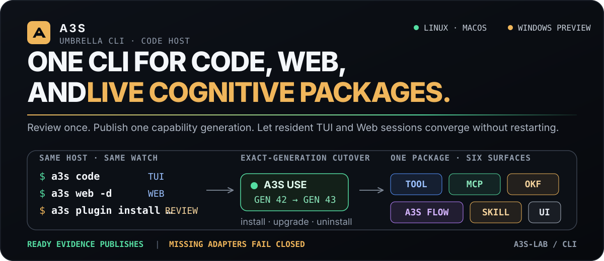
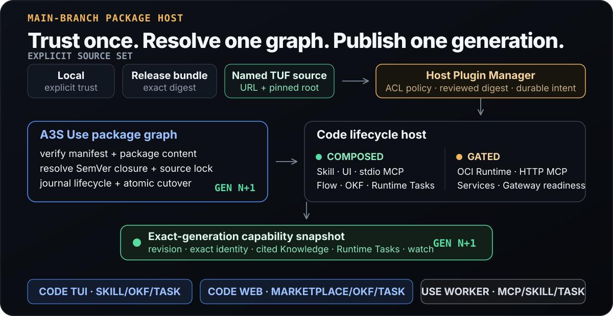

<p align="center">
  
</p>

<p align="center">
  <strong>Build with agents in the terminal or browser, then extend both with one reviewed package lifecycle.</strong>
</p>

<p align="center">
  <a href="https://github.com/A3S-Lab/CLI/actions/workflows/ci.yml"></a>
  <a href="https://crates.io/crates/a3s"></a>
  <a href="LICENSE"></a>
</p>

<p align="center">
  <a href="#quick-start">Quick start</a> ·
  <a href="#cognitive-packages-live">Cognitive packages</a> ·
  <a href="#architecture">Architecture</a> ·
  <a href="#a3s-code">A3S Code</a> ·
  <a href="#component-lifecycle">Components</a> ·
  <a href="#development">Development</a>
</p>

> [!IMPORTANT]
> Active development, issues, and pull requests live in the
> [A3S monorepo](https://github.com/A3S-Lab/a3s). This repository remains a
> compatibility release endpoint for older clients. The canonical source path
> is `crates/cli` in the monorepo.

## One surface for A3S

`a3s` is the umbrella command for the A3S developer platform. The base install
contains A3S Code; optional native components and cognitive packages arrive
through explicit, verifiable lifecycle operations.

```text
a3s
├── code        agentic coding workspace in the terminal
├── web         the same Code host through a local Web application
├── plugin      reviewed cognitive-package Marketplace lifecycle
├── use         native capabilities and AI-native package engine
├── compose     multi-service applications delegated to A3S Box
└── components  install · upgrade · inspect · repair · uninstall
```

| Entry point | What it gives you |
| --- | --- |
| `a3s code` | Interactive coding agent, workspace tools, durable sessions, memory, research, asset development, and governed execution. |
| `a3s web -d` | A detached loopback Code service and bundled Web workspace with the same configuration, sessions, models, plugin manager, and Use watcher. |
| `a3s plugin …` | Search, review, install, upgrade, enable, disable, and uninstall packages through one shared Plugin Manager. |
| `a3s use …` | Browser, Office, OCR, Box, and installed package capabilities supplied by A3S Use. |
| `a3s install …` | Cross-platform lifecycle for registered A3S products and delegated Use packages; it is not a universal replacement for OS package managers. |

## Quick start

Install the current release:

```bash
# Homebrew
brew install A3S-Lab/tap/a3s

# crates.io
cargo install a3s --locked
```

Build the canonical source from the monorepo:

```bash
git clone --recurse-submodules https://github.com/A3S-Lab/a3s.git
cd a3s
cargo install --path crates/cli --locked
```

Start in the terminal or browser:

```bash
a3s code
a3s web -d
```

The first `a3s code` launch creates `~/.a3s/config.acl` when no configuration
exists. Use `/config` in the TUI or the root config commands to inspect it:

```bash
a3s config path
a3s config show
a3s config validate
```

Prepare and inspect A3S Use explicitly when you do not want first-use setup:

```bash
a3s install use --source release
a3s use doctor --json
a3s use capabilities --json
```

## Cognitive packages, live

A cognitive package is an npm-like, versioned distribution unit owned by A3S
Use. One package has a stable `<publisher>/<name>` identity, one ACL manifest,
one required `README.md`, optional SemVer dependencies, and any combination of
six named surfaces:

```text
acme-research/
├── a3s-use-extension.acl   identity · version · dependencies · surfaces
├── README.md               required package documentation
├── tools/                  executable Tasks or long-lived Services
├── releases/               content-bound Tool and MCP descriptors
├── flows/                  A3S Flow TypeScript workflow sources
├── skills/                 SKILL.md files and supporting content
├── ui/                     integrity-bound static assets
└── okf/                    Open Knowledge Format bundles
```

The package generation—not an individual file—is the install, upgrade,
enable, disable, and uninstall unit. Dependencies install before dependents;
unused packages uninstall in reverse order; changed packages publish through
one capability generation.

### Six surfaces, explicit readiness

| Surface | Package contract | Current A3S Code host composition |
| --- | --- | --- |
| **Tool** | Executable Task or long-lived Service | Executable Tasks use the Runtime lifecycle host. Services fail closed until a production Runtime Service adapter is injected. |
| **MCP** | stdio, HTTP, or immutable release descriptor | stdio MCP is composed. HTTP MCP fails closed until Runtime/Gateway readiness is available. |
| **OKF** | Versioned Open Knowledge Format graph | Manifest, plan, validation, and Use lifecycle contracts exist. Code rejects required OKF until a production A3S Knowledge adapter is configured. |
| **A3S Flow** | `flows/*.ts`, export, digest, and Tool/MCP/OKF edges | Real `a3s-flow` Native TypeScript preflight, compiled-artifact revalidation, exact-generation binding, and a live typed catalog are composed. |
| **Skill** | Content-bound `SKILL.md` plus supporting files | Immutable static validation and live session projection are composed. |
| **UI** | Integrity-bound static entry and optional Skill/MCP/Flow bindings | Static package validation and sandboxed Web Activity projection are composed. |

Required surfaces never downgrade silently to a different provider. Missing
Knowledge, Runtime Service, Gateway, or Flow evidence prevents publication.

### Install, upgrade, uninstall—without restarting Code

Registry metadata can be searched without downloading package archives. A
mutating operation always creates an immutable reviewed plan first:

```bash
a3s plugin search science
a3s plugin inspect a3s/science

# Interactive review and apply
a3s plugin install a3s/science --channel stable
a3s plugin upgrade a3s/science
a3s plugin uninstall a3s/science

# Non-interactive two-step apply
a3s --output json plugin install a3s/science --dry-run
a3s --output json plugin apply <operationId> \
  --plan-digest <canonicalPlanDigest> \
  --yes
```

Code TUI and Web share one capability watcher per process. Successful package
publication advances the exact generation/revision and updates resident
sessions without restarting the host:

```text
verified install  → generation N+1 → new Skill / MCP / UI / Flow appears
verified upgrade  → generation N+2 → old evidence is replaced atomically
verified uninstall → generation N+3 → package surfaces disappear and drain
```

The detached-Web integration gate exercises this complete
`install → upgrade → uninstall` sequence through the public HTTP API and a
separate Use process contract. It verifies Activity, Skill, Flow export,
digest, dependency edges, lifecycle generation, and removal at the same daemon
address. The TUI watcher gate separately verifies `/use` reports
`A3S Flow ready (1/1)` for the live generation and withdraws it after disable.

### Replaceable Registry sources

Registry URLs and trust roots are host configuration, not package-controlled
fields. Add a mirror, private source, or another explicitly trusted TUF
Registry without changing the resolver:

```bash
a3s registry add https://packages.example.org/a3s/ \
  --trust-root ./root.json \
  --yes
a3s registry refresh packages
a3s registry disable packages --yes
a3s registry replace packages https://mirror.example.org/a3s/ \
  --trust-root ./mirror-root.json \
  --yes
a3s registry enable packages --yes
```

Dependency declarations contain only package IDs and SemVer requirements. The
resolved lock records each selected version, source URL, root identity, TUF
metadata versions, target, archive digest, manifest digest, and dependency
edge. An installed receipt remains pinned to that Registry identity; changing
or removing it blocks upgrades until the source is restored or the package is
explicitly migrated or reinstalled.

`disable` removes a source from Marketplace browsing, root/dependency
resolution, and refresh without deleting its ACL or trust material. `replace`
keeps the stable Registry name and current enabled state while atomically
switching URL and trust identity. File-backed TUF roots are copied into a
content-addressed, symlink-safe host directory before the ACL cutover. Neither
operation rewrites package receipts, so an installed package whose recorded
source no longer matches continues to fail closed on upgrade.

### One A3S Flow model

A packaged Flow does not introduce a second workflow engine:

| Layer | Responsibility |
| --- | --- |
| `a3s-use-extension.acl` | Package identity, Flow source/export, lifecycle policy, and Tool/MCP/OKF dependencies. |
| `flows/*.ts` | Code-authored workflow logic shipped by the package. |
| `native-ts` | The currently accepted source-to-runtime adapter. |
| `flow.json` | A3S Code visual design and deployment document for the same Flow identity. |
| `a3s-flow` | The sole engine for preflight, durable execution, event history, replay, scheduling, and observation. |

Code resolves the compiler from `A3S_FLOW_NATIVE_TS_COMPILER`, falling back to
`a3s-flow-native-compiler`. Compiled cache and exact-generation bindings live
under the Use state root. Source presence alone never means ready: Code
rechecks the source and compiled artifact before exposing the Flow through:

```http
GET /api/v1/plugins/flows
```

The endpoint returns schema version, availability, generation, revision, and
typed Flow items. Mapping visual `flow.json` deployment to an installed package
identity and production durable execution remain separate release gates.

## Architecture

<p align="center">
  
</p>

The boundaries are deliberate:

| Owner | Responsibility |
| --- | --- |
| Umbrella CLI | Public commands, named Registry configuration, trust roots, ACL policy, confirmation, component orchestration, and product UX. |
| Shared Plugin Manager | The one lifecycle application service used by CLI, Web, and the read-only management MCP adapter. It owns reviewed plans, actor/scope binding, durable intent, cutover evidence, and replay. |
| A3S Use | Package validation, deterministic dependency resolution, immutable generations, receipts, route leases, lifecycle journals, bindings, and capability reconciliation. |
| Code lifecycle factory | Host composition for executable Tool Tasks, stdio MCP, A3S Flow, Skill, and UI; missing production adapters fail closed. |
| A3S Runtime / Flow / Gateway / Knowledge | Execution, preflight, serving, indexing, observation, and typed readiness evidence. |
| Code TUI and Web | Consume one live snapshot; neither implements a second package manager or bypasses host policy. |

Package storage, grants, Runtime, Gateway, Knowledge, and capability projection
cannot share one database transaction. The complete mutation is therefore a
durable, idempotent saga. See
[A3S Use and Component Platform](docs/a3s-use-component-platform.md) and
[Plugin Authorization Policy](docs/plugin-authorization-policy.md).

## A3S Code

`a3s code` is an agentic developer workspace, not only a chat prompt. It keeps
conversation, tool execution, approvals, delegated work, workspace changes,
memory, and verification evidence in one semantic transcript.

| Area | Product surface |
| --- | --- |
| Coding | Streaming agent loop, saved-file Code Intelligence, workspace editor, file attachments, image paste, Live Preview, and bounded diffs. |
| Control | Default, strict read-only Plan, and non-interactive Auto modes; exact session/project grants; FIFO approvals; cancellable delegated tasks. |
| Continuity | Durable sessions, resume, prompt history, queued follow-ups, context search, memory, compaction, forked sessions/worktrees, and conflict-checked rewind. |
| Deep work | Effort profiles from `low` through `ultracode`, durable goals, host-native parallel tasks, A3S Flow-backed dynamic workflows, and engineered loops. |
| Research | Evidence-first DeepResearch with bounded acquisition, typed claim graphs, citations, deterministic quality gates, and Markdown/HTML artifacts. |
| Assets | Local Agent, MCP, Skill, Flow, and OKF authoring; signed-in publishing/deployment through A3S OS services. |
| Packages | Dedicated `use` worker, `/use` status, live Skill/MCP/Flow projection, package Marketplace, and sandboxed Web Activity contributions. |
| Models | ACL-configured providers plus account-owned Claude Code, Codex, Kimi, WorkBuddy, and A3S OS routes without copying their credentials into A3S config. |

Everyday commands:

```bash
a3s code                              # interactive TUI
a3s code resume                       # newest session in this workspace
a3s code exec --mode auto "Fix the focused test and verify it"
a3s code research --web "compare Tokio and async-std"
a3s code top --json
```

Useful TUI inputs:

```text
@src/main.rs                  attach a workspace file
! cargo test -p my-crate      direct shell turn
? investigate the regression evidence-first research
/ide                          workspace browser and editor
/preview site/index.html      persistent local preview
/queue                        pending follow-up control
/tasks                        delegated-task control
/permissions                  exact grant review and revocation
/use                          live A3S Use generation and readiness
/plugin                       discovered Skill/plugin controls
/goal <outcome>               durable ultracode goal
```

| Key | Behavior |
| --- | --- |
| `Enter` | Send now when idle; queue a follow-up while a turn is active. |
| `Ctrl+O` | Cancel the active turn and promote the current prompt ahead of normal follow-ups. |
| `Shift+Tab` | Cycle Default, Plan, and Auto for future submissions. |
| `Ctrl+R` | Search current-session prompts. |
| `Ctrl+B` | Open delegated-task control. |
| `Ctrl+T` | Open the complete semantic transcript. |
| `Esc` | Interrupt the active turn or close the current panel. |

### Code Web

```bash
a3s web start
a3s web start --detach
a3s web start --detach --replace
a3s web start --api-only
```

Web reuses Code configuration, model routing, Core sessions, permission modes,
DeepResearch, Code Intelligence, and the shared Plugin Manager. The default
listener and OAuth callback are loopback-only. Background startup returns only
after the service binds and prints the PID, URL, and workspace-keyed log path.

Managed startup is idempotent. A healthy workspace instance is reused;
`--replace` can replace only an authenticated, same-workspace managed process.
A foreign or ambiguous port owner is never terminated. Plugin HTML runs in an
opaque-origin iframe with restrictive CSP, bounded messages, and explicit
context review before a same-package Skill can enter Code.

## Component lifecycle

The base archive contains the umbrella CLI and A3S Code. Other products remain
separately released and arrive only when policy permits:

| Component | Included | Public route | Lifecycle |
| --- | --- | --- | --- |
| Code | Yes | `a3s code` | Runs from the umbrella executable. |
| Web | Release-dependent assets | `a3s web` | Release archives/Homebrew bundle it; Cargo installs fetch and verify the exact Web asset on first start unless offline. |
| Box | No | `a3s box`, `a3s compose` | Visible first-use install or explicit preparation. |
| Bench | No | `a3s bench` | Explicit compatible control-component install. |
| Search | No | `a3s search` | Explicit compatible component install; Browser engines keep their own lifecycle. |
| Use | No | `a3s use`, `a3s code` | Verified first-use setup for TUI when allowed, or explicit install. Web consumes an already-ready Use component. |
| WebView | Release-dependent | native RemoteUI windows | Managed native companion with browser fallback when unavailable. |

```bash
a3s list
a3s install use --source release
a3s install box
a3s upgrade use
a3s uninstall use/a3s/science
a3s doctor use
```

`--offline` and `A3S_NO_AUTO_INSTALL=1` are strict no-download boundaries.
Help/version probes do not trigger delayed installation. Every downloaded
release path verifies target, manifest, checksum, ownership, and health before
switching its active receipt; a failed upgrade leaves the prior healthy
generation available.

### Reviewed plans and recovery

Component install, upgrade, and uninstall support immutable review/apply:

```bash
a3s install box --source release --dry-run --json
a3s install box --source release \
  --plan-digest <reviewed-sha256> \
  --json
```

The digest covers operation flags, target platform, current receipt, ordered
dependencies, selected release/TUF evidence, and local-package content when
applicable. Apply resolves again and fails before payload mutation if any
covered value changed.

Mutating batches use a cross-process lock and durable checkpoints. Interrupted
recovery revalidates completed steps against current presence, health, version,
provenance, and path before skipping them; it never replays a stale download
plan.

## Safety model

| Mode | Workspace files | Host shell | Boundary crossings |
| --- | --- | --- | --- |
| Default | Bounded reads and writes follow workspace policy. | A small Rust-proven read-only subset runs quietly; other non-critical commands enter HITL. | Exact allow-once, session, or project grant; critical operations fail closed. |
| Plan | Read-only discovery only. | Bash is unavailable. | Ends at Approve, Revise, or Abandon; approval starts a separate Default turn. |
| Auto | Governed operations run without prompts. | Only Rust-proven read-only commands run; unproven or mutating host commands are denied. | Explicit policy and hard workspace denials remain authoritative. |

Host Bash is not an isolation boundary. Untrusted, dependency-heavy, OCI,
build, and test workloads that need isolation belong on A3S Box or an A3S
Runtime placement.

The dedicated Use worker is narrower than the parent agent:

- it receives only `mcp__use_*` tools and verified package Skills;
- it cannot use workspace, shell, unrelated MCP, or recursive delegation;
- the primary model does not receive raw Use tool definitions;
- mutations, destructive calls, open-world access, and missing annotations
  escalate to the parent confirmation stream; and
- application failures never fall back to a different execution surface.

The management MCP surface is read-only: search, inspect, installed status, and
plan creation only. It cannot apply a plan, mutate registries, execute a
package, inject a URL/path, or grant secrets.

## Configuration and models

Configuration uses A3S ACL, not TOML or HCL. Resolution checks an explicit
`A3S_CONFIG_FILE`, then workspace `.a3s/config.acl`, then
`~/.a3s/config.acl`.

```bash
a3s model list
a3s model current
a3s model use codex/gpt-5.6-sol
a3s model use claude-code/claude-opus-4-6
a3s model use openai/my-model --scope workspace
a3s auth list
a3s auth login os
```

Claude Code, Codex, Kimi, and WorkBuddy keep ownership of their account state
and login flows. A3S discovers their available models and routes requests
without copying account tokens into `config.acl`, command output, logs, or the
browser.

## Platform support

| Platform | Current guarantee |
| --- | --- |
| macOS arm64 / x86_64 | Primary release, Code, Web, component, Use, Browser, Office, OCR, and native WebView target. |
| Linux arm64 / x86_64 | Primary release, Code, Web, component, Use, Browser, OCR, and headless runtime target. |
| WSL | Uses the Linux runtime and filesystem contract. |
| Windows x86_64 | Preview: native Code/WebView and verified Use ZIP, Edge core Browser profile, Office MCP operations, and local OCR E2E. Advanced Browser profiles and complete plugin lifecycle parity remain gates. |

## Development

Work from `crates/cli` in the monorepo or from this standalone repository. Do
not create a Rust workspace at the monorepo root.

```bash
cargo fmt --all -- --check
cargo test --lib
cargo test --tests
cargo clippy --all-targets --all-features -- -D warnings
```

Focused cognitive-package gates:

```bash
cargo test --lib use_registry::tests:: --no-fail-fast
cargo test --test web_cli \
  plugin_api_exposes_catalog_and_fails_closed_without_trust_roots
cargo test --test web_plugin_marketplace \
  marketplace_install_upgrade_uninstall_hot_plugs_verified_activity_skill_and_flow_catalog
cargo test --lib \
  code_host_preflights_flow_and_persists_exact_generation_binding
```

The independently released real-Use process gate is orchestrated from the
monorepo so Cargo outputs stay isolated:

```bash
just use-hotplug-e2e
```

## Documentation

- [A3S Use and Component Platform](docs/a3s-use-component-platform.md)
- [Plugin Authorization Policy](docs/plugin-authorization-policy.md)
- [CLI Product Design](docs/cli-product-design.md)
- [CLI Technical Architecture](docs/cli-technical-architecture.md)
- [Code Intelligence](docs/code-intelligence.md)
- [DeepResearch Evidence-First Design](docs/deep-research-evidence-first-redesign.md)
- [A3S Use website](https://a3s-lab.github.io/Use/)
- [A3S Use package contracts](https://github.com/A3S-Lab/Use/tree/main/docs)

## Updating

```bash
a3s update          # update Code; alias of `a3s update code`
a3s update code
a3s update box
a3s update bench
```

The TUI `/update` saves the current session, upgrades Code, and resumes it.
Component updates preserve their owning provenance; there is no implicit
update-everything operation.

## License

A3S CLI is licensed under the [MIT License](LICENSE). Release archives retain
the licenses and provenance notices of their bundled components.
