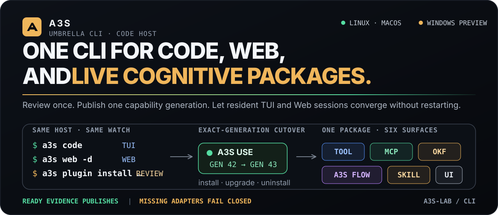

<p align="center">
  
</p>

<p align="center">
  <strong>Language / 语言:</strong>
  <a href="README.md">English</a> ·
  <a href="README.zh-CN.md">中文</a>
</p>

<p align="center">
  <strong>在终端中使用代理进行构建。通过经过审查的版本化包扩展同一主机。</strong>
</p>

<p align="center">
  <a href="https://github.com/A3S-Lab/CLI/actions/workflows/ci.yml"></a>
  <a href="https://crates.io/crates/a3s"></a>
  <a href="LICENSE"></a>
</p>

<p align="center">
  <a href="#quick-start">快速开始</a> ·
  <a href="#a3s-code">A3S Code</a> ·
  <a href="#component-lifecycle">组件</a> ·
  <a href="#development">开发</a>
</p>

> [!IMPORTANT]
> **A3S 0.21.0 — 2026 年 9 月 29 日。** 该仓库是规范的 CLI
> GitHub 档案、crates.io 与 Homebrew 发布源。交互式 `a3s code` 启动基于
> a3s-code 9.1.1 构建的 TUI（`a3s-code-tui` 与 `a3s-code-acp`，rev
> `e2c42e92bf871ac501cf83416fd335a61f8c6416`）。已发布的
> `a3s` crate 钉住 `a3s-code-core` `=9.1.1`（git rev
> `e2c42e92bf871ac501cf83416fd335a61f8c6416`）供 `a3s code exec` 使用。该 Core 线使用纯 Rust
> a3s-vec 词法 FTS，非空 `web_search` 结果视为成功，项目说明来自 `AGENTS.md`，
> 不再使用 AgentDir `serve` 布局。主机侧隔离、沙箱诊断与 worktree 路径处理随该钉
> 一起发布。扩展走 `a3s use`。`a3s install` 只放置已注册组件。`a3s plugin` 已不是命令。
> 不可用的提供方继续失败关闭。

## 一个 CLI，一台代码主机

`a3s` 是 A3S 开发者平台的总括命令。基础安装
包含A3S Code。其他本机产品和 A3S Use 功能保持不变
自己的发布和生命周期边界。

```text
a3s
├── code        interactive pager, or non-interactive exec
├── use         Browser, Office, OCR, and installed Use capabilities
├── compose     multi-service applications delegated to A3S Box
└── components  install · upgrade · inspect · repair · uninstall
```

|切入点|现任职务 |
| ---| ---|
| `a3s code` | 外部 Code pager、`a3s code exec`、持久会话，以及 Core memory。 |
| `a3s use …` |将浏览器、Office、OCR、Box 和扩展功能委托给A3S Use。 |
| `a3s install …` |管理注册的A3S产品和委托使用包；它不是通用操作系统包管理器。 |

## 快速开始

使用一个命令安装最新的公共稳定版本：

```bash
# macOS or glibc Linux (x86_64 / arm64)
curl --proto '=https' --tlsv1.2 -fsSL \
  https://raw.githubusercontent.com/A3S-Lab/CLI/main/install.sh \
  | A3S_MODIFY_PATH=1 sh
```

```powershell
# Windows x64 — PowerShell 5.1 or newer
$env:A3S_MODIFY_PATH = '1'
irm https://raw.githubusercontent.com/A3S-Lab/CLI/main/install.ps1 | iex
```

安装程序在安装期间比较两个官方版本存储库
当前迁移，选择较新的稳定SemVer，验证GitHub发布
SHA-256，拒绝不安全的存档成员，验证`a3s --version`，并激活
二进制、捆绑的特定目标 Moli 运行时和可选的 WebView
作为一项可恢复操作的伴随。他们从不使用 `sudo` 或 UAC。省略
`A3S_MODIFY_PATH=1` 离开
shell 配置文件和用户路径不变。

包管理器安装仍然可用：

```bash
# macOS or Linux with Homebrew
brew install A3S-Lab/tap/a3s

# Any platform supported by the Rust toolchain
cargo install a3s --locked
```

上述独立安装程序支持 Intel macOS 12。当地人
macOS 沙箱使用操作系统的内置 Seatbelt 边界，并且不会
不需要 Node.js 或 npm 运行时。

在终端中启动：

```bash
a3s code
```

第一次 `a3s code` 启动在未配置时创建 `~/.a3s/config.acl`
存在。使用以下命令检查选定的 ACL 配置：

```bash
a3s config path
a3s config show
a3s config validate
```

首次安装不合适时，显式准备 A3S Use：

```bash
a3s install use --source release
a3s use doctor --json
a3s use capabilities --json
```

`--offline` 和 `A3S_NO_AUTO_INSTALL=1` 是严格的禁止下载边界。

### 可替换的注册表源

注册表 URL 和信任身份属于主机配置，而不属于主机配置
不受信任的包。可以添加、禁用或禁用镜像或私有源
无需更改解析器代码即可替换：

```bash
a3s registry add packages https://packages.example.org/a3s/ \
  --root-sha256 <root-sha256> \
  --trusted-root ./root.json \
  --yes
a3s registry refresh packages
a3s registry list # copy the current revision before each mutation
a3s registry disable packages --revision <current-revision> --yes
a3s registry replace packages https://mirror.example.org/a3s/ \
  --root-sha256 <mirror-root-sha256> \
  --trusted-root ./mirror-root.json \
  --revision <current-revision> \
  --yes
a3s registry enable packages --revision <current-revision> --yes
```

`state/use/registries.acl` 是 `a3s registry` 使用的唯一 Registry 源文档。
每个突变都使用修订版 CAS。`a3s install` 不选择 Registry 源，也不放置认知包。
正式生产注册表根尚未公开，因此这些命令当前需要源经营者刻意信任。

## 架构

交互式 `a3s code` 启动外部 pager（`a3s-code-tui` 与 `a3s-code-acp`）。`a3s code exec` 在本进程运行。`a3s box`、`a3s search`、`a3s bench` 和 `a3s use` 转发给已注册产品。`a3s install` 只安装已注册目录：`code`、`box`、`bench`、`search`、`use`、`use/browser`、`use/office`、`use/ocr` 和 `webview`。

## A3S Code

`a3s code`是一个代理开发者工作区，而不仅仅是一个聊天提示。它保留了
对话、工具执行、批准、工作区更改、内存和
一份语义记录中的验证证据。

|面积 |产品表面|
| ---| ---|
|编码 |流代理循环、工作区工具、有界图像文件/剪贴板输入、保存文件代码智能、有界差异和实时预览。 |
|检索|精确、增量 BM25、符号、语义和混合工作空间搜索。可选的语义索引在会话拥有的内存中异步构建，并且需要显式的嵌入出口授权；不使用矢量数据库服务或持久矢量缓存。 |
|控制|默认、只读计划和非交互式自动模式，具有精确的拨款、可取消的工作和封闭的自动化工具配置文件。 |
|连续性|持久会话、恢复、优先排队后续、上下文搜索、内存、压缩、具有摘要绑定补丁切换的隔离工作树分支，以及冲突检查倒带。 |
|资产|`$` Skills 仍供 exec 使用。`a3s code kb`、上下文浏览和 `a3s plugin` 命令已移除。 |
|型号| ACL 配置的 `provider/model`，以及已登录的 A3S OS 网关路由。不再借用本机 Claude Code、Codex、Kimi、WorkBuddy 登录。 |
|集成 |用于有界编辑器上下文和差异审查的 VS Code/Cursor/Windsurf 命令，以及经过许可的存储库本机 GitHub 操作。 |

日常命令：

```bash
a3s code
a3s code resume
a3s code exec --mode auto "Fix the focused test and verify it"
a3s code exec --mode plan --tool-policy read-only "Review this workspace"
a3s code exec --web-search enabled "Compare the current published guidance"
a3s code exec --mode auto --tool-policy local-workspace --model provider/model "Fix this offline task"
a3s code exec --image before.png,after.png "Compare these screenshots"
a3s code sandbox status
a3s code sandbox setup  # Probes the native platform boundary
```

每个 `a3s code exec` 运行都会在同一工作空间范围内自动保存其转录本
`a3s code`、`a3s code resume` 和 `a3s code session` 使用的会话存储。

扩展见[Code editor and CI integrations](docs/code-integrations.md)
安装、操作使用、确切的权限配置文件以及故意
封闭的自动化边界。

语义工作区检索已从 `a3s code exec` 和 `a3s config show` 移除。ACL 里的 `workspace_retrieval` 块会被忽略。精确、glob 与增量 BM25 搜索仍由编码代理提供。

### 本地命令沙箱

`a3s code exec` 和 `a3s code sandbox` 使用经过验证的本地进程沙箱。
默认和自动在该边界内运行普通 Bash 调用；计划暴露无
猛击。显式 `require_escalated` 请求永远不会悄无声息地转义：默认
要求提供准确的主机命令，而 Auto 拒绝它。如果沙箱准备或
它的本机功能探测失败，Bash 在每种模式下都被拒绝。灾难性的
在任何情况下，命令和凭证或控制路径仍然是硬性拒绝。

沙箱是用 Rust 实现的，仅调用本机操作系统隔离
边界：macOS 上的安全带、Linux 上的用户/PID/网络命名空间以及 seccomp，
以及 AppContainer 以及 Windows 上的终止关闭作业对象。没有 Node.js，
npm 包、sidecar 运行时或一次性提升的设置。 Linux 需要
`bubblewrap` 和可用的非特权用户命名空间； macOS 和 Windows 不需要
额外的沙盒包。 CLI 在使用前探测真实的操作系统边界。
TUI 在终端切换之前附加一个故障关闭代理并将其标记为就绪
仅在帧后探测成功后； `code exec` 保持急切的探测。
这两条路径都不会默默地退回到未沙盒的进程。

对于必须保留完整本地编码能力的无人值守存储库工作
没有公共网络访问权限，`code exec --mode auto --tool-policy
local-workspace` 公开工作区读取、代码智能、有界编辑、
结构化的本地 Git，以及受管理的批处理、程序、任务、工作流程和技能
执行。主机 Web/下载/运行时/知识/托管工具/MCP 入口点和
未知的动态工具保持隐藏和拒绝。 Bash 仅出现在本机沙箱之后
探测成功，无法升级到主机，并使用沙箱的空
网络白名单；委派和技能运行继承相同的边界。的
结构化 Git 工具没有获取、推送、拉取或克隆操作。

沙箱拒绝网络出口和本地侦听器，限制写入
工作区和私有临时目录，保护存储库/控件
元数据，隐藏常见凭证存储和嵌套 `.env*` 文件，清理
周围环境，并拒绝凭证硬链接别名。委托和
技能子运行继承相同的冻结沙箱和权限快照。

## 组件生命周期

基本安装包含伞式 CLI 和 A3S Code。可选产品
保持单独发布：

|组件|包含 |公共路线 |生命周期|
| ---| ---| ---| ---|
|代码|是的 | `a3s code` |从伞式可执行文件运行并使用编译到 A3S Code Core 中的本机沙箱。 |
|盒子|没有 | `a3s box`、`a3s compose` |可见的首次使用安装或显式准备。 |
|长凳|没有 | `a3s bench` |显式安装；兼容的公共控制组件版本仍然是一个门槛。 |
|搜索 |没有 | `a3s search` |显式组件安装；嵌入式代码搜索和浏览器引擎保留单独的生命周期。 |
|使用 |没有 | `a3s use`、`a3s code` |显式安装；在政策允许的情况下异步 TUI 首次使用准备；所需的桌面一次性设置；普通 Code Exec 执行仅安装的发现，无需突变。 |
|莫莉|依赖于版本 |默认代码网络搜索无头后端|捆绑每个目标运行时； source/Cargo 安装使用带有跨进程锁定的经过摘要验证的共享缓存。 |
|网页视图 |依赖于版本 |本机 RemoteUI 窗口 |具有浏览器回退功能的托管本机伴侣。 |

```bash
a3s list
a3s info use --versions --sources
a3s install use --source release --dry-run --json
a3s install use --source release --plan-digest <reviewedSha256> --json
a3s upgrade use --yes
a3s doctor use
a3s uninstall use --yes
```

检查下载的版本的目标、清单、摘要、所有权和
活动收据更改之前的健康状况。变异批次使用跨进程
锁定和耐用的检查点；升级中断或失败会留下
上一代健康一代可用。

## 安全和配置

|模式|工作空间 |主机外壳|过境点 |
| ---| ---| ---| ---|
|默认|有限的读取和写入遵循工作区策略。 |普通命令使用经过验证的沙箱；显式主机升级进入审查，并且缺少沙箱执行被拒绝。 |精确的一次性、会话或项目资助。 |
|计划|只读发现。 | bash 不可用。 |批准开始单独的默认回合。 |
|汽车 |受管控操作在没有提示的情况下运行。 |普通命令使用经过验证的沙箱；主机升级或缺少沙箱被拒绝。 |硬性工作空间和政策否认仍然具有权威性。 |

主代码会话仅在托管时接收`use_knowledge_search`
OKF 投影已激活；默认、计划、自动和研究证据收集
将其视为有界只读检索。精确托管的运行时任务显示为
仅在快照生成和命名时使用保守的`use_tool_*`工具
已审查的提供商可用。专用的 Use 工作人员仅接收
已验证的包技能、`mcp__use_*`和`use_tool_*`工具。它没有
工作区 shell、不相关的 MCP 访问或递归委派。套餐
突变和开放世界操作返回到父确认流。

配置使用 A3S ACL，而不是 TOML 或 HCL。分辨率检查显式
`A3S_CONFIG_FILE`，工作区`.a3s/config.acl`，然后`~/.a3s/config.acl`。

```bash
a3s model list
a3s model current
a3s model use openai/my-model
a3s model use openai/my-model --scope workspace
a3s auth list
a3s auth login os
```

`a3s auth` 只管理 A3S OS 会话。模型来自 ACL provider，登录后还可以选择 OS 网关模型。`claude-code/`、`codex/`、`kimi/`、`workbuddy/`、`codebuddy/` 前缀会被拒绝。若 ACL provider 正好使用这些名字，写成 `config/<provider>/<model>`。

## 平台支持

|平台|当前保证|
| ---| ---|
| macOS arm64 / x86_64 |主要代码、组件、Use、Moli、原生WebView发布目标；本地命令隔离使用`sandbox-exec`。 |
| Linux arm64 / x86_64 |主代码、组件、Use、Moli 和无头运行时发布目标；本地命令隔离使用 bubblewrap 和用户命名空间。 |
| WSL |使用 Linux 运行时和文件系统合约。 |
| Windows x86_64 |预览：原生 A3S Code 与捆绑的 Moli、WebView 和 AppContainer/Job 对象本地隔离存在，无需单独的设置步骤。完整的浏览器、六面和故障注入奇偶校验仍然是一个门。 |


## 发展

直接在此存储库中工作或通过 A3S monorepo 的固定
`crates/cli`子模块。不要在 monorepo 根目录下创建 Rust 工作区。

锁定文件将发布的包固定到确切的版本和可组合代码，
Flow、Memory 和 Search 是不可变 git 修订版的伴侣。发布
预检会在发布前验证每个版本和每个平台 Moli 存档
存档或 crate 已发布。

```bash
cargo fmt --all -- --check
cargo test --lib
cargo test --tests
cargo clippy --all-targets --all-features -- -D warnings
```


真正的独立进程使用集成是从 monorepo 编排的，因此
其Cargo输出保持隔离：

```bash
just use-hotplug-e2e
```

## 文档

- [CLI reference](docs/cli-reference.md)
- [CLI product design](docs/cli-product-design.md)
- [CLI technical architecture](docs/cli-technical-architecture.md)
- [A3S Use website](https://a3s-lab.github.io/Use/)
- [A3S Use package contracts](https://github.com/A3S-Lab/Use/tree/main/docs)

## 更新中

```bash
a3s self update --check
a3s self update
a3s upgrade use
```

隐藏的 `a3s update` 仍走到 `a3s self update`。组件升级保留各自的来源。

## 许可证

A3S CLI 已根据 [MIT License](LICENSE) 获得许可。发布档案保留
其捆绑组件的许可证和出处通知。
