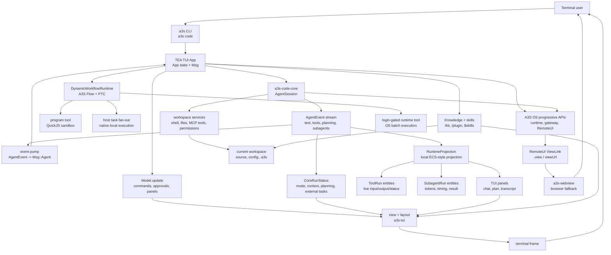

# a3s

The umbrella CLI for the [A3S](https://github.com/A3S-Lab) platform.

`a3s <tool> [args...]` runs the matching A3S product. Code is included in the
main `a3s` installation. Box, Bench, Search, and Use are separately released
components. Box and Use may be installed visibly on first real use; every
optional component can also be prepared explicitly.

```
a3s code                       # launch the included A3S Code TUI
a3s box ps                     # run Box, installing it on first real use
a3s up -d                      # converge the local Compose application with Box
a3s ps                         # list services in the local Compose application
a3s compose exec api -- sh     # use the complete Box Compose command namespace
a3s bench run ./tasks/smoke --agent codex
a3s search doctor              # run the registered Search product
a3s use browser open https://example.com
a3s use box compose up -d      # route through Use to the one managed Box
a3s list                       # list registered components and external tools
a3s install use                # install or repair a registered component
a3s upgrade use                # upgrade one managed component
a3s uninstall use              # remove component-owned files
a3s --version
```

Headless search browsers are execution dependencies of the embedded
`a3s-search` library. In the **Code CLI product profile** (`scientific`, which
includes `headless-search`), Moli is the default `web_search` headless backend
and is discovered from the package or downloaded once into the shared Code
cache on first headless use (`auto_download_moli`). Core's crate `default`
feature (`local-code`) does **not** enable headless Moli — SDK embeds must opt
into `headless-search` / `scientific` for the same contract. Chrome and
Lightpanda remain explicit compatibility backends:

```bash
a3s search engines
a3s search doctor
a3s search browser install chrome
a3s search browser update chrome
a3s search browser repair lightpanda
```

The bundled Code Core 8.4.0 runtime uses a structurally gated cascade for
`web_search`: the Moli headless tier runs first, followed by HTTP/RSS and
native API fallbacks while retrieval requirements remain unmet. Configure the
`search.engine` entries in `config.acl` to replace the built-in selection,
including an explicit `anysearch { enabled = true }` entry when desired.
AnySearch can use `ANYSEARCH_API_KEY` when set. A failure or empty result from
any selected engine enters the same bounded fallback policy; quota exhaustion
and other provider failures remain visible in structured search metadata.

Moli is the default JavaScript-capable backend. Release archives bundle the
target-specific executable beside the CLI; source and Cargo installs resolve
the same pinned, digest-verified runtime from the shared per-user cache on
first use. The cache is process-safe and shared by local Code processes, so
multiple `a3s` installations do not download duplicate copies. Chrome and
Lightpanda remain explicit compatibility backends. `a3s search doctor` reads
the same project-local or user-global `config.acl` selected by `a3s code`,
reports the active backend and cache status, and returns an actionable install
or repair command when a configured backend is unavailable.

## Install

```sh
# from crates.io
cargo install a3s

# or from source
cargo install --git https://github.com/A3S-Lab/CLI

# or Homebrew
brew install A3S-Lab/tap/a3s
```

The initial installation always contains the umbrella CLI and A3S Code. It does
not download Box, Bench, Search, or Use. Published release archives also carry
the target-specific Moli sidecar and the native `a3s-webview` companion, so
the default Code search path and RemoteUI are immediately self-contained.
Source and Cargo installations retain lazy, digest-verified provisioning for
those companions, while every product still has one public entry point under
`a3s`.

Official installers and Homebrew install `a3s-webview` next to `a3s` from the
same release archive. It owns RemoteUI windows. If a source or Cargo
installation does not have that helper, RemoteUI falls back immediately to the
browser; this does not prevent the TUI from starting.

### Components and delayed installation

The built-in catalog registers `code`, `box`, `bench`, `search`, and `use`.
Browser, native Office, and OCR are capabilities owned by Use:

| Component | Installed with `a3s` | Public command | Installation behavior |
| --- | --- | --- | --- |
| Code | Yes | `a3s code ...` | Runs directly from the main `a3s` installation. |
| WebView | Yes | `a3s-webview` (companion) | Ships beside `a3s` in official installers and Homebrew; owns native RemoteUI windows. |
| Box | No | `a3s box ...` | Installs Box on first use, then forwards the arguments to it. |
| Bench | No | `a3s bench ...` | Requires an explicit compatible Bench installation. |
| Search | No | `a3s search ...` | Requires an explicit compatible Search installation. |
| Use | No | `a3s use ...` / `a3s code` | Installs Use on first real use, including TUI startup when policy allows, then forwards or projects native Browser, Office, OCR, Box, or extension surfaces. |
| Use/Browser | With Use | `a3s use browser ...` | Reports Browser provider readiness through Use; it is not a second product archive. |
| Use/Office | With Use | `a3s use office ...` | Delegates OfficeCLI readiness and explicit installation through Use. |
| Use/OCR | With Use | `a3s use ocr ...` | Projects the built-in local PP-OCRv6 tools and Skill; install or repair its pinned models with `a3s install use/ocr`. |

First-use installation for opted-in components is persistent and user-wide. After a component has been
installed, subsequent commands reuse it; changing projects does not download it
again. Bench validates a downloaded bundle before switching its active-version
record, so a failed Bench download or validation is not reported as installed.
Run `a3s list` at any time to inspect local state without installing or updating
anything.

Help and version probes are read-only as well. If Box or Bench is missing,
`a3s box --help`, `a3s bench --help`, their nested `--help` forms, and
`--version` report wrapper/component status without triggering delayed
installation. The missing-component Bench help still shows its four normal
commands and explicit local-path rule. Once installed, those arguments are
forwarded to the component for command-specific help.

For example, a new user can start Code immediately and let the other products
arrive only when needed:

```sh
a3s code
a3s box ps
a3s install bench
a3s bench run ./tasks/smoke --agent codex
```

The first `a3s box ...` command resolves or installs Box. Bench and Search
require explicit installation so an evaluation or search command never starts
an unplanned download. Users still type `a3s bench`; its private executable is
not installed as another public command on `PATH`.

### Compose applications

`a3s compose` is the canonical multi-service application namespace. It resolves
the registered Box component and forwards the remaining arguments without a
shell or a second Compose parser:

```sh
a3s compose config                  # discovers compose.acl first
a3s compose up -d
a3s compose exec api -- sh
a3s compose down --volumes
a3s compose -f compose.yaml config # explicit YAML remains supported
```

The everyday project commands also have concise top-level forms:

```sh
a3s up -d
a3s ps
a3s logs --follow api
a3s down --volumes
```

These are exact routes to `a3s-box compose up|ps|logs|down`; project discovery,
service state, networks, volumes, health checks, and rollback remain owned by
Box. The global `-C/--directory` option selects the Compose project directory.
Because the route is transparent, newly shipped Box Compose subcommands become
available under `a3s compose` without a matching umbrella CLI release. The
canonical `compose.acl` schema, validation, environment resolution, and YAML
compatibility are all implemented once by Box.

The Bench control component compiles and locks tasks, plans trials, coordinates
evaluation, and produces scores and reports. It does not execute an Agent.
Candidate and Judge Agent Assets are both executed by A3S OS Runtime, which is
the sole Agent execution layer. This keeps sandboxing, credentials, model
access, resource limits, and execution evidence in the shared OS Runtime rather
than duplicating execution infrastructure in the control component.

### Explicit component installation

Use `a3s install` to prepare a component before its first use, for example on a
CI runner or before going offline:

```sh
a3s install code
a3s install box
a3s install bench
a3s install search
a3s install use
a3s install webview
a3s install use/browser
a3s install use/office
```

Installation is idempotent. If the requested component is already healthy,
`a3s` reports the available local version and location metadata instead of
downloading it again.

`a3s install code` reconciles the Code component already delivered by the
running `a3s` executable; it does not create a second `a3s-code` installation.
Moli is a Code-owned runtime rather than a separately registered component:
release archives carry it beside the CLI, while source/Cargo installs use the
shared digest-verified cache and a cross-process lock. There is therefore no
`a3s install moli` command and no per-project browser copy.
The very first installation of `a3s` itself must still be performed with Cargo,
Homebrew, or another supported system installer as shown above.

`a3s install box` performs the same installation that `a3s box ...` would
trigger automatically. `a3s install bench` downloads and validates the private
Bench control component without running a benchmark. This is the preferred
preparation step for machines whose benchmark run will not have network access.

The Bench repository currently publishes the canonical design and fixtures but
not a compatible control-component release. Until that release exists,
`a3s install bench` and direct `a3s bench ...` use fail with an explicit
diagnostic that the control component is not published and do not create an
installed-component record. Bench does not opt into first-use installation.

### Signed extension registries

External Use domains can be resolved from explicitly trusted TUF registries.
No Registry source is implicit. The CLI never invents or silently accepts a
replacement root. Add a named source with a pinned SHA-256 and optionally
import the exact root file:

```sh
a3s registry add packages https://packages.example.org/a3s/ \
  --root-sha256 <root-sha256> \
  --trusted-root ./root.json \
  --yes
a3s registry refresh packages

a3s --output json install use/acme/research --dry-run
a3s --output json install use/acme/research \
  --plan-digest <reviewed-plan-sha256>

a3s --output json upgrade use/acme/research --dry-run
a3s --output json upgrade use/acme/research \
  --plan-digest <reviewed-upgrade-sha256>
```

Root files are copied beneath the Use-owned
`state/use/registry-trust-roots/sha256/<digest>.json` path and checked against
the recorded digest whenever configuration is loaded. The canonical source
document is `state/use/registries.acl`; active CLI config selection never
creates another Registry state. A
digest-only registry bootstraps from `<registry>/metadata/root.json`; the root
is cached only after its bytes match the pin. `registry refresh` performs full
TUF root, timestamp, snapshot, and targets verification, including expiration
and rollback checks. It does not use a reachability-only `HEAD` request and does
not download package targets.

Install planning starts from the selected `--registry-name` or the configured
default, then uses the other enabled sources only for dependency resolution.
No match is an error, and the same package resolving from more than one trusted registry is
rejected as ambiguous. Cognitive-package installs accept only signed targets
from these explicitly trusted registries. There is no unsigned or local-package
installation bypass. Registry URLs must use HTTPS, except loopback HTTP used by
the hermetic test suite.

A cognitive-package upgrade reads the complete source provenance from the
installed Use receipt and queries only that registry and release channel. It
refuses a removed registry, a changed URL or trust root, and a semantic-version
downgrade. `a3s upgrade --all` includes eligible signed Registry packages.
Plain `a3s upgrade` includes newer signed targets in its update listing. When
verified metadata resolves to the already installed target, the operation
converges without downloading the archive or publishing a new activation.

### Reviewable component plans

Installation, upgrade, and uninstall support an immutable review/apply guard:

```sh
a3s install box --source release --dry-run --json
a3s install box --source release --plan-digest <reviewed-sha256> --json

a3s upgrade box --dry-run --json
a3s uninstall box --purge --dry-run --json
```

The dry-run result contains `planSchemaVersion`, `planCommand`, `planDigest`,
and the ordered `plans` array. The digest covers the requested operation and
flags, target platform, current component state and normalized receipt,
operation order and every exact GitHub release version, asset URL, asset name,
and SHA-256 selected during resolution. For cognitive packages it also covers
the registry name and URL, pinned root, all TUF metadata versions, package
version and channel, platform target, target path, archive length and SHA-256,
complete catalog-v3 record, exact dependency lock, and every signed executable
planning target. Presentation text is deliberately excluded.

A release dry-run reads release metadata and, when necessary, its checksum
file. It never downloads the component payload or changes component state. An
apply with `--plan-digest` resolves the plan again and fails with
`component.plan_mismatch` before payload download or mutation when anything
covered by the digest changed. Once accepted, the installer consumes the exact
resolved artifact from that plan instead of performing another `latest`
lookup.

Cognitive-package dry-runs verify metadata without downloading the archive. On
apply, the umbrella digest is checked first; `a3s` then passes the exact
resolved package, complete dependency lock, planning bundles, and inner
registry-plan digest to A3S Use in-process. Use repeats TUF verification before
target download, so a repository change between the outer check and payload
fetch also fails without activation.

`--plan-digest` and `--dry-run` are mutually exclusive. Homebrew plans bind the
formula, operation, flags, and current receipt, but Homebrew remains responsible
for selecting and installing its current bottle; use `--source release` when an
exact A3S release artifact must be bound by the digest.

### Durable component batches

Mutating `install`, `upgrade`, and `uninstall` batches are serialized by one
cross-process batch lock. After the operation plan has been resolved and any
expected digest has been verified, A3S writes an active journal before the
first component mutation. Every component success or failure is then
checkpointed with an atomic write and filesystem sync.

If the process or machine stops during a batch, rerunning the same action with
the same ordered component list resolves and verifies a fresh plan. A3S does
not replay a stale download plan. Instead, it validates every completed
checkpoint against current component presence, health, version, provenance,
and executable path. A still-applied checkpoint is skipped and appears in JSON
output with `"recovered": true`; a checkpoint whose state has drifted is
executed again through the normal idempotent lifecycle path. Duplicate
component IDs are rejected before locking or mutation.

Batch recovery preserves the existing partial-success contract: completed
components are not rolled back when another component fails. Normal failed
batches are finalized as failed; only an interrupted active batch is eligible
for checkpoint recovery. Journals live below the resolved A3S state root:

```text
component-operations/active.json
component-operations/last.json
component-operations/last-interrupted.json
```

The directory and files use private permissions on Unix. Invalid, oversized,
or symbolic-link active journals fail closed instead of being ignored.

### Listing installed components

```sh
a3s list
```

The list distinguishes bundled Code, optional product components, delegated
Use capabilities, and explicitly installed external Use domains. It reports
whether each entry is installed, missing, disabled, or broken. For
an installed component it includes version metadata when it can be read without
executing the component, plus its source and executable location. A Box found
on `PATH` can therefore show `-` for version: `a3s list` deliberately does not
run third-party commands just to probe them. Other executable `a3s-*` tools
found on `PATH` remain visible as additional tools; they are not treated as
managed A3S product components.

`a3s list` is a local inspection command. It does not contact a release server,
install a missing component, or update an installed one.

### Bench control-component files and project state

The Bench control component and benchmark project data have different lifetimes
and must not be mixed:

```text
~/.a3s/components/bench/   user-wide, versioned Bench control component
<project>/.a3s/bench/      locks, plans, attempts, evidence, and reports for one project
```

The global `~/.a3s/components/bench/` directory is owned by the component
manager and shared by every workspace. It contains validated versioned payloads
and the active-version record used by `a3s bench`. Set `A3S_COMPONENTS_DIR` when
the user-wide component root must live elsewhere; the `bench/` component remains
under that root.

The project-local `.a3s/bench/` directory is owned by the benchmark workflow.
It contains reproducibility locks and run state for that project, not the Bench
control component. Archiving or removing a project's `.a3s/bench/` state does
not uninstall Bench, and updating the global control component does not rewrite
a project's locked task, agent, plan, evidence, or report data. Benchmark
project state always uses `.a3s/bench/`; no separate top-level benchmark state
directory is created.

## Components And A3S Use

The umbrella CLI owns the catalog and delegates domain-specific runtimes to
their parent component:

```sh
a3s list --json
a3s install use
a3s install use/browser
a3s install use/office
a3s info use/ocr --sources
a3s doctor use/ocr
a3s uninstall use/office

a3s use capabilities --json
a3s use browser render https://example.com
a3s use browser open https://example.com --session research
a3s use browser snapshot --session research --json
a3s use browser close --session research
a3s use ocr doctor --json
a3s use box compose up --detach
a3s use knowledge usage --json
a3s use knowledge usage --scope-kind workspace --scope-id workspace/acme --json
a3s use knowledge audit --scope-kind workspace --scope-id workspace/acme --json
a3s use knowledge backup ./workspace.a3s-okf-backup --scope-kind workspace --scope-id workspace/acme --json
a3s use knowledge verify-backup ./workspace.a3s-okf-backup --scope-kind workspace --scope-id workspace/acme --json
a3s use knowledge repair-search-index --yes --scope-kind workspace --scope-id workspace/acme --json
a3s --output json plugin disable acme/slack --dry-run
a3s --output json plugin apply <operationId> --plan-digest <sha256> --yes
a3s use extension watch --after-generation 3 --timeout-ms 30000 --json
```

Browser, native Office, and OCR are built-in Use domains. Independently
implemented domains can be explicitly installed from A3S ACL packages that
declare native CLI, standard MCP, and/or `SKILL.md` surfaces. A3S does not
define an extension JSON-RPC protocol; `--json` remains a one-command CLI
result.

The Code TUI treats Use as an asynchronous first-use component: terminal
startup does not wait for Use discovery, download,
installation, or initial projection. Those steps continue in the background
when networking and automatic setup are allowed, and the live registry is
hot-plugged into current and future Code sessions when ready. Offline mode and
`A3S_NO_AUTO_INSTALL=1` remain strict no-mutation boundaries, and a failed or
slow setup does not prevent the TUI from starting. The process keeps one
registry watcher. Browser, Office, OCR, enabled external
MCP/Skill surfaces, installed Flows, and exact promoted OKF projections are
projected into every active Code session. Code registers a dedicated `use`
worker that can
invoke only `mcp__use_*` tools; workspace, shell, unrelated MCP, and recursive
delegation tools are denied. The worker's current capability IDs and purpose are
published in the live `task` definition, so the parent
model can select it without a hard-coded prompt. Application failures do not
fall back to another execution surface, and an Office
`use.office.outcome_unknown` result is never retried automatically. A session
rebuild replays the current surfaces.

Headless Code Exec uses a different lifecycle shape. Ordinary invocations only
reuse an already-ready Use installation and never auto-install it. A required
first-party host invocation prepares one atomic managed-MCP/Skill/Runtime-Task/UI
snapshot, stops its watcher, verifies the final Code catalog receipt and Task
catalog digest against the Use cursor, and only then admits the one-shot Run.
One process-owned Plugin Manager supplies exact-generation Task dispatch and
trusted HTTP MCP route resolution. The TUI remains the owner of long-lived
built-in MCP, compatibility Knowledge, and Flow projection.

Managed OKF packages use a separate read-only session tool,
`use_knowledge_search`; they are not exposed as raw package text or delegated
to the Use worker. The tool appears only while at least one exact projection is
active and searches the current User/Workspace scope through the Use-owned
SQLite/FTS5 adapter. Results retain package, generation, projection, index,
concept-path, and source-digest citations. Before touching SQLite, the carrier
deduplicates projected surfaces by exact package generation and acquires a Use
Registry lease bound to the package digest, manifest digest, and lifecycle
generation. It holds every lease through search and final Registry revision
verification; missing or contradictory generation evidence fails closed, and
an accepted query delays prior-generation retirement until it completes. A
racing cutover is retried once without returning stale results.

`a3s use knowledge usage --json` reports non-secret storage evidence for the
default User scope. Workspace accounting requires `--scope-kind workspace` and
an exact `--scope-id`; the CLI does not guess Workspace identity. The default
Use policy bounds receipt-accounted expanded content, retained projections,
generations per surface, and removal tombstones, and receipt-owned removal
physically compacts SQLite and its WAL.

`a3s use knowledge audit` validates the exact scope's SQLite, foreign keys,
receipts, accounting, identity, and FTS index. `backup <path>` first audits and
then writes a new non-overwriting versioned snapshot; `verify-backup <path>`
checks its bounded manifest, scope, database digest, storage evidence, and FTS
integrity without changing live state. `repair-search-index --yes` can rebuild
only the derived FTS rows after authoritative state has passed validation.
These commands do not restore Registry receipts, package roots, bindings,
journals, Grants, Flow history, or UI state. Coordinated restore is not yet
implemented, and copying a verified snapshot into live state is unsupported.

Inside the TUI, `/use` and `/use status` report background setup progress, the
discovered binary, generation/revision convergence, provider readiness,
built-in MCP connection/tool counts, managed MCP verified/atomic counts,
verified/loaded Skills, ready Flows, and managed OKF projection counts.
`/use repair` waits for an in-flight setup to settle before
printing explicit repair commands, but never executes them. The primary model
does not receive raw `mcp__use_*`
definitions; only the dedicated worker does. Closed-world read-only MCP tools,
including local PP-OCRv6 doctor and extraction, can proceed without another
prompt. Missing annotations, open-world access, mutations, destructive
operations, and submit risk escalate to the parent TUI. Parent denials remain
authoritative.

The TUI derives capability lifecycle labels only from standard MCP progress
emitted by the dedicated `use` worker: Browser progress appears as
`Using Browser` while live and `Used Browser` after completion. Multiple routes
remain ordered and deduplicated, restored task snapshots preserve the same
identity, and raw MCP tool names do not replace the user-facing worker label.

### Platform support

macOS and Linux remain the broad runtime and managed-artifact targets for the
component platform. Windows x86_64 now supports the native WebView managed
release, bundled Moli runtime, and Code first-use installation. A real-process Windows E2E additionally
covers the verified Use ZIP layout, all 31 Browser core-profile tools against
Microsoft Edge, every native Office MCP operation and view, confirmed OfficeCLI
installation, and confirmed PP-OCRv6 model installation plus extraction.
Advanced Browser profiles, persistent-session promotion, and full file-lock
conformance remain roadmap work.

`a3s install` manages registered A3S components; it is not a universal frontend
for Homebrew, APT, DNF, Pacman, Winget, npm, pip, Cargo, or arbitrary package
names. Native package-manager adapters remain ownership-preserving and will be
added only for a registered component with release artifacts and conformance
tests.

## A3S Code TUI

`a3s code` launches the interactive A3S Code terminal UI in the current
workspace. On first launch it creates `~/.a3s/config.acl`; use `/config` to edit
models, provider credentials, and optional paths such as `skill_dir`
and memory/session storage.

A3S Code is a complete agentic workspace. It combines a coding-agent chat loop,
workspace editor, durable context, local skill discovery, OS capability publishing,
Runtime fan-out, RemoteUI views, and engineered automation loops in one terminal
surface.

Use this README as the TUI capability guide:

- [A3S Code CLI Command Examples](#a3s-code-cli-command-examples) shows
  copyable non-interactive command forms and how they map to TUI workflows.
- [Capability Overview](#capability-overview) maps the major product surfaces.
- [Everyday Capability Paths](#everyday-capability-paths) explains how those
  surfaces fit together during real work.
- [Inside The TUI](#inside-the-tui) explains the interactive transcript,
  input modes, panels, and keyboard model.
- [Code Intelligence](docs/code-intelligence.md) documents saved-file symbols,
  navigation, diagnostics, language prerequisites, and TUI behavior.
- [Startup, Sessions, And Safety](#startup-sessions-and-safety) covers launch,
  resume, confirmation, and smoke validation.
- [Effort Profiles](#effort-profiles) explains how `/effort` changes reasoning,
  tool rounds, continuations, and `ultracode`.
- [Dynamic Workflows](#dynamic-workflows) separates `DynamicWorkflowRuntime`
  from OS Workflow as a Service (Desktop / OS control plane).
- [OS, Runtime, and RemoteUI](#os-runtime-and-remoteui) shows what `/login`
  unlocks, including the login-gated `runtime` tool.
- [Core Command Reference](#core-command-reference) lists the everyday TUI
  commands that are not tied to an asset family.
- [Agents, Research, and Loops](#agents-research-and-loops) lists the detailed
  command forms for assets, DeepResearch, and engineered loops.

### A3S Code CLI Command Examples

`a3s code` is both the interactive TUI entry point and a small non-interactive
CLI for the same asset, model, knowledge, research, and OS surfaces. The CLI
forms are useful in scripts, release checks, terminals without a full-screen UI,
and docs that need reproducible examples. Commands that read or mutate OS
resources require `a3s auth login os`; local discovery, config, memory, KB, and
review prompts keep working without an OS session. Root-owned reads support
`--output json`; use JSON rather than scraping human tables.

Start, resume, and update the TUI:

```sh
a3s code                         # launch the TUI in the current workspace
a3s code --worktree              # isolated .a3s-worktrees checkout, then TUI
a3s code --worktree feature-x    # same with an explicit branch/path identity
a3s code resume                  # resume the newest saved TUI session here
a3s code resume 018f-session-id  # resume a specific saved session
a3s self update                  # update the a3s executable
```

Run one non-interactive coding task:

```sh
a3s code exec --mode auto "Update the focused test and verify it"
a3s code exec --mode plan --tool-policy read-only "Review this workspace"
a3s code exec --mode auto --tool-policy workspace-write "Apply the requested source edits"
a3s code exec --force "Ship the change without confirmation prompts"
a3s code exec --yolo --tool-policy workspace-write "Apply edits without HITL pauses"
a3s code exec --web-search enabled "Compare the current published guidance"
a3s code exec --mode auto --tool-policy local-workspace --model provider/model "Fix this offline task"
a3s code exec --image before.png,after.png "Compare these screenshots"
a3s --output json code exec --mode auto --prompt-file ./task.md
```

`--force` (alias `--yolo`) matches force mode: tool calls that would normally
`Ask` are allowed automatically. Critical rule denials, protected paths,
catastrophic shell, and leaving the verified sandbox stay denied. It is
incompatible with `--mode plan`. Write-capable closed tool policies accept
`--force`/`--yolo` as an alternative to `--mode auto`.

Ordinary `code exec` performs installed-only A3S Use discovery. It never
downloads Use or mutates component state: a missing installation leaves
`capabilityRuntime` null, while a compatible installation publishes one atomic
managed-MCP/Skill/Runtime-Task/UI generation and returns its frozen evidence.
An incompatible optional runtime can be skipped only after its watcher has
stopped and both the Session capability catalog and dynamic-tool names are
proven unchanged; otherwise execution fails closed.

Desktop and other first-party process hosts use the reserved
`--capability-runtime scoped-v1` negotiation flag. That mode requires Use to be
ready before the first provider call and may perform the normal policy-bounded
first-use installation. Offline mode and `A3S_NO_AUTO_INSTALL=1` therefore fail
with `capability-runtime.unavailable` when Use is missing, without component or
model network I/O. Cancellation during setup returns `operation.cancelled`.
A successful JSON or JSONL result carries:

```json
{
  "capabilityRuntime": {
    "schema": "a3s.code.scoped-capability-runtime.v1",
    "ready": true,
    "codeCatalog": {
      "generation": 1,
      "digest": "sha256:..."
    },
    "useSnapshot": {
      "schema": "a3s.use.capability-snapshot-cursor.v1",
      "generation": 7,
      "revision": "...",
      "registryRevision": "sha256:...",
      "packageCount": 2
    },
    "mcpCount": 1,
    "skillCount": 4,
    "runtimeTasks": {
      "count": 2,
      "digest": "sha256:..."
    },
    "uiCount": 2
  }
}
```

The short-lived watcher is stopped before Run admission, so those receipts
cannot race a later Use cutover. This scoped host projects managed MCP, Skill,
Runtime Task, and UI values in one Core batch. The same trusted ACL composes one
Plugin Manager, and that Manager remains alive through Session teardown so an
accepted `use_tool_*` call reaches the leased exact-generation dispatcher and
an admitted HTTP MCP surface resolves only opaque provider/reference/path
evidence to a credential-free numeric loopback route. A missing named provider
omits only that Task and emits a warning. This host does not start built-in MCP,
compatibility Knowledge, Flow, or Plugin Manager presentation surfaces. Closed
automation profiles hide Runtime Tasks, and a standard non-interactive
invocation never auto-approves a Task that requires confirmation. Code closes
the Session and projected clients before bounded Runtime/Gateway shutdown.

Auto mode runs bounded workspace reads and edits without hidden prompts while
retaining the shared safety floor. Operations that still require human
approval, such as unbounded shell commands, terminate immediately in this
non-interactive surface with a nonzero `approval.required` result. Default and
plan modes never silently approve workspace mutations.

`--tool-policy read-only` and `workspace-write` are closed automation profiles.
They do not expose shell, Git, delegated tasks, runtime or package execution,
MCP, download, or Knowledge tools; any unknown future tool is denied. Web
search/fetch stays hidden by default and is admitted only when the caller adds
`--web-search enabled`.
`workspace-write` is valid with `--mode auto` or `--force`/`--yolo` and adds bounded native file
write/edit/patch operations while rejecting repository and agent control
metadata. Successful JSON and JSONL results echo the effective `toolPolicy` and
`webSearch` preference so an automation host can verify both boundaries.

`local-workspace` is a separate deny-by-default profile for unattended local
coding. It requires `--mode auto` or `--force`/`--yolo` and retains bounded
workspace reads and edits, Code Intelligence, structured local Git, and
governed batch, program, task, parallel-task, dynamic-workflow, and Skill
execution. Web search/fetch remains denied unless `--web-search enabled`
explicitly admits those two governed network-read tools; download, Runtime,
Knowledge, managed Tool, MCP, and unknown dynamic tools remain hidden and denied. Bash is exposed only after
the A3S-owned native sandbox passes its capability probe, cannot request host
escalation, and runs with the sandbox's empty network allowlist. Nested task and
Skill runs inherit the same live checker and sandbox. The structured Git tool
does not implement fetch, push, pull, or clone.

`--web-search auto|enabled|disabled` is independent from planning mode and
workspace tool policy. `auto` preserves the selected policy's legacy behavior,
`enabled` exposes governed `web_search` and `web_fetch` reads, and `disabled`
hides and denies both for the entire run even when task wording requests the
Web. This flag does not enable download, arbitrary HTTP tools, Runtime, MCP, or
shell networking.

Run audited L1 engineered loops on a local background cadence:

```sh
a3s code schedule list
a3s code schedule enable daily-triage --every 1d --model deepseek/deepseek-v4-flash
a3s code schedule run daily-triage
a3s code schedule status
a3s code schedule notifications
a3s code schedule disable daily-triage
a3s code schedule stop
```

`enable` validates the real loop contract and its denylist, persists
`schedule.json` beside the loop, and starts one detached worker for the
workspace. `run` queues one immediate execution through that same worker.
Claims are atomic and at most once: missed recurring intervals advance to the
next cadence rather than replaying a backlog, and a worker restart records an
uncertain active run as interrupted instead of repeating its possible effects.
The TUI automatically starts the worker when it opens a workspace with enabled
schedules; after an operating-system reboot, opening the TUI or running
`a3s code schedule start` resumes processing.

Scheduled runs use an internal, hidden `scheduled-report` profile. It allows
bounded native reads, `git status` and `git log`, and writes only the selected
loop's `STATE.md`, `RUN_LOG.md`, and descendants of `reports/`. It denies shell,
Web/network, Runtime, delegated work, package/Skill/MCP tools, unknown tools,
the active ACL configuration, credential paths, and the loop denylist. Each run
stores bounded stdout/stderr plus a structured result under the loop's `runs/`
directory. Completion notifications remain pending until the TUI displays them
or `schedule notifications` renders them successfully, then move to a durable
delivered log.

`code exec -i/--image` accepts repeated flags and comma-separated paths. PNG,
JPEG, GIF, and WebP inputs are detected from their bytes, decoded under bounded
resource limits, and retained in argument order. An image-only turn is valid.
Configured models must set `attachment = true` or include `"image"` in
`modalities.input`; unsupported account CLI transports fail before launching a
provider process instead of discarding the image.

Durable memory extraction may attach a validated, LLM-authored
`a3s.evolution.signal.v1` description for a reusable preference, Skill, or OKF
knowledge package. Code never promotes ordinary memory through keyword
matching. It aggregates matching evidence across sessions and can automatically
materialize a conflict-free local asset only after the stricter recurrence,
session, confidence, importance, and explicit-signal thresholds are all met.
Nothing is published automatically. The `/evolution` panel lists evidence-backed
candidates, rescans the durable store, supports explicit save, reject, and
reconsider decisions, and rolls back immutable versions while preserving a
recovery copy. Rolling back to the baseline removes the active
asset without deleting its versions, so it can be restored later. Active
preferences are injected into bounded system-prompt context and active Skills
are loaded from the workspace Skill directory. The TUI keeps an activation
barrier until every affected live session has refreshed successfully.

The TUI `/ide` editor and the agent share native Code Intelligence for
saved-file symbols, definitions, declarations, references, implementations,
and diagnostics. Dirty editor buffers remain local and explicitly label
semantic results as based on the saved version. The agent receives the
same read-only capability through `code_symbols`, `code_navigation`, and
`code_diagnostics`; existing `read`, unified `search` (grep mode), `edit`, and
`patch` tools remain the only source and mutation paths. See the
[Code Intelligence guide](docs/code-intelligence.md) for commands, keyboard
actions, and language executables.

Inspect and create `config.acl`:

```sh
a3s config path                       # print the active config path
a3s config init                       # create the user config
a3s config init --scope workspace     # create .a3s/config.acl
a3s config show                       # print a redacted effective summary
a3s config validate                   # validate the effective A3S ACL
a3s config edit --scope workspace     # open VISUAL/EDITOR, or print the path
a3s config paths                      # print config, asset, memory, KB, and OKF paths
```

### Workspace semantic retrieval

Semantic and hybrid workspace search can use an asynchronous, session-bound
in-memory vector index. It does not start a vector database, write vectors to
disk, or serialize them into a session snapshot. A fresh or resumed session
rebuilds from the current admitted workspace; closing or replacing the session
cancels indexing and releases its vectors. Exact, glob, incremental BM25, and
Code Intelligence paths remain available while semantic coverage is building
or degraded.

The CLI host always attaches the manifest-backed lexical chunk catalog (and
best-effort persistent zvec FTS under `.a3s-code/index` when the native feature
is available) before workspace services attach. Semantic/embedding retrieval is
optional and independent: enable `workspace_retrieval` only when you want
in-memory vectors. `search` `bm25` cold-starts on the portable catalog scorer
and switches to the durable zvec generation once ready, without changing the
tool contract. With a custom chunking strategy under `workspace_retrieval`, the
host configures that strategy exactly once; otherwise default line chunking is
used. CLI and TUI sessions reuse the catalog for the same workspace, but
per-session options contain no catalog override: each Code session still
builds, owns, and closes its own in-memory semantic projection.

Remote embedding sends admitted source chunks outside the machine. Enabling it
therefore requires two explicit gates in a trusted user ACL or a file selected
with `--config`:

```acl
workspace_retrieval {
  enabled = true
  allow_source_egress = true

  # This is an embedding route, independent from the default chat model.
  model = "openai/text-embedding-3-small"
  dimension = 1536
  normalization = "none"

  # Optional. Otherwise the effective provider/model baseUrl is extended with
  # /embeddings. Non-loopback endpoints must use HTTPS.
  # endpoint = "https://api.openai.com/v1/embeddings"

  provider_timeout_ms = 30000
  max_records = 100000
  max_bytes = 134217728
  shutdown_timeout_ms = 5000

  # Optional event-driven barrier for a query that races an in-flight semantic
  # generation. Zero preserves immediate lexical fallback; the hard maximum is
  # 30000. Session construction always remains asynchronous.
  semantic_readiness_timeout_ms = 0

  # Optional. Omit this typed block to preserve line chunking.
  chunking {
    recursive {
      target_bytes = 8192
      overlap_bytes = 512
      separators = ["\n\n", "\n", ". ", " "]
    }
  }

  # Optional. Omit this typed block to preserve RRF-only.
  deterministic_reranker {
    enabled = true
    max_candidates = 100
    max_feature_bytes_per_candidate = 4096
    max_fingerprints_per_candidate = 128
    max_scratch_bytes = 4194304
  }
}
```

The provider name must exist in `providers`; the embedding model ID does not
need to be listed as a chat model. Provider/model `apiKey`, `baseUrl`, and
static headers are resolved by the host. HTTP redirects are not followed,
successful response bodies are bounded, provider error bodies are discarded,
and credentials and full endpoints are excluded from debug/status output.
OpenAI-compatible `/embeddings` responses are supported by the initial host
adapter.

Local CPU embedding is a mutually exclusive trusted route. It requires an
`a3s` binary built with `local-cpu-embedding`, but it does not require
`allow_source_egress`, a remote provider, or a rerank model:

```acl
workspace_retrieval {
  enabled = true
  semantic_readiness_timeout_ms = 30000
  max_records = 100000
  max_bytes = 134217728
  shutdown_timeout_ms = 5000

  local_cpu {
    intra_threads = 2
  }
}
```

With no `artifact_manifest`, A3S Power provisions the revision-locked
`Xenova/all-MiniLM-L6-v2` ONNX bundle on first runtime use. Downloads are
bounded, HTTPS-only, SHA-256-admitted per file, serialized across processes,
and atomically committed below the A3S data root. Later sessions re-verify and
reuse the same files without network access. `--offline` and
`A3S_NO_AUTO_INSTALL=1` fail before mutation when that bundle is absent. In the
interactive TUI that failure degrades asynchronous semantic indexing after the
first frame while exact/BM25 search remains available; `code exec` reports it
during eager one-shot preparation.
`a3s config validate` validates this managed configuration without downloading
or writing anything, while `a3s config show` reports
`localCpuArtifactMode`, `localCpuArtifactsReady`, and the locked revision.

Enterprises can retain a self-managed bundle explicitly:

```acl
local_cpu {
  artifact_manifest = "models/multilingual-mini/model.acl"
  intra_threads = 2
}
```

That path is resolved relative to the trusted ACL. Configuration validation
verifies its manifest shape, containment, regular-file policy, size limits,
and every artifact SHA-256 before launch. Both modes repeat admission on first
load, so post-validation substitution fails closed. Model loading is lazy and
executes on a bounded blocking pool; one content-compatible model, one native
inference job, and two inputs per executor microbatch are admitted per process.
See
[Local CPU workspace embedding](local-cpu-workspace-embedding.md) for the
versioned manifest contract, platform matrix, and operational limits.

`chunking` is a mutually exclusive typed block. It contains exactly one
`line {}`, `fixed_window { ... }`, or `recursive { ... }` child and does not
accept a primitive `strategy` field. Omission and an explicit `line {}` both
select compatibility line chunking. Fixed and recursive blocks require
`target_bytes`; `overlap_bytes` defaults to zero. Targets are limited to
4–65,536 UTF-8 bytes and overlap must be smaller than the target. A recursive
`separators` list is optional; when present it must contain 1–16 unique,
non-empty strings of at most 64 UTF-8 bytes without NUL. Omitting the list uses
the pinned Core defaults, while an empty list is invalid. Unsupported/custom
strategy blocks, mixed typed children, unknown fields, and workspace-layer
overrides fail before provider resolution or source egress. Arbitrary custom
splitters remain available only to trusted Rust hosts. Only admitted text files
are split and embedded; non-text files stay outside this retrieval pipeline and
belong to the separate knowledge-compilation path.

`deterministic_reranker` is a typed, default-off host option. It applies the
bounded `rrf_k60+deterministic_mmr_v1` second stage without a neural runtime or
additional remote call. Every limit is checked against the pinned A3S Code
contract before the provider route is resolved or the workspace catalog starts.
The block requires an explicit `enabled` boolean so a later trusted layer can
return to RRF-only with `enabled = false`. Raw `mode` and `algorithm` fields,
unknown fields, duplicate blocks, and out-of-range limits fail validation. An
automatically discovered workspace ACL cannot add or alter this block.

An automatically discovered workspace `.a3s/config.acl` is untrusted for
source egress. Its only accepted retrieval block is:

```acl
workspace_retrieval { enabled = false }
```

Provider credentials, base URLs, and headers used by retrieval are also
resolved only from the trusted user/explicit layer. A workspace provider block
may still configure the agent's ordinary model route, but it cannot indirectly
reroute an inherited embedding grant.

Use `a3s config validate` before launch. The TUI footer distinguishes building,
partial, ready, degraded, and closed state with a cached readiness chip; the
disabled state stays hidden to preserve footer space. `/status` refreshes the
snapshot immediately and reports indexed/eligible files, chunks, queue depth,
failed files and attempts, vector records/bytes, catalog/source/vector
revisions, embedding identity/dimension, document inputs and bytes, logical
batches, provider requests versus their lower bound, request amplification,
time to first ready, and the non-text admission count. The heartbeat updates
the cache every 280 ms, so the 120 FPS render path never clones the full Core
status.
`a3s config show` additionally reports whether the local CPU route is
available, a null or stable non-sensitive unavailable reason, the effective
embedding batch-input limit, the selected backend, the semantic-readiness
timeout, the effective chunking strategy,
target/overlap, explicit separators or Core-default state, requested rerank
mode, versioned algorithm, active state, and non-sensitive resource limits.
JSON/JSONL `a3s code exec` results include the structured
`workspaceRetrieval` field. These projections
never contain source text, vectors, credentials, or endpoints.

The embedding route is deliberately independent from `default_model`. For
example, `.a3s/config.acl` may use DeepSeek for the agent's chat/tool loop while
a local deterministic or separately admitted provider supplies embeddings.
The host never sends source code to a DeepSeek chat endpoint merely because it
is the active model. Architecture, ownership, delivery gates, and performance
budgets are maintained in the
[A3S Code Workspace Retrieval roadmap](https://github.com/A3S-Lab/Code/blob/main/ROADMAP.md#6-workspace-retrieval-program).
The separate
[ACL-host evaluation](workspace-retrieval-evaluation.md) documents the
first-principles adversarial plan, real DeepSeek reproduction command, quality
metrics, resource accounting, cross-file batching result, and subsequent
cross-SDK real-model qualification. It also records the production host run in
which a revision-locked multilingual Sentence Transformers model crosses the
same OpenAI-compatible HTTP adapter, reaches the in-memory index, and supports
the real DeepSeek completion loop.

Sign in to A3S OS and check account state:

```sh
a3s auth login os              # open the configured OS OAuth login flow
printf '%s' "$A3S_OS_TOKEN" | a3s auth login os --token-stdin
a3s auth status os             # show OS endpoint, account, and expiry
a3s auth logout os             # remove the stored OS session
```

Inspect managed and externally owned account sources without copying OAuth
credentials into `config.acl`:

```sh
a3s auth list
```

Claude Code, Codex, Kimi, and WorkBuddy continue to own their login flows and
local credential stores. The A3S CLI only reports whether those accounts are
available; `a3s auth login/logout` manages the configured A3S OS session.

Model routes use one catalog shared by the root CLI and the Code TUI. Custom
provider models come from `config.acl`; Claude Code, Codex, Kimi, WorkBuddy,
and A3S OS models remain bound to their product-owned credentials:

```sh
a3s model list
a3s model current
a3s model use openai/my-model
a3s model use claude-code/claude-opus-4-6
a3s model use codex/gpt-5.2-codex
a3s model use kimi/k3-agent
a3s model use workbuddy/glm-5.1
a3s model use a3s-os/my-model
a3s model use openai/gpt-5 --scope workspace
a3s model reset --scope user
```

`a3s model use` validates the route and updates `default_model` in the selected
A3S ACL layer while preserving unrelated ACL text. `--config` always targets
that explicit file; otherwise `--scope user|workspace` selects the layer. No
Claude, Codex, Kimi, WorkBuddy, or A3S OS token is copied. Selecting a route
probes only that credential source; `model list` refreshes independent account
catalogs concurrently.

List runtime-callable models:

```sh
a3s model list
a3s model current
```

The model commands list `config.acl` models, local Claude/Codex/Kimi/WorkBuddy
account models, and signed-in OS gateway models from the unified gateway.
Codex uses its current account catalog with its cache as an offline fallback;
Kimi discovers models from Kimi Desktop or Kimi Code account state, and
WorkBuddy discovery uses its installed CodeBuddy CLI. These runtime routes are
not digital asset repository entries whose category happens to be `model`.

Asset authoring CLI surfaces (`a3s code agent|mcp|skill|flow|okf`) and the
matching TUI slash commands were removed. Publish and deploy those OS asset
families from Desktop / the OS control plane. Local skill discovery for
`/plugin` and `$` mentions remains.

Manage local knowledge, context history, and memory:


```sh
a3s code kb stats
a3s code kb add "Release notes should mention the gateway model split."
a3s code kb import docs/
a3s code kb search "gateway model split"
a3s code kb vault

a3s code ctx search "RemoteUI view link"
a3s code ctx show 01HVEXAMPLEEVENT --window 8
a3s code ctx session 018f-session-id

a3s code memory list
a3s code memory list "database migration"
a3s code memory stats
a3s code memory dir
a3s code mem list "preference" # alias for memory
```

`/ctx <n>` attachment and `/ctx save <n>` memory promotion are interactive TUI
state, so the CLI exposes the durable `search`, `show`, and `session` forms
instead of pretending to attach context to a running transcript. Interactive
search never performs an implicit index refresh. The local `ctx` child runs
with null stdin, a dedicated process group, a 15-second deadline, and a 2 MiB
combined-output ceiling; parsed identifiers, titles, providers, and snippets
are sanitized and length-bounded before they reach the transcript. A selected
window is quote-prefixed as untrusted historical material and limited to 6,000
UTF-8 bytes before one-shot prompt attachment.

Inspect local process activity:

```sh
a3s code top
a3s code top --json
```

Run bounded DeepResearch without opening the TUI:

```sh
a3s code research --web "compare Tokio and async-std"
a3s code research --local-only "summarize the repository architecture"
```

`--web` and `--local-only` set the evidence scope explicitly and override
phrasing inside the query. The global `--offline` option also forces
local-only evidence; combining it with `--web` is rejected. DeepResearch has
one host-managed runtime and exposes no runtime-selection route.

Headless CLI and TUI use `CodeDeepResearchRunner` with the typed
`a3s-deep-research` request, result, event, and cancellation contracts. The
runner creates an isolated read-only `AgentSession`; local-only mode does not
expose Web tools. Every exit path settles or aborts the root task and closes
the isolated session.

Each run writes authoritative artifacts to
`.a3s/research/artifacts/<run-id>/report.md` and `index.html`, and records its
bounded typed projection at
`.a3s/research/runs/<run-id>/journal-v2.jsonl`. Lifecycle is independent from
publication. A completed run reports exactly one of `synthesized`,
`qualified`, `source_backed`, or `no_evidence`.

RemoteUI and local research reports open from the inline `Open view` action in
the TUI. There is no separate `a3s code view` command.

Inside the TUI, the same surfaces are available through slash commands and
input prefixes:

```text
/help
/status
/model
/effort
/config
/terminal
/checkup
/queue
/history
/tasks
/permissions
/ide
/login
/relay
/loop init release-gate ci-sweeper
/loop run release-gate
? research how the OS gateway discovers runtime models
! cargo test --all-targets
@src/main.rs
```

### Capability Overview

| Area | What A3S Code TUI provides |
| --- | --- |
| Coding loop | Chat with the coding agent, stream semantic tool cards, choose Default, Plan, or Auto execution, inspect the current session and token budget with `/status`, control pending follow-ups with `/queue`, and inspect or safely cancel delegated work with `/tasks` or `Ctrl+B`. Run direct shell turns with `!`, run a durable Ultracode `/goal`, and fork, rewind, or clear sessions when needed. `/relay` pins the current session, searches a bounded 64-row catalog per source, preserves semantic selection across refreshes, shows saved state, model, age, unfinished runs, and live background-agent counts, or hands the latest task from a workspace-scoped external transcript to the active session. |
| Permission review | Gated calls enter a FIFO approval queue backed by the authoritative tool name and arguments. The overlay can allow once, grant that exact capability for the current session, atomically add the reviewed capability to `.a3s/permissions.acl`, or collect denial feedback for the agent. `/permissions` shows and cycles the next-turn Default/Plan/Auto mode with `M`, searches session and project grants, opens their canonical arguments, and revokes only after a second matching action. Changing the composer mode does not rewrite the active or already queued turn. Project rules are bounded, parsed and generated with `a3s-acl`, reject symbolic-link targets, and remain narrower than hard workspace guardrails. Revocation affects future checks, not tools already running. |
| Execution modes | Default runs bounded workspace file changes directly. A shared Rust guardrail silently admits a narrow, proven read-only host Bash subset; unproven commands, protected metadata, mutating Git operations, and annotated external side effects enter HITL, while critical commands fail closed. Plan exposes only read-only discovery tools and denies Bash. Auto never enters HITL: it admits only Rust-proven read-only Bash and denies other host commands, protected metadata, and mutating Git operations. A queued turn retains the mode captured when it was submitted. |
| Workspace UI | `/ide` opens a superfile-style tree and editor with terminal-stable file marks. `/config` edits the active config in the shared editor, `Ctrl+T` opens the complete semantic transcript, `Ctrl+G` reviews the latest turn's file DiffViews (←/→ files, `i` follow-up), and file edits render bounded diffs through the shared `DiffView` component. |
| Code Intelligence | One native, read-only runtime serves the agent and TUI `/ide`. Rust and TypeScript/JavaScript language servers provide saved-file outlines, workspace symbols, definitions, declarations, references, implementations, and diagnostics through `code_symbols`, `code_navigation`, and `code_diagnostics`. Queries are cancellable, time-bounded, workspace-confined, UTF-16-positioned, terminal-safe, and explicitly report stale saved-version evidence without replacing `read`, unified `search`, or mutation tools. |
| Models and effort | `/model` switches configured providers, OS gateway models, and signed-in account tabs. Codex account discovery delegates refresh and entitlement checks to the installed Codex CLI, so an expired identity token does not hide models while reusable account access remains. WorkBuddy `hy3` tagged calls are converted into native tool events without exposing protocol markup in streamed messages. `/effort` scales thinking budget, tool-round budget, auto-continuation, and model-agnostic rigor guidance from `low` through `max` and `ultracode`. A3S Code Core 8.4.0 structured calls use native JSON Schema or forced-tool output only when every active candidate advertises that capability; unknown custom OpenAI-compatible endpoints retain the bounded prompt fallback instead of receiving an assumed `tool_choice`. |
| Dynamic workflows | `ultracode` and `?` DeepResearch can use `DynamicWorkflowRuntime`, a local A3S Flow-backed workflow runner. It records workflow/step history while PTC scripts perform ordinary tool work, binds recovery to the exact run, query, and completed step, and permits 1-4 independently session-bound `generate_object` calls when the provider can fork sessions. DeepResearch 0.1.3's four-slot limit is validated and forwarded unchanged to Core 8.4.0, and the terminal card shows the active slot bound. Persisted OS Workflow-as-a-Service asset authoring (`/flow`) was removed from Code TUI; durable Flow history here is per-turn orchestration only. |
| Local and remote parallelism | Local subagent fan-out uses one `task` call with multiple independent `tasks[]` items. QuickJS/PTC may call one item directly but cannot fan out; dynamic workflows schedule a host Flow step named `task`. After `/login`, the approval-gated `runtime` tool can submit at most 64 independent tasks to an OS tool-worker UUID or resolved name, stream bounded progress, honor cancellation and a maximum 30-minute absolute poll deadline, and return completed members when the batch times out. Requests, responses, IDs, event text, and per-member results are bounded before entering the TUI or model context. |
| Deep research | Prefix a prompt with `?` to run the shared evidence-first Host path. Exact-query bootstrap and one bounded semantic outline run concurrently. The planner decomposes at most 24 atomic user requirements, maps all of them to at most eight material tracks, and may add at most 15 plain-text queries. Up to two later gap-directed rounds expand missing atomic criteria and share Host-owned totals of at most 24 new queries and 16 supplemental fetches. Core 8.4.0 searches the Moli-backed headless tier first, continues through HTTP/RSS and native APIs only while structural retrieval requirements remain unmet, and retains typed engine/fallback evidence without an external semantic verifier. TUI search cards show the tier path, result count, retrieval decision, engine success ratio, and output limiting without treating provider metadata as evidence. The Host stages a source-backed artifact, admits one typed claim graph, and runs an independent commercial review over every mapped requirement and claim before `synthesized` can count as success. `qualified`, `source_backed`, and `no_evidence` remain accessible previews but return incomplete/failure semantics. Markdown and editable single-HTML output use the user's language and the shared report design system. |
| Context and memory | The bottom status bar is the single context-fill indicator. Auto-compaction uses the active model's real window, runs before an overflowing request, and re-arms after every cycle. `/history` or `Ctrl+R` searches prompts in the current session; local `/ctx` retrieval searches indexed A3S Code, Claude Code, Codex, and Cursor sessions, shows an exact hit window, stages one sanitized 6,000-byte quoted block for the next turn, or promotes a hit into durable memory with event/session provenance. CTX subprocesses have hard deadlines, isolated process groups, and combined-output limits. `/sleep` consolidates the day, and `/memory` browses the resulting event/entity graph. Product memory is Core 8.4.0's V1 file store (lazy `~/.a3s/memory` by default, LLM extraction, per-turn recall cap 5); V2 Active-only `DurableMemorySession` remains a separate host opt-in that needs explicit activation UX and is not the default Code TUI path. |
| Knowledge | `/kb` manages a local personal knowledge vault for notes, imports, search, browsing, and shared-confirm deletion. Shareable OKF package authoring (`/okf`) was removed from Code TUI; the `$okf` Skill remains for knowledge compilation. |
| Skills and plugins | Local `SKILL.md` discovery (`skill_dir` and project roots), `/plugin` toggles, `$` Skill mentions, and `/reload` remain. The removed `/skill` slash surface no longer authors OS skill assets from Code. |
| Runtime activity | Use the standalone `a3s top` command for local process activity. OS Runtime batch work after `/login` uses the approval-gated `runtime` tool rather than five-pack asset `activity` panels. |
| Engineered loops | `/loop init`, `/loop run`, `/loop audit`, and `/loop logs` manage durable loops under `.a3s/loops`. Loops use maker/checker separation, reports, budgets, state files, and OS Runtime/RemoteUI evidence when enabled. |
| OS and RemoteUI | `/login` enables OS capabilities. A bounded progressive search → describe → execute path discovers supported OS operations without baking every service API into the client; it evaluates at most four candidates and limits request/response bytes, traversal depth, node count, identifiers, and schema fields. Shaped responses (`.view` or `viewUrl`) surface an inline `Open view` action, using the native `a3s-webview` helper when available and browser fallback otherwise. |
| Operations | `/help` shows the full command guide, `/terminal` reports negotiated terminal capabilities and fallbacks, and `/checkup` audits installation/configuration/context health in enforced read-only Plan mode before presenting proposed fixes at an Approve / Revise / Abandon boundary. The live activity row distinguishes context resolution, planning, exploration, and external-task waits; queue recovery, persistence failures, budget thresholds, and other operational events remain in the semantic transcript. Typed tool failures retain actionable version-conflict, argument, backend, timeout, transport, cancellation, partial-result, and rate-limit semantics. `/theme` cycles syntax themes, `/plugin` and `/reload` manage skills/plugins, `/update` upgrades and restarts, `/compact` summarizes context, `/fork worktree` creates an isolated workspace branch, and `/rewind` safely undoes the last completed turn. |

The reusable DeepResearch control flow lives in the independent
`a3s-deep-research` crate. The CLI implements its structured-generation,
workflow-execution, publication, and progress ports in
`CodeDeepResearchRuntime`; `CodeDeepResearchRunner` delegates one complete
typed run to `DeepResearchEngine::execute_request`. Search/fetch tools, Flow
durability, filesystem publication, CLI/TUI events, and cancellation settlement
remain product adapters.
Planning contracts, bounded fallback semantics, evidence admission, quality
gates, and report rendering do not have a second CLI implementation.

Every new DeepResearch run starts acquisition from the exact user query while
one bounded semantic planner runs concurrently. Bootstrap search never waits
for the planner. The planner returns only a structured research outline:
`focused` or `comprehensive` scope, freshness and workspace requirements, one
to 24 atomic request requirements, one to eight material evidence tracks with
observable completion criteria and exact requirement mappings, and zero to 15
supplemental search queries. It cannot return URLs, sources, facts, answers, or
transport budgets. Missing, duplicate, unknown, or unmapped requirements make
the outline invalid.

The Host keeps the exact query as the first query, rejects blank, duplicate, or
URL-shaped supplements, and caps the planner-owned query set at 16. For
web-capable scopes, it separately promotes at most three explicit HTTP(S)
references from the exact user query to direct fetch seeds, strips fragments,
rejects credential-bearing references, and deduplicates normalized URLs.
Local-only scope emits no URL seeds and remains network-free. Planned
retrieval reuses the durable bootstrap packet. When bootstrap already retained
web evidence, it does not search the exact query again; it searches only the
validated supplements and merges both packets before source and chunk
selection. If planning fails or returns an invalid contract, the fallback is
the exact query and one generic evidence track, with no inferred topic and no
query expansion. Unknown breadth and temporal intent fail toward the stronger
contract: the fallback is always `comprehensive` and
`freshness_required = true`, so an undated synthesized answer is never
authorized by planner failure. Up to two later gap-directed rounds may generate
queries only from typed missing criteria, missing source roles, or failed
retrieval effects. The Host expands each unresolved track into one ordered
target per missing atomic criterion and rotates targets across tracks. The
eight-track, three-criteria contract therefore derives a maximum of 24 new
queries, while both rounds share at most 16 supplemental fetches and subtract
prior actual consumption before scheduling more work. No product domain, named
entity, keyword family, publisher, domain, or language-specific topic template
changes this control flow.

DeepResearch model execution is also content-blind. The selected model remains
first, followed by at most three tool-capable, structured-output-compatible
candidates from configured and signed-in registries, ordered by model source
and endpoint failure-domain diversity. Failover reacts only to request failure,
cancellation, or the caller-derived generation deadline. A streaming candidate
is remembered only after its terminal `Done` event; partial events from a failed
candidate are buffered and discarded before the next candidate runs.

Discovery candidates first pass one bounded semantic selection over closed
candidate IDs. If that selection fails, the retrieval workflow may fetch a
bounded fallback set so transport failure does not erase potentially useful
material, but fallback web text remains audit-only. Every fetched web source,
including fallback material, must then pass the same closed semantic evidence
selector before it can support a report. The selector returns exact chunk IDs,
obligation-relevance edges, completion-criterion coverage, and typed
`supporting`, `primary`, and `independent` roles. Partial evidence can remain
visible and support an atomic claim through an exact relevance edge without
falsely closing a criterion. Only the separate completion-criterion edges and
their criterion-scoped roles can close a track. Small catalogs use one
selector; larger catalogs use complete source-local JSON windows capped at
32 KiB and a second exact-ID reduction capped at four excerpts per source.
Window boundaries are byte budgets and never inspect punctuation, language,
topic, or URL text.

Search rank, query-token overlap, language or script detection, publisher
names, hostnames, TLDs, URL path vocabulary, workspace path shape, and
maintained site lists never promote a source into claim evidence.
Search-provider metadata only identifies retrieval opportunities and remains
visible as audit metadata. The Host-projected inquiry collection is the sole
semantic admission authority for both web and workspace sources. The Host
validates exact source/chunk IDs, criterion indexes, role shapes, and
provenance before publication. The two bounded gap rounds may retrieve missing
evidence without opening an unbounded search loop or duplicating transport
budgets inside the workflow.

The report catalog preserves structurally valid source text without classifying
its vocabulary. Sanitization removes script/style/noscript element blocks,
HTML markup, control characters, and inline transport targets under fixed
bounds; visible text remains available to the closed semantic review even when
it resembles application state or JavaScript. A failed or malformed source
cannot erase valid siblings, and raw web or workspace acquisition that lacks
inquiry-projection provenance remains audit-only.

Once at least one source survives, the Host atomically stages `report.md` and
`index.html` before report synthesis becomes terminal. That source-backed
artifact is published independently as `source_backed`: it reports zero
synthesized claims and makes the evidence limitation explicit instead of
presenting source excerpts as a finished answer. With no semantically admitted
source, the same Host path publishes a versioned `no_evidence` boundary
artifact.

The optional report proposal is a closed typed claim graph over bounded
excerpts and the validated semantic dimensions. A transient generation failure
may retry once; there is no section fan-out, topic-specific compiler, or hidden
continuation. The Host builds the schema
for that exact attempt: dimension, source, and chunk enums contain only IDs
from the closed packet, while audit-only sources are absent. Claims are typed
as facts, inferences, or recommendations. Inferences and recommendations name
admitted basis claims; derived claims keep their method and exact input IDs;
contradictions name two admitted claims in one dimension. The compiler rejects
malformed items while keeping valid siblings and derives citations, coverage,
the source ledger, and both renderings from the admitted graph. It never
compares query, claim, or source prose and never promotes evidence by publisher,
domain, path, language, token, or error wording.

After graph admission, a separate commercial editorial generation receives the
exact query, current date, mapped requirements, admitted claims, and only the
closed excerpts cited by those claims. It must review every dimension and claim
for requirement coverage, support, analytical depth, boundary quality, scope,
attribution, modality, language, and temporal status. It also returns
evidence-preserving claim rewrites and paragraph order. The Host rejects an
omitted or duplicate review, inconsistent readiness, an invalid temporal class,
numeric drift, claim-identity changes, dependency inversions, or prose that
still reads as a source-summary inventory. Editorial failure can preserve a
qualified preview, but it can never let a synthesized draft remain successful.

Focused publication requires one cited direct-answer claim, at least one
admitted claim, and one cited eligible source. Comprehensive publication
additionally requires five findings, six admitted claims, two cited sources,
and 1,200 substantive characters. Every resolved material dimension also needs
two factual findings across two sources, one cross-source comparison, one
explanation, one supported implication, one challenge or boundary, one
cross-source synthesis, and 1,200 substantive characters. Complete material
coverage publishes `synthesized`; deeply analyzed resolved dimensions plus
explicit material gaps may publish `qualified` only as an incomplete preview.
If every dimension remains bounded, at most one qualified partial preview may
remain when it passes the same two-source analytical chain and keeps a typed
gap. Only `synthesized` is a successful completed research result; all other
publication outcomes return non-success semantics while preserving their
run-scoped artifacts. Audit-only sources do not poison an otherwise valid
proposal, but they cannot strengthen a conclusion. Reader-facing labels,
claims, editorial rewrites, and evidence-boundary prose are pinned to the
user's output language. Website metrics are derived from admitted typed claims
and citations, never from source headings or provider metadata. Markdown and
HTML use matching versioned artifact markers rather than title-word
classification. The admitted editorial plan groups exact claim IDs under
natural headings without changing evidence; the renderer produces continuous
prose and keeps basis edges in a collapsed traceability disclosure. The
standalone HTML uses the shared report design tokens, a sticky left action menu, and a
sticky right table of contents, with edit, save, print, and responsive mobile
controls built into the fixed Host script.

`a3s code research` (including its aliases) and the TUI `?` path call this same
evidence-first runtime; there is no second CLI implementation. Durable search,
fetch, generation, and publication identities are reused after restart, and
bootstrap workflow metadata cannot replace the Host-owned terminal result. A
report view opens only after the scoped run has settled and the Markdown/HTML
pair passes path, content, and quality validation.

### Everyday Capability Paths

A3S Code TUI is designed around work paths rather than isolated commands. Most
turns start as a normal chat prompt, then the TUI decides which context,
permissions, tools, panels, and follow-up evidence are needed.

| Work path | Typical flow | Useful surfaces |
| --- | --- | --- |
| Repository orientation | Start with `/init`, ask for a map of the codebase, attach files with `@`, and open `/ide` when you need to browse or edit directly. | `/init`, `/ide`, `@<path>`, `/ctx`, `/help` |
| Focused coding | Ask for a change, review streamed reads/searches/diffs, approve gated writes, and let the agent run focused checks before summarizing what changed. | Tool cards, approval overlay, `DiffView`, `Ctrl+T`, `! <command>` |
| Debugging and verification | Let the model inspect logs, search call sites, run shell or test commands, and keep the exact tool evidence visible in the semantic transcript. | `search`, `read`, `bash`, `git`, `Ctrl+T`, `a3s top` |
| Context carry-over | Search previous sessions, attach relevant transcript windows, save durable facts, and compact when the context meter gets high. | `/ctx <query>`, `/ctx <n>`, `/ctx save <n>`, `/ctx memory`, `/ctx sleep`, `/compact` |
| Deep work | Raise `/effort`, use `ultracode` for complex turns, and let the host decide whether planning, goal tracking, dynamic workflow execution, or parallel fan-out is justified. | `/effort`, `/goal`, `dynamic_workflow`, `task` |
| Research | Prefix with `?` so the Host acquires relevant sources first, stages a durable evidence view, and publishes a cited report only after deterministic quality admission. | `? <question>`, `web_search`, `web_fetch`, `batch`, `generate_object`, `DynamicWorkflowRuntime` |
| Skills and automation | Discover and toggle Skills, mention them with `$`, and engineer durable `/loop` automation when a repeatable workflow needs maker/checker separation. | `/plugin`, `$<skill>`, `/loop`, `/reload` |
| Operations and recovery | Resume saved sessions, inspect local activity, hot-reload plugins, and update the CLI without losing the session. | `a3s code resume`, `Open view`, `a3s top`, `/plugin`, `/reload`, `/update` |

The key boundary is that local automation stays useful without an OS account,
while OS-backed actions become available only after `/login`. Local commands can
run tools, build memory, use MCP, discover Skills, delegate to child agents, and
execute dynamic workflows. Signed-in sessions add Runtime batches via the
`runtime` tool, RemoteUI ViewLinks from shaped progressive responses, and OS
gateway models — not the removed five-pack asset publish/deploy slash surfaces.

The TUI keeps these paths observable. A long turn can show a plan row,
reasoning deltas, live tool status, approval prompts, subagent progress,
dynamic-workflow artifacts, memory events, RemoteUI actions, and final
verification evidence in the same transcript instead of scattering state across
separate logs. High-frequency Core phases stay on one transient activity row,
while queue recovery, persistence, budget, passivation, and external-task
failures become bounded semantic notices. Tool cards preserve Core's typed
failure discriminant and add retry guidance only when that structured evidence
exists; arbitrary error prose is never classified heuristically.

### Inside The TUI

The main screen follows SessionChrome / PromptBar:
transcript first, then the composer, then a quiet prompt footer under the
input. Dual horizontal rules, pinned plan/subagent/queue strips, and a footer
chip wall are not part of the default main screen. Plan, queue, tasks, and
retrieval detail stay in the transcript or open on demand through slash panels
(`/queue`, `/tasks`, `/status`, `/permissions`).

```
transcript (fill)
──────── spacer / jump-to-latest ────────
→ prompt
mode · model · ctx% · [live…]
~/path · branch
```

User messages, model text, reasoning deltas, tool starts, streamed tool output,
approvals, subagent progress, plans, memory events, and final summaries arrive
as structured `AgentEvent` values from `a3s-code-core` and are rendered
incrementally through `a3s-tui`.

The event reducer maintains a separate `CoreRunStatus` projection for selected
agent mode, context resolution, planning, and pending external tasks. These
states replace the generic working label without creating transcript noise.
Operational events that require attention are sanitized, length-bounded, and
stored as semantic notices, so resizing and transcript export preserve them.
Terminal tool events retain `ToolErrorKind`; the visible card distinguishes a
safe retry from a version refresh, argument correction, unsupported backend,
partial result, cancellation, or provider reset without parsing human-readable
output.

Every untrusted terminal-facing value crosses one shared layout-safe boundary
before component styling. It removes complete ESC/CSI/OSC/DCS/SOS/PM/APC and
C1 control strings, C0/C1 controls, and bidirectional formatting controls while
preserving ordinary spaces, line breaks, Unicode text, and four-column tab
stops. Notice, tool, and transcript render sources have explicit character
budgets, and semantic message sources are sanitized before they are retained.
The live assistant Markdown source stops at 4 MiB per segment, whole-turn
assistant capture stops at 4 MiB, and private reasoning stops at 1 MiB; each
uses a UTF-8-safe terminal marker and ignores later deltas. Before a terminal
tool result arrives, streamed arguments and output are also limited to 1 MiB
per transcript/runtime projection. Authoritative tool arguments and metadata
are structurally projected below a 1 MiB serialized-JSON ceiling before
retention, preserving common semantic fields and explicit truncation metadata;
HITL continues to authorize against the exact unprojected arguments. The pinned
plan retains at most 256 presentation-only task records, bounds each visible
step, validates the complete `update_plan` payload, and reports every omitted
row without changing semantic task IDs used for lifecycle matching. In Default
mode the agent can call the Core `update_plan` tool to create and refresh that
plan checklist mid-turn (full `plan` array replace; prefer one `in_progress`
step). The checklist renders in the main viewport with a progress header
(`plan · done/total · N active`) and the shared Checklist status glyphs. Queue and
delegated-task labels pass through the same boundary.

Tool calls occupy a stable transcript position from preparation through
approval, execution, and completion, so interleaved calls cannot swap order.
After a terminal model event, the TUI keeps new input queue-only until the
stream worker finishes persistence and releases the session's single-flight
lease; synthesis, loop, DeepResearch, and queued continuations cannot overlap
the previous operation.
When Core restarts an interrupted response stream, it reuses the same LLM turn
and message snapshot. A repeated `TurnStart` for that turn restores the TUI's
pre-attempt transcript, reasoning, Markdown, and tool projection before the
replacement stream arrives, so retries never append another user message or
leave duplicated partial output.
Pending host turns are scheduled by `a3s_lane::PriorityQueue`: explicit user
input has priority over host-generated continuations, while equal-priority
messages remain FIFO. A queue item is committed only after Core admits its
stream; `SessionBusy` and admission timeouts restore the same priority and FIFO
position. Enter appends a follow-up to that immutable FIFO queue. `Ctrl+O`
performs Send now: it cancels and settles the active turn, then promotes the
new prompt ahead of normal follow-ups without cancelling a durable goal. Each
queued row retains its submission-time execution mode even if the composer mode
changes later. The bottom queue strip is suppressed on the main screen; `/queue` opens the
authoritative pending queue: move with Up/Down or the wheel, press Enter or `S`
to send the exact selected row now, press Delete or `D` to remove it, and press
`C` followed by an explicit confirmation to clear all pending rows. These
operations retain every untouched Lane priority/FIFO sequence; Send now also
retains the selected turn's attachments, Plan draft, and submission-time mode.
While a turn is actively running, Enter on an empty composer sends the current
queue head now.
The transcript favors compact tool rows and borderless continuations by
default. Explore cells group adjacent reads/lists/searches, and semantic
arguments, output, diffs, and Markdown reflow after a resize. User, reasoning,
and assistant message surfaces each own a blank row above and below their
content; streaming and finalized cells keep the same vertical rhythm while
adjacent tool activity remains compact. Streamed Markdown commits only
complete lines, paces stable rows with adaptive catch-up, keeps active tables and
open `mermaid` fences in a replaceable tail (so `sequenceDiagram` architecture
art can reflow until the fence closes), and provisionally completes a candidate
table before painting it so raw pipe rows never flash or move the scrollbar.
Tables use compact rounded cards with a soft header surface and a stacked
narrow-screen fallback while preserving code, URLs, Unicode graphemes, headings,
Mermaid sequence diagrams as terminal architecture art, and every cell value.
Tail-only updates reuse the already-wrapped transcript prefix instead of
rebuilding the full viewport.

The transcript compositor owns vertical separation: every top-level semantic
cell boundary receives exactly one neutral blank row in both the main history
and the `Ctrl+T` view. Messages, notices, reasoning, tool calls, delegated-task
results, and the live assistant tail therefore follow the same rule without
cells adding or doubling their own outer padding.

| Surface | What you see and control |
| --- | --- |
| Transcript | Assistant text, reasoning, tool cards, diff summaries, task updates, memory recall/store notices, compaction notices, and RemoteUI action links stay in one scrollable history. Drag-select copies the complete semantic range on release; committed-history selection survives streaming refresh and terminal resize, and edge dragging auto-scrolls. |
| Input line | Type a normal prompt (empty composer shows a dim placeholder), use `Ctrl+J` (or `Shift+Enter` when the terminal reports it) for multiline input capped at six visible rows then internal scroll, paste small text inline or stage large dumps as PromptBar pills, prefix `!` for a direct shell turn, prefix `?` for DeepResearch, use `@<path>` to reference a workspace file (image files become validated visual attachments), mention an enabled Skill as `$<skill>`, or paste an image with `Ctrl+V`. Submitted images render as half-block previews in the user bubble; click a preview to open RemoteUI. Interaction grammar vs Cursor CLI is tracked in `docs/composer-input-grammar.md`. |
| Command and Skill menus | Press `/` or type a slash command to open the wheel-browsable built-in command palette backed by the same registry and Workflow, Session, Context, Asset, and System groups used by `/help`. Command search ranks exact names, prefixes, descriptions, concepts, and bounded typos. Submitting an unknown slash command rejects it locally with suggestions; it never becomes an agent prompt. Type `$` at the start of an active prompt token to search and insert enabled Skills; non-built-in Skills no longer occupy slash-command names. |
| Pending queue | `/queue` shows each pending follow-up with its immutable execution mode. Keyboard or wheel selection can Send now, remove one row, or enter an explicit clear confirmation without changing the composer draft. |
| Prompt history | `/history` or `Ctrl+R` opens a fuzzy-searchable, newest-first catalog of the current session's prompts. Enter or Tab restores the selected prompt, while Esc closes without changing the current draft. |
| Delegated tasks | `/tasks` or `Ctrl+B` opens the authoritative task catalog while the parent turn keeps streaming. Search, inspect recent progress or full output, refresh, and cancel a running task with a second matching `X` or Delete press. |
| Permission grants | `/permissions` opens while a parent turn streams. `M` cycles the next-turn Default/Plan/Auto mode without changing the active or queued turns. The same panel separates session grants from project grants, filters exact tools/arguments, and requires a second matching `X` or Delete before revocation. Both scopes stop authorizing new calls immediately; project changes then atomically update `.a3s/permissions.acl` and restore the grant if persistence fails. Running tools are not cancelled. |
| Approvals | In agent mode, host Bash that the Rust guardrail cannot prove read-only and other calls that cross the established local boundary pause in a Cursor-style confirmation overlay: cyan countdown bar (default 15s, `A3S_CODE_APPROVAL_TIMEOUT_MS`; `0` disables), `->` selection with hotkeys, and auto Skip & tell when the bar runs out. Options include Allow, Allow session, Add project rule, and Skip & tell. Bounded workspace file tools and proven read-only commands remain quiet. Plan is a strict read-only boundary: the host execution policy denies mutations, and Core `AgentStyle::Plan` (PROMPT-ALIGN1) is installed at session build/rebuild and kept in sync on Shift+Tab / turn finish via `AgentSession::set_agent_style` so the Plan system prompt and read-only repository-tool contract stay aligned with the host boundary. Headless `code exec --mode plan` sets the same style on prompt slots. Reviewer is an async specialty side-session that runs a **claim-vs-record reply verifier**: sticky `/reviewer` / Shift+Tab review the latest reply against turn tool evidence without owning or blocking the main stream; explicit `/review [working-tree|…]` remains git-scoped code review. Followed by Approve, Revise, or Abandon review after Plan. Auto never enters HITL; unproven host Bash and operations that cannot stay inside governed boundaries are denied. |
| Status line | One meter above the prompt shows model/provider, effort, active mode (`agent` / `plan` / `reviewer` / `auto` / `yolo`), context fill, branch, and optional goal or retrieval chips filtered by `/display` (`default` / `compact` / `zen`). `/statusline` can append a decorator; it does not replace the meter. Dual rules and a footer chip wall are not shown on the main screen. |
| Tool calls | Live tool status appears inline while running. Completed history rows stay brief: verb + target, at most one result sentence (or a `Ctrl+T` expand hint). Adjacent explore-family calls collapse to one `Exploring` / `Explored` block with a count summary (`N reads · M searches`), one detail row per call (shared `explore_detail` formatter, including pagination / `L…` ranges), and `… N more` for older rows. Successful MCP/JSON payloads stay out of the main stream. File edits use a short borderless DiffView peek; `Ctrl+T` owns full output and hunks. Inline `program` calls summarize structured intent, research scope, workflow phase, and completed nested-call results instead of repeating JavaScript wrapper source. |
| Semantic transcript | `Ctrl+T` opens the complete live session transcript in a dedicated full-width viewport, preserving user-surface, tool-state, and diff colors while showing reasoning, plans, every tool lifecycle and full output, subagent state, and the current live Markdown tail. |
| Workspace editor | `/ide` opens a full-screen file browser/editor. `:status`, `:symbols`, `:definition`, `:declaration`, `:references`, `:implementations`, and `:diagnostics` query the shared saved-file Code Intelligence runtime asynchronously; a jump never discards a dirty buffer. `/config` reuses the editor for the active ACL config. |
| Cross-session context | `/ctx <query>` searches up to eight local indexed hits across supported coding-agent histories. `/ctx <n>` fetches the exact event window and stages it once as bounded, quoted, explicitly untrusted context; `/ctx save <n>` stores an episodic memory with `ctx_event_id` and `ctx_session_id` back-links. It does not upload transcript history to OS. |
| Memory and knowledge | `/memory` opens the durable memory graph, including promoted CTX provenance. `/kb` opens the local personal knowledge vault. Memory search/recall/store and final verification are projected as bounded semantic activity without exposing recalled content or internal memory IDs in status notices. |
| Skills and plugins | `/plugin` toggles discovered Skills; `$` mentions insert enabled Skills into the prompt. Five-pack asset panels (`/agent`, `/mcp`, `/skill`, `/flow`, `/okf`) are removed. |
| Operations panels | `/status`, `/model`, `/effort`, `/history`, `/tasks`, `/permissions`, `/loop`, `/plugin`, `/theme`, `/help`, and `/terminal` open focused panels or diagnostics without losing the current conversation. |

Key interactions:

| Key or input | Behavior |
| --- | --- |
| `Enter` | Send the prompt; when a turn is busy, queue the next message. On an empty composer during a live turn, send the current queue head now. |
| `Ctrl+O` | Send now: cancel the active turn and promote this prompt ahead of normal queued follow-ups. |
| `Ctrl+J` | Insert a newline (reliable when the terminal remaps `Shift+Enter`). |
| `Shift+Enter` | Insert a newline when the terminal reports Shift. |
| `Shift+Tab` | Cycle the composer mode: agent → plan → reviewer → auto → yolo. Running and queued turns keep their submission-time mode. |
| `Up` / `Down` | Recall session prompt history on a single-line draft, or ↑ from the first row of a multiline draft; otherwise move the caret. Menus/panels keep their own navigation. |
| `PgUp` / `PgDn` | Scroll the transcript or the active full-screen panel. |
| `Shift+End` | Jump to the latest transcript output. |
| `Ctrl+T` | Open the complete live semantic session transcript, including full tool output and the current streaming tail. |
| `Ctrl+G` | Review DiffView for the latest turn's successful file edits; ←/→ switch files, j/k or Home/End scroll, `i` seeds a follow-up draft, Esc closes (Ctrl+G again refreshes). |
| `Ctrl+R` | Fuzzy-search current-session prompts; repeated Ctrl+R cycles matches. |
| `Ctrl+B` | Open or close delegated-task control without interrupting the parent turn. |
| `Esc` | Interrupt the running turn or close the active panel. |
| `Ctrl+C` twice | Quit the TUI after session persistence runs. |

### Startup, Sessions, And Safety

Launch the TUI from the repository or workspace the agent should inspect:

```sh
a3s code
a3s code resume <session-id>
a3s code resume
```

Interactive launch constructs exactly one complete `AgentSession` before
terminal handoff. The initial session already carries the restored model and
effort profile, thinking or Ultracode policy, execution mode, project grants,
memory observer, workspace retrieval, hooks, workspace services, Skills, and
auto-save/compaction settings. A fresh id uses only Core's create path. A saved
id uses only the resume path; if resume fails, Code reports the error and
refuses to replace the persisted conversation with an empty session.

`a3s code resume <session-id>` checks that exact id without listing or loading
unrelated saved sessions. Enumeration is deferred to the missing-id diagnostic;
`a3s code resume` without an id still enumerates sessions because it must choose
the newest one. Status-bar branch discovery reads repository `HEAD` metadata
directly, follows linked-worktree `.git` indirection, and never launches a Git
subprocess.

File-backed Memory is represented by one lazy handle shared by the initial TUI
session and all history-preserving session rebuilds. Session construction does
not read or decode the Memory `index.json`. The first actual search, retrieval,
write, count, or prune operation initializes the durable `FileMemoryStore`
once; later model, effort, Evolution, fork, rewind, or refresh rebuilds reuse
the same handle instead of reopening the index.

The complete semantic history is still restored before terminal handoff, but a
history with more than 128 entries renders only its newest 128 entries for the
first frame. Page Up, Ctrl+Home, and mouse-wheel movement toward older output
replace that projection with the complete rendered transcript. No messages are
dropped, and navigation toward the bottom does not trigger unnecessary full
history layout.

Only work required to render a correct first prompt stays on the foreground
critical path. The command writes an immediate `Loading workspace…` indicator
to an interactive terminal during that work. Enabling the lexical catalog does
not open the durable zvec index; that native FTS projection attaches on first
`search` `mode: "bm25"` demand (not Grep). When deferred workspace retrieval is
enabled, embeddings still wait for the first-frame gate. Terminal takeover does
not wait on crossterm's Kitty keyboard-enhancement device probe (that probe can
block up to two seconds when a host ignores the query); the TUI pushes the
progressive-key flags unconditionally and unsupported terminals ignore them. The
first TUI frame contains a ready editor and accepts input immediately. Deferred
first-frame services (Use, WebView, MCP, sandbox, Evolution, retrieval, and
related setup) continue silently in the background without a persistent loading
chrome. A PTY regression treats three seconds from process entry to the first
interactive frame as a hard upper bound.

The boundary is event-driven. `Model::init` initially dispatches only a waiter.
After the renderer flushes its first frame, `Model::cursor` opens the dormant
manifest gate as the first post-frame operation and then releases one retained
shared gate. The TUI subsequently dispatches Evolution synchronization,
WebView and A3S Use setup, configured MCP, sandbox preparation, semantic
indexing, interrupted-run recovery, update checks, and UI metadata scans.
Before manifest activation, manifest-backed workspace tools preserve their
direct local fallback. There is no timer or assumed terminal speed. Startup
checks for the optional `ctx` command by executable PATH metadata rather than
running `ctx --version`; actual `/ctx` calls retain their isolated process
group, bounded output, and timeout.

User-configured MCP servers therefore never participate in Agent bootstrap. A
post-frame runtime projects their tools through
`AgentSession::add_mcp_server`. That
runtime follows every model, effort, authentication, or refresh session
replacement. A failed server is logged without delaying the editor; its normal
connection timeout applies only to the background projection.

Local workspace retrieval exposes its stable embedding descriptor during
session construction, but the TUI places every provider behind a one-way
post-frame gate. For `local_cpu`, A3S Power provisioning, artifact admission,
and ONNX initialization are additionally held until the first real embedding
batch. Native sandbox initialization, policy compilation, and OS-boundary
verification also move beyond terminal takeover. The session receives a proxy
immediately; before verification, standard Bash is bounded
and fail-closed rather than routed to the host. Once verification succeeds,
future run snapshots treat the sandbox as available. If it fails, every Bash
request remains denied. Headless `A3S_CODE_TUI_SMOKE=1` deliberately resolves
WebView before
returning because that mode verifies first-use packaging rather than terminal
paint latency; it also explicitly opens the retrieval/MCP gates and prepares
the sandbox before its test turn. `a3s code exec` retains eager retrieval and
sandbox preparation.
For a restored Codex account, credential and model construction does not load
native trust roots: TLS roots/connectors initialize on the first network
request, and the OAuth refresh client initializes only after an unauthorized
response requires it.

Set `A3S_CODE_STARTUP_TRACE=1` to write content-free phase timings to stderr:

```sh
A3S_CODE_STARTUP_TRACE=1 a3s code 2>startup-trace.log
```

Each `[a3s-code-startup]` record contains a phase name, time since the previous
checkpoint, and total milliseconds since the interactive TUI launch path began.
`terminal_handoff` is immediately before alternate-screen takeover.
`first_frame_flushed` records the renderer's completed terminal flush, and
`first_deferred_operation` records the first capability future polled after that
gate. The trace never includes paths, configuration values, prompts,
credentials, tokens, or endpoints.

The optimized release binary was compared with both relevant baselines in 12
interleaved PTY rounds on the same macOS host. The harness answered the
Crossterm keyboard-capability queries and measured process launch through the
first cleared terminal frame. These comparative measurements are not a
cross-machine latency guarantee.

| Release binary | Median | p95 | Observed range |
| --- | ---: | ---: | ---: |
| Previous CLI main / Core 6.9 | 397.813 ms | 489.898 ms | 383.742–489.898 ms |
| Core 7.0.1 before startup optimization | 401.464 ms | 453.811 ms | 387.675–453.811 ms |
| Core 7.0.1 with optimized TUI startup | 99.270 ms | 139.452 ms | 91.067–139.452 ms |

The optimized median improved by 75.0% versus the previous CLI and 75.3%
versus the unoptimized Core 7 integration. Across ten traced optimized launches,
wall-clock median was 96.983 ms. Median phase costs were 9.5 ms for
`session_profile`, 24.0 ms for `workspace_services`, 34.5 ms for `session`,
4.0 ms for `session_runtime`, and 14.0 ms from the preceding checkpoint to
`terminal_handoff`; total traced time at handoff was 88.0 ms.

Config discovery checks `A3S_CONFIG_FILE`, then `.a3s/config.acl` while walking
upward from the current directory, then `~/.a3s/config.acl`. If none exists, the
first launch writes a starter `~/.a3s/config.acl` and opens it in the built-in
editor. Project-local config can set model/provider choices, OS endpoint,
`skill_dir`, storage, memory, and delegation paths.

Core session snapshots auto-save under
`<workspace>/.a3s/tui/sessions/v1/sessions`; TUI-owned per-session state is
stored under `<workspace>/.a3s/tui/session-state/v1`. Exiting prints the exact
`a3s code resume <session-id>` command and highlights the command when color
output is enabled. `a3s code resume` without an id resumes the newest saved
session in that workspace. Resume restores the selected model and credential
source, effort profile, execution mode (`default`, `plan`, or `auto`), and syntax
theme instead of resetting them to launch defaults. `/fork` (or
`/fork session`) copies the current transcript into a new session id while
keeping the original. `/fork worktree` additionally creates
`a3s/fork-<id>` in a sibling `.a3s-worktrees` directory, transfers the current
tracked and untracked workspace content through a binary Git patch, copies the
complete session and TUI sidecar into the isolated workspace, and prints the
exact command that opens it. TUI persistence is transferred explicitly rather
than captured in the patch, and the user's real Git index is never modified.
A post-creation failure retains the worktree and reports its path.
Every new isolated session also records its source repository and immutable
base commit. From that session, `/worktree status` reports the branch, source,
changed-file count, and commits since the base. `/worktree handoff` snapshots
the complete workspace-scoped result through the same alternate-index path and
writes a Git binary patch plus a JSON manifest under the source repository's
`.a3s/tui/worktree-handoffs/v1` directory. The manifest binds the patch's exact
SHA-256 digest, byte length, session, branch, source, worktree, workspace scope,
and base commit. The command prints separate inspect and `git apply --3way`
commands but never applies, stages, commits, or merges automatically.
`/worktree cleanup` likewise prints ordinary `git worktree remove` and
`git branch -d` commands without executing them or suggesting a force flag;
Git therefore refuses cleanup while uncommitted or unintegrated work remains.

For ordinary user turns, the TUI records bounded pre/post Git tree checkpoints
with an alternate temporary index. `/rewind` forks the pre-turn conversation
under a new session id and reverses the last file patch only after `git apply
--check` succeeds. If a touched file changed after that turn, rewind refuses the
entire file operation without overwriting it. It never moves `HEAD` or changes
the real Git index, and the original conversation remains resumable. Outside a
Git worktree, the same command can still rewind the conversation and reports
that file rewind was unavailable. `/clear` starts a fresh conversation.

If exit interrupts a durable `/goal`, the goal is saved as paused. The resumed
TUI opens a startup picker with `Resume goal` and `Leave paused`. The first
choice continues the next goal iteration without changing the restored execution
mode; the second enters the session with the goal still paused, where
`/goal resume` can continue it later.

The TUI owns HITL confirmation for boundary crossings. In Default mode,
workspace-scoped file changes run without approval. Bash executes through the
active workspace's host command runner. One shared Rust guardrail silently
admits only a deliberately small command subset that it can prove read-only;
unproven shell work, protected metadata changes, mutating Git operations, and
MCP or application tools that advertise side effects enter the wheel-browsable,
clickable approval overlay. Critical shell operations fail closed before an
approval can be created. Each decision is scoped
explicitly: allow once; allow the exact operation and resource for this
session; add that exact capability to the project's `.a3s/permissions.acl`; or
deny it and send typed guidance back to the agent. Shell grants retain the exact
command and boundary request, file-mutation grants retain the exact operation
and path, and other tools retain their complete canonical arguments. Project
ACL writes use a bounded, validated, atomic replace and never derive a rule from
presentation text. Shift+Tab still cycles agent, plan, reviewer, auto, and yolo modes, and
`/auto` remains an explicit execution-mode choice rather than a side effect of
one approval.
Plan mode exposes only read-only discovery tools. When planning completes, the
TUI freezes queue draining at an explicit Approve, Revise, or Abandon boundary;
approval starts implementation as a separate Default turn, and remembered
grants cannot bypass the read-only plan boundary. Auto mode resolves every
decision without user interaction. Rust-proven read-only Bash is admitted;
unproven host Bash, protected metadata, and mutating Git operations fail closed,
and explicit policy denials and workspace guardrails remain authoritative.
Delegated tasks and Skill runs inherit the same permission checker and parent
confirmation boundary. Core freezes that governance when the run is admitted;
foreground, queued, parallel, Skill, and background descendants keep the same
snapshot even if the composer selects another mode for the next turn.
Tool timeouts and confirmation timeouts are tracked separately so a human
approval pause does not consume the command runtime budget.

All local filesystem work stays under the active workspace services and A3S Code
permission policy. OS operations require `/login`; before login the TUI can
still author local assets, run local subagents, use local memory, and execute
DynamicWorkflowRuntime, but the OS `runtime` tool, RemoteUI ViewLinks, asset
publishing, and OS service activity panels are unavailable.

For CI or release probes, set `A3S_CODE_TUI_SMOKE=1` to exercise the same
`AgentSession::stream()` integration without taking over the terminal.
`A3S_CODE_TUI_PROMPT` selects the probe: a normal string streams the model;
`!command` runs a direct shell tool; `?query` runs DeepResearch; `@mechanisms`
runs Plan style hot-switch, lexical `search` mode `bm25`, optional `web_search`
(skip with `A3S_CODE_TUI_SMOKE_SKIP_WEB`), and a shell sanity check.

### Tool Runtime And Safety

A3S Code TUI exposes tools through the session registry, not by letting the
model run arbitrary host APIs. Each tool call carries a name, JSON arguments,
streamed output, timeout policy, permission decision, and traceable event id.
The TUI then turns those events into live status lines, retained output logs,
approval prompts, and RemoteUI action links.

TUI and `code exec` attach the same verified A3S native process sandbox to
Core. Default and Auto admit ordinary Bash only through that
boundary; Plan denies Bash. `sandbox_permissions = "require_escalated"` is an
explicit host-boundary request: Default asks for the exact command and Auto
denies it. If runtime preparation or the real OS capability probe fails,
every Bash request is denied. The
shared Rust guardrail still rejects catastrophic commands and protected
credential/control paths before either sandbox or approval can run.

The implementation is part of A3S Code Core and has no Node.js, npm, sidecar,
or downloaded sandbox payload. It uses Seatbelt on macOS, bubblewrap namespaces
plus seccomp on Linux, and AppContainer plus a kill-on-close Job Object on
Windows. Linux requires bubblewrap and usable unprivileged user namespaces;
macOS and Windows require no additional sandbox package. Use `a3s code sandbox
status` for a read-only native-boundary probe. `a3s code sandbox setup` performs
the same probe and does not install or elevate anything.

The sandbox denies network egress, local binding, and Unix sockets; limits
writes to the active workspace and a private scratch directory; protects Git,
A3S, editor, agent, and tool control metadata; blocks common credential stores
and nested `.env*` files; rejects sensitive hard-link aliases; and passes a
scrubbed environment plus explicit command values. Timeouts, process-group
cancellation, bounded output, streaming deltas, and delegated/Skill child runs
retain the same frozen boundary. There is no silent unsandboxed fallback.

The TUI also enables Core's local workspace credential policy for in-process
tools. `read`, range reads, unified `search` in grep mode, `write`, `edit`, and
`patch` therefore
cannot bypass the command boundary: explicit sensitive targets fail closed,
directory grep omits protected candidates, and source-tree hardlink aliases
are rejected before a write can truncate them. Legitimate package-store
hardlinks remain available unless they alias a discovered credential inode.
Read-only Git diff enumerates changed paths in a non-ambiguous format and
regenerates output only for allowed files. Option-like revision input cannot
become a Git flag, and remote display removes embedded HTTP credentials and
query tokens.

The local boundary targets routine repository work. Dependency-heavy,
untrusted, OCI, build, and test workloads that need stronger isolation still
belong on A3S Box or an A3S Runtime placement; they are never promoted silently
from the local sandbox.

Each ordinary TUI turn pins Core's reply language from the user's message
script (`zh-CN`, `ja`, `ko`, or `en`) via `AgentSession::set_output_language`.
Short acknowledgements do not flip an established pin. User-facing prose must
stay in that one language; code, paths, commands, URLs, and quoted source keep
their original form.

| Tool family | TUI behavior |
| --- | --- |
| Workspace tools | `read`, `ls`, and all unified `search` modes (`grep`, `glob`, `bm25`, `semantic`, `hybrid`) coalesce into Explore cells; semantic and hybrid cards identify verified results, index readiness/coverage, exact-cosine or RRF/MMR ranking, channel count, bounded fallback, and output limiting without reflecting unknown metadata. Degraded or still-building success uses warning semantics. `Ctrl+T` adds the full Retrieval section with channel candidates, rerank accounting, revisions, digest verification, explicit fallback, and the complete result body without repeating the query. Shell/git calls use Running/Ran command cells; writes and edits show Added/Edited/Deleted diffs only after successful execution. A3S Code v5.2.2 also supports resumable `write` calls with `mode = "append"` and a UTF-8 `expected_offset`, so long ordinary files can continue idempotently without resending prior content. All operations still run through workspace services, path boundaries, timeout handling, cancellation settlement, and confirmation policy. |
| Structured output | `generate_object` uses `Generating/Generated object` cards and keeps schema-shaped JSON in the same bounded tool event stream as normal tools. |
| Web retrieval | Successful `web_search` cards hide the raw provider body but project Core 8.1.0's structured result count, Moli headless/HTTP/API tier path, retrieval-requirement decision, engine outcomes, fallback use, and output-limited state. Degraded success uses warning semantics; `Ctrl+T` expands the search evidence and result body. `web_fetch` keeps the same concise success and explicit-failure presentation. |
| MCP tools | Configured `mcp__<server>__<tool>` calls render as `Calling/Called server.tool({...})` while retaining the same approval, output, and error path. |
| PTC scripts | The `program` tool runs sandboxed JavaScript-compatible scripts with a host-provided `ctx` object and summarizes its structured nested-call metadata. Recursive `program`, `dynamic_workflow`, and the removed `parallel_task` alias stay out of the default PTC allow-list; a one-item `task` call is allowed, but direct fan-out is blocked. |
| Delegation | `task` launches one focused child for a single `tasks[]` item or fans out multiple independent items on the native host runtime, preserves input order, emits subagent progress events, and respects `max_parallel_tasks`. |
| Dynamic workflow | `dynamic_workflow` is always registered because `ultracode` and `?` DeepResearch use it. Its cell shows the run id, active generation-slot limit, and structured step status instead of raw workflow metadata; durable history lives under `.a3s/workflow`. Exact completed-step recovery is bound to the original run and query. |
| OS runtime | The `runtime` tool is registered only after `/login`. Once present, normal model turns and dynamic workflow PTC steps can call it for OS Function as a Service batch execution. |
| Dynamic tools | Agent-directory and host-registered tools without a dedicated renderer fall back to bounded Codex-style `Calling/Called tool(args)` cards instead of exposing an unformatted tool name. |

### Effort Profiles

`/effort` is not just a UI label. It rebuilds the active session with a larger
reasoning budget, larger tool-round budget, longer auto-continuation allowance,
and stronger model-agnostic rigor guidance. These host-side budgets continue to
apply for every provider. Anthropic models also receive the thinking budget
directly; signed-in Codex models receive their catalog-supported native level as
`reasoning.effort`; other GPT, GLM, OS Gateway, and account-backed models use the
profile through prompt guidance and host limits.

These changes use an asynchronous atomic session replacement: the current
session remains live if the new configuration cannot be built, and is closed
only after the replacement is ready with the same persisted identity.

| Level | Thinking budget | Tool rounds | Continuations | Parallel tasks | Intended behavior |
| --- | ---: | ---: | ---: | ---: | --- |
| `low` | 2,048 | 240 | 4 | 4 | Fast, minimal changes with narrow verification. |
| `medium` | 8,192 | 800 | 8 | 8 | Balanced default behavior without extra depth steering. |
| `high` | 16,384 | 1,200 | 12 | 8 | More deliberate planning, relevant tests, and self-review. |
| `xhigh` | 32,768 | 1,800 | 16 | 8 | Compare alternatives, probe edge cases, and verify thoroughly. |
| `max` | 65,536 | 2,400 | 24 | 8 | Maximum rigor for correctness, adversarial checks, and completeness. |
| `ultracode` | 65,536 | 3,200 | 32 | 8 | Message-gated dynamic workflow mode: trivial turns stay direct; complex turns may use `dynamic_workflow`, A3S Flow replay, host-side `task` fan-out, and signed-in `runtime`. |

For signed-in Codex models, `low`, `medium`, `high`, `xhigh`, and `max` request
the same-named native reasoning effort. `ultracode` remains an A3S orchestration
profile and uses Codex's maximum wire effort: `max` for Sol, Terra, and Luna,
and `xhigh` for older GPT models. The account catalog's product-level `ultra`
label is never sent as `reasoning.effort`; like native Codex, A3S maps it to
`max` and supplies multi-agent orchestration separately. When a requested level
is unavailable, A3S clamps it downward and shows the effective level in the TUI.

All effort levels keep local `task` available with the profile-specific limits
shown above. Runtime-driven automatic delegation is
disabled for `low` through `max`; those levels continue to control native Codex
reasoning independently. `ultracode` enables automatic delegation alongside
`PlanningMode::Auto`, goal tracking, and dynamic-workflow guidance, while the
pre-analysis gate still decides whether a turn actually needs planning or
fan-out. The eight-task value is a shared provider-admission window, not a cap
on total goal work: larger investigations run in bounded waves without bursting
one signed-in account. Final-answer synthesis continuations never start another
delegation wave.

### Dynamic Workflows

There are two workflow concepts, intentionally kept separate:

| Concept | Surface | Purpose |
| --- | --- | --- |
| `DynamicWorkflowRuntime` | Model-visible `dynamic_workflow` tool, used by `ultracode` and `?` DeepResearch | Per-turn dynamic orchestration. A sandboxed JavaScript PTC function returns A3S Flow commands such as `complete`, `fail`, `schedule_step`, or `schedule_steps`; A3S Flow records replayable workflow and step history. |
| OS Workflow as a Service | Desktop / OS control plane (not Code TUI `/flow`) | Durable workflow asset lifecycle for published OS `workflow` assets. Code keeps only the per-turn `DynamicWorkflowRuntime` path. |

Dynamic workflow PTC steps can call ordinary tools such as `ctx.read`,
`ctx.search`, or `ctx.tool("runtime", ...)` when `runtime` is registered after OS
login. They may call `task` with one item but cannot fan out directly. To fan
out local subagents, the workflow schedules a Flow step with
`step_name: "task"`; the TUI host then runs the native implementation outside
QuickJS. Legacy persisted `parallel_task` steps remain readable.

Minimal dynamic workflow scripts return Flow commands from a default exported
function. If you author the script in TypeScript locally, transpile it first:
the source passed to the TUI runtime must be JavaScript-compatible for the
QuickJS PTC sandbox.

```javascript
export default async function run(ctx, inputs) {
  if (inputs.kind === "workflow") {
    return {
      type: "schedule_steps",
      steps: [
        {
          step_id: "inspect",
          step_name: "inspect_workspace",
          input: { query: inputs.input.query }
        },
        {
          step_id: "fanout",
          step_name: "task",
          input: {
            tasks: [
              {
                agent: "explore",
                description: "Find test coverage",
                prompt: "Inspect relevant tests and coverage gaps."
              },
              {
                agent: "review",
                description: "Review risk",
                prompt: "Review the approach for regressions."
              }
            ]
          }
        }
      ]
    };
  }

  if (inputs.step_name === "inspect_workspace") {
    const hits = await ctx.search(inputs.input.query, {
      mode: "grep",
      include: "*.rs"
    });
    return { hits };
  }

  return { ok: true };
}
```

### Architecture

A3S Code is a TEA-style terminal application: terminal events and agent stream
events become `Msg` values, `Model.update` mutates one session model, and view
functions render the current state through `a3s-tui`. Runtime-heavy state is
kept as a small ECS-style projection: tool runs, subagent runs, Runtime activity
records, and RemoteUI links are updated by stable event ids and queried by
panels instead of coupling every panel to the streaming protocol.

The command palette, asset selectors, approval overlay, `/model` account picker,
`/plugin` skill toggles, detail panels, tool status lines, transcript gutters
and user bubbles, input prompt chrome, live reasoning, live and completed tool
output, pinned plan rows, task summaries, file-edit diffs, SPF/IDE file
metadata, `/loop` details, compaction progress, the live activity shimmer,
effort overlay, and footer status rows use
shared `a3s-tui` components such as
`MenuPanel`, `ChoicePrompt`, `TabbedMenuPanel`, `DetailPanel`, `Timeline`,
`ActivityBlock`,
`SectionHeader`, `ToolStatusLine`, `GutterBlock`, `InlineAction`, `Alert`,
`TextOverlay`, `Toast`,
`InputBorder`, `PromptLine`, `OutputBlock`, `Badge`, `Checklist`, `CursorLine`,
`DiffView`, `Divider`, `PanelFrame`, `Breadcrumb`, `Progress`, `Confirm`,
`Paragraph`, `PreviewPanel`, `TreePicker`, `ShimmerText`, `LevelSlider`,
`Scrollbar`, `Sparkline`, `KeyValue`, `DataTable`, `WrappedPrefixBlock`,
`SessionStatus`, `ModeLine`, and the `Meter` context fill rendered inside the
footer status row. Reusable menu scrolling, selection, slash command wheel
browsing and click-to-run, approval overlay wheel browsing and click-to-approve
or deny, `/model` account tab mouse switching, `/effort` wheel/click adjustment,
`/theme` wheel preview and click-to-apply, `@` file picker wheel browsing and
click-to-insert, `/plugin` wheel browsing and
click-to-toggle, approval choices, RemoteUI and jump-to-latest action links, tool status
truncation, shared alert rows for OS login/configuration warnings, overlay
composition for menus and prompts, IDE flash footer notifications, live tool
activity/output tails,
`/loop` key-value summaries, `/kb` delete confirmations, transcript gutters and
input bubbles, prompt continuation alignment, input border labels, shared
display-width wrapping for live reasoning and detail text, completed output tail
previews, pinned plan checklists, task status summaries, compaction progress
bars, pinned memory importance bars, transcript scrollbars, IDE cursor rows,
panel dividers, activity output tails, diff wrapping, framed panels, breadcrumbs,
detail-row layout, activity shimmer, `/model` tab hit-testing, `/effort` slider
hit-testing, slash command palette hit-testing, approval overlay hit-testing,
`/theme` preview hit-testing, `@` file picker hit-testing,
`/plugin` overlay hit-testing, and width-bounding fixes are
exercised directly by `a3s code`.



### OS, Runtime, and RemoteUI

Add an OS endpoint to `config.acl`, then sign in:

```acl
os = "https://os.example.com"
```

```sh
a3s code
# then inside the TUI:
/login
```

After login, A3S Code can use OS capabilities directly from the TUI:

| Command | What it does |
| --- | --- |
| `runtime` tool | Registered only after `/login`. It resolves a tool-kind worker asset by UUID or name, submits independent inputs to OS Function as a Service batch execution, streams progress, and returns aggregated results. |
| Progressive OS skill | The built-in `a3s-os-capabilities` skill steers model turns through the bounded progressive search → describe → execute path. Shaped responses (`.view` / `viewUrl`) surface inline `Open view` actions. |
| OS gateway models | `/model` can list OS gateway models when signed in. |

Signed-out behavior is intentionally useful but local: chat, file editing,
tools, MCP connections, Skill discovery, memory, `/ctx`, `/kb`, `task`,
`dynamic_workflow`, full local DeepResearch, and local loops keep
working. Signed-in behavior adds the `runtime` tool, RemoteUI ViewLinks from
shaped progressive responses, and OS gateway models. Five-pack asset
publish/deploy slash surfaces (`/agent`, `/mcp`, `/skill`, `/flow`, `/okf`)
were removed from Code; those lifecycles belong on Desktop / the OS control
plane.

| Capability | Signed out | Signed in after `/login` |
| --- | --- | --- |
| Coding chat and workspace tools | Available with local permission checks and HITL approval. | Available with the same local safety path. |
| Context, memory, and local knowledge | `/ctx`, `/memory`, `/sleep`, and `/kb` use local stores. | Local stores remain available; OS-backed reports can also return RemoteUI views. |
| Dynamic workflows | `DynamicWorkflowRuntime` can run local Flow-backed orchestration and host-side `task` fan-out. | Workflow PTC steps may also call the registered `runtime` tool for OS batch work. |
| Skills and plugins | `/plugin`, `$` mentions, and local `SKILL.md` discovery remain available. | Same local surfaces; OS skill-asset authoring is not a Code TUI slash path. |
| RemoteUI | Validated local DeepResearch HTML opens through the loopback report viewer; OS `.view`/`viewUrl` responses are unavailable. | Local reports remain available, and OS `.view`/`viewUrl` responses also become inline `Open view` actions. |
| Runtime activity | Use the standalone `a3s top` command for local processes. | The `runtime` tool streams OS batch progress; use Desktop/OS for asset-scoped service consoles. |
| Updates and recovery | `/update`, `/fork`, `/fork worktree`, `/rewind`, `/clear`, and `a3s code resume` remain local. | Same behavior; saved sessions keep OS login-derived capability state separate from secrets. |

### OS Service Mapping

| OS mechanism | A3S Code TUI path |
| --- | --- |
| Function as a Service | The approval-gated `runtime` tool sends parallel batches to OS Function as a Service for real runtime function/tool workers after `/login`. MCP tool calls remain local workspace MCP connections; Code no longer publishes MCP/skill/agent assets via slash commands. |
| Progressive capabilities | Model turns use the `a3s-os-capabilities` skill for bounded search → describe → execute. Request/response sizes and candidate counts stay fail-closed; shaped `.view`/`viewUrl` becomes RemoteUI. |
| Agent / Workflow / Knowledge asset services | Authoring, publish, deploy, and asset `activity` for those families live on Desktop / the OS control plane, not Code TUI five-pack slash commands. |
| Local knowledge | `/kb` remains the personal knowledge-base browser. The `$okf` Skill supports knowledge compilation; `/okf` package lifecycle commands were removed. |

OS RemoteUI views are captured from progressive responses (`.view`/`viewUrl`).
The TUI remembers the latest OS view and surfaces ViewLinks returned by
shaped progressive calls and OS-enabled loops. DeepResearch uses a separate
path: it validates a local, source-traceable HTML report and serves it through
the loopback viewer without injecting OS credentials. OS-enabled loops may
still require fan-out evidence plus a shaped `.view`/`viewUrl`; when either
part is missing, they spend the next loop turn on a targeted Runtime-evidence
retry before accepting a final answer.

### Core Command Reference

These commands are available in the Code TUI:

| Command | Capability |
| --- | --- |
| `/help` | Open the full command guide with quick-start input, keys, commands grouped by Workflow, Session, Context, Asset, and System, domain-specific command forms, panels, and resume help. |
| `/status` | Print a read-only snapshot of session identity, workspace and branch, model and effort, active and next permission modes, workspace guardrails, context/output tokens, activity and pending queue, OS account state, active asset/goal scopes, and the exact resume command. When semantic retrieval is enabled, separate retrieval, vector, and embedding rows include phase/coverage/files/chunks/queue/failures, memory and catalog/source/vector revisions, and bounded batching efficiency/latency/non-text evidence. Provider/model labels are terminal-sanitized; credentials, endpoints, vectors, and source text are never projected. It performs no network request and is available while a turn runs. |
| `/model` | Switch among configured ACL models, OS gateway models, and signed-in account-backed model tabs when available. |
| `/effort` | Change the active effort profile from `low` to `ultracode`, with keyboard, wheel, and click adjustment before confirmation rebuilds the session with matching budgets and prompt guidance. |
| `/init` | Analyze the workspace and generate an `AGENTS.md` instruction file. |
| `/config` | Edit the active ACL config in the built-in editor. |
| `/terminal` | Inspect the detected emulator and multiplexer, terminal I/O, canvas size, render fallback, color depth, alternate-screen/mouse/paste support, enhanced keys, OSC 8 links, OSC 52 copy, passthrough warnings, and copy-paste repair snippets for Shift+Enter / Ctrl+J. Opt-in: `A3S_CODE_NOTIFY=1` rings on idle turn complete; `A3S_CODE_SUGGEST=1` prints one dim follow-up tip (Ctrl+G when the turn edited files). |
| `/checkup` | Review local context hygiene from real `Skill` usage. A typed preflight scans at most 128 persisted sessions and reports invocation/session counts plus context bytes. Cleanup suggestions require at least three sessions, twelve completed turns, and a Skill older than 14 days. Recently changed, duplicate-name, disabled, managed, and unknown-age Skills are excluded. Instruction and MCP counts are footprint signals only and never treated as usage telemetry. A strict read-only Plan turn offers each eligible Skill as a separate reversible `/plugin` disable choice; it never deletes files or changes anything before Approve / Revise / Abandon and normal HITL. |
| `/queue` | Inspect pending follow-ups with their submission-time modes; Send now, remove one row, or explicitly confirm clearing all pending rows. |
| `/history` | Fuzzy-search up to 100 matching prompts from the current session and restore the selected text without disturbing the current draft on cancel. |
| `/copy` / `/copy transcript` | Copy the latest assistant source Markdown or the complete semantic session. Native clipboard delivery is reported only when verified; otherwise the TUI identifies the OSC 52 request and its 64,000-byte UTF-8 payload limit. |
| `/export [path]` | Atomically create a private Markdown session snapshot at a workspace-relative path. With no path, generate a unique session-and-time filename; never overwrite an existing target. |
| `/tasks` | Inspect the current session's running and recent delegated tasks, search status/progress/output, open full details, refresh, or safely cancel a running task. |
| `/review` / `/review working-tree` | Spawn an async, strictly read-only CodeReview side-session over staged, unstaged, and relevant untracked changes (main stream stays free), then open the severity-sorted issue checklist. |
| `/review commit <revision>` | Async review of exactly one commit patch plus the surrounding code needed to prove findings. |
| `/review branch <base>` | Async review of the merge-base-to-HEAD branch patch plus current staged and unstaged changes. |
| `/reviewer` | Toggle sticky async **claim-vs-record reply verifier** on an isolated reviewer lane (`a3s_lane` priority queue; sticky priority below explicit `/review`). After each main turn, critiques the just-finished assistant message against the user request and bounded turn tool evidence without owning or blocking the main agent stream; skips when there is no assistant reply. Open findings inject into subsequent main turns until addressed or waived. |
| `/permissions` | Inspect or cycle the next-turn Default/Plan/Auto mode with `M`, search exact session and project grants, inspect canonical arguments, and revoke with a second matching confirmation. A mode change does not alter the active or already queued turn. Project revocation atomically updates `.a3s/permissions.acl`; all revocation applies to future checks only. |
| `/theme` | Cycle syntax highlighting themes. |
| `/login` / `/logout` | Sign in or out of the configured OS account; login registers OS capabilities and the `runtime` tool. |
| `/ide` | Advanced typed command: open the workspace file browser and editor. Prefer an external editor for large edits; omitted from the empty `/` browse list. |
| `/memory` | Browse durable memory as an event/entity graph. Prefer `/ctx memory`. |
| `/evolution` | Review LLM-authored reusable preferences, Skills, and OKF candidates. Prefer `/ctx evolution`. |
| `/ctx` | Context hub: search past sessions, attach/save hits, or open `/ctx memory` · `/ctx kb` · `/ctx sleep` · `/ctx evolution`. |
| `/ctx <query>` | Search up to eight matches in locally indexed A3S Code and other local coding-agent sessions without refreshing the index during the interactive request. |
| `/ctx <n>` | Fetch the selected event window and attach one sanitized, quote-prefixed, explicitly untrusted block of at most 6,000 bytes to the next message only. |
| `/ctx save <n>` | Promote the selected hit into durable episodic memory with its provider, event ID, session ID, and timestamp provenance. |
| `/sleep` | Consolidate the day's work into memory. Prefer `/ctx sleep`. |
| `/kb` / `/kb add` / `/kb import` / `/kb search` / `/kb vault` | Manage the local personal knowledge base. Prefer `/ctx kb …`. |
| `/goal <text>` | Advanced durable goal run (hidden from empty `/` browse). Switches to `ultracode`, creates `.a3s/loops/goal-*`, and continues until Core emits a matching verified `GoalAchieved`. |
| `/goal resume` | Continue a durable goal that was left paused during session resume. |
| `/compact` | Summarize and shrink the active conversation context. |
| `/clear` | Start a fresh conversation in the current session surface. |
| `/fork` / `/fork session` | Branch the current transcript into a new session id. |
| `/fork worktree` | Create an isolated Git branch/worktree, transfer current workspace content without changing the real index, and copy the complete session into it. |
| `a3s code --worktree [NAME]` | Cold-start isolation: create the same class of worktree from the current repo, bind managed lifecycle, and open a fresh TUI session inside it. Cleanup remains non-forcing via `/worktree cleanup`. |
| `/unstick` | Clear sticky skill mode (Alt/Option+Enter on a `$skill` menu pick attaches; Esc on an empty composer also clears). |
| `/worktree status` | Inspect the current A3S-managed isolated worktree, its immutable source/base identity, changed files, and commits since the base. |
| `/worktree handoff` | Create a bounded binary Git patch and SHA-256-bound JSON manifest containing committed, staged, unstaged, and untracked workspace content without mutating the source worktree. |
| `/worktree cleanup` | Print non-forcing worktree and branch removal commands. It does not remove anything while the TUI still owns the workspace. |
| `/rewind` | Fork the conversation before the last completed user turn and reverse its workspace patch only when conflict checks pass. |
| `/relay` | Open the multi-session/background-work dashboard. Press `/` to filter by task, status, model, session id, or source path; `Space` toggles a compact task peek; `R` refreshes immediately, and the panel also refreshes every 15 seconds while retaining the selected session when it is still present. Native resume restores model, effort, execution mode, theme, and paused goal. |
| `/auto` | Typed alias for Shift+Tab → auto (non-interactive future turns). Omitted from the empty `/` browse list. |
| `/yolo` | Typed alias for Shift+Tab → yolo. Omitted from the empty `/` browse list when hidden. |
| `/use` | Integrations hub: `/use [status|repair|plugin|packages|reload]`. |
| `/plugin` / `/reload` | Manage and hot-reload skills/plugins. Prefer `/use plugin` and `/use reload`. |
| `/update` | Upgrade the CLI and restart back into the saved session. |
| `/exit` | Quit `a3s code` after session persistence runs. |

Session copy/export uses the raw semantic transcript rather than terminal-wrapped
ANSI output. It preserves user and assistant Markdown, visible tool lifecycle
and output, and visible delegated-task results. Private reasoning, transient UI
notices, terminal-width-dependent rows, and hidden duplicate cells are excluded.
An explicit export path must stay inside the workspace, its parent directory
must already exist, and an existing file or escaping symlink is rejected.

A3S Code auto-discovers `SKILL.md` skills from project and user roots:
`.a3s/skills`, `.agents/skills`, `.codex/skills`, `.claude/skills`, plus
plugin-bundled `plugins/**/skills` directories under `.agents`, `.codex`, and
`.claude`. Discovered skills appear in `/plugin` and are selected on demand by
the skill matcher for the current request.

### Agents, Research, and Loops

| Command | What it does |
| --- | --- |
| _(removed)_ | `/agent`, `/mcp`, `/skill`, `/flow`, and `/okf` five-pack surfaces are unregistered. Use Desktop/OS for asset publish/deploy; keep `/plugin`, `$` Skills, `/kb`, `/use`, and `/evolution` in Code. |
| `? <question>` | Starts the evidence-first DeepResearch path described above. Exact-query bootstrap and one bounded semantic outline run concurrently. The planner may map at most 24 atomic user requirements to at most eight material tracks and propose at most 15 supplemental plain-text queries. Up to two later typed-gap rounds expand unresolved atomic criteria and share Host-owned totals of at most 24 new searches and 16 supplemental fetches. The Host also promotes at most three explicit query URLs as direct seeds, searches only work not already covered by bootstrap, and merges evidence under fixed transport budgets. Invalid planning falls back to the unchanged exact query and one generic track. Web and workspace text becomes claim evidence only through closed source/chunk IDs and exact provenance edges; publisher names, hosts, paths, source language, and query-token rules cannot promote it. The Host stages a `source_backed` snapshot before attempting one typed claim graph, retries a transient proposal failure at most once, and submits admitted work to an independent requirement, evidence, temporal, depth, and prose review. Only `synthesized` passes the complete quality gate. `qualified`, `source_backed`, and `no_evidence` retain inspectable artifacts but settle with incomplete/failure semantics. Replay reuses completed durable effects and cannot promote a source snapshot without the matching closed publication receipt. |
| `/loop` | Opens the engineered-loop dashboard for persisted loops under `.a3s/loops/`. |
| `/loop init [name] [pattern]` | Creates a durable loop spec, `STATE.md`, `RUN_LOG.md`, budget file, skills, and reports folder. Built-in patterns include `daily-triage`, `ci-sweeper`, `pr-babysitter`, `dependency-sweeper`, `changelog-drafter`, and `agent-dev`. |
| `/loop run <name>` | Runs a loop with maker/checker separation. With OS signed in and `os_runtime = true`, normal workspace loops require Runtime/parallel fan-out, Markdown/HTML reports, RemoteUI report view data, and Runtime evidence visibility. |
| `/loop schedule <name> [15m\|2h\|1d]` | Validate and enable a local unattended cadence for an audited L1 report-only loop, then start the workspace singleton worker. Completion is reported in the TUI and the durable CLI notification inbox. |
| `/loop unschedule <name>` / `/loop schedules` | Disable recurring execution without deleting history, or inspect all persisted schedules and worker state. |
| `/loop audit <name>` / `/loop logs <name>` | Check loop readiness or open the append-only run log. |
| `/loop <task>` | Runs an autonomous quick loop until the task reports completion or you stop it. |

## Account Models

In `a3s code`, `/model` lists configured `config.acl` models plus signed-in
account tabs. When Claude Code is logged in (`claude /login`), the Claude Code
tab can switch the current session to Claude models using the local Claude Code
OAuth credentials, including Claude Code's macOS Keychain entry.
`CLAUDE_CODE_OAUTH_TOKEN` or `ANTHROPIC_AUTH_TOKEN` can also provide the account
token for non-standard environments. If Anthropic rejects the raw OAuth Messages
API bridge with a rate-limit or authentication error, a3s falls back to the
installed `claude` CLI in safe streaming mode; Claude Code's own tools stay
disabled while a3s host tools are requested through an adapter protocol and
still execute inside a3s-code. The adapter accepts Claude Code-style
`<function_calls>` output and tool names such as `Read` or `Bash`, normalizes
common argument aliases like `path` to a3s's `file_path`, and feeds tool results
back into the next Claude turn as structured history.

When Codex CLI is logged in (`codex login`), the Codex tab can switch the
current session to Codex account models using `$CODEX_HOME/auth.json` or
`~/.codex/auth.json`.

For local account paths, native Windows uses `%USERPROFILE%` (or
`%HOMEDRIVE%%HOMEPATH%`) when the `HOME` environment variable is absent. This
applies consistently to Claude Code, Codex, Kimi Code, and WorkBuddy state;
Kimi Desktop continues to use its `%APPDATA%` Daimon state.

Codex account requests start with the native Responses WebSocket transport.
HTTP 403/426 during the upgrade switches the same request immediately to HTTPS
SSE; other connection failures receive two bounded WebSocket retries before the
same fallback. HTTPS retries only transient statuses, and the selected fallback
remains sticky across turns in that session while a new or child session probes
WebSocket again. A stream interruption replays the turn over HTTPS without
committing its provisional deltas. Both transports honor `HTTP_PROXY`,
`HTTPS_PROXY`, `ALL_PROXY`, `NO_PROXY`, macOS system/PAC proxy settings, platform
root certificates, and `CODEX_CA_CERTIFICATE` (with `SSL_CERT_FILE` as the
fallback). Only allowlisted Cloudflare infrastructure cookies are shared between
the transports. On HTTP 401, A3S first reloads a token rotated by Codex CLI and
then performs one OAuth refresh and one request retry if necessary.

When Kimi Desktop or Kimi Code is signed in, the Kimi tab exposes the models
enabled for that account as `kimi/<model>`. A3S prefers Kimi Desktop's local
Daimon model configuration and coding API key, then falls back to Kimi Code
OAuth state under `~/.kimi-code` or `~/.kimi`. Credentials are read only when
needed to authenticate requests; they are never copied into A3S configuration,
command output, or logs. Expired OAuth state is refreshed under a file lock and
atomically rotated in Kimi's own credential store. Responses use Kimi's coding
endpoint while tool calls continue through native A3S host tools.

When WorkBuddy is installed and signed in, the WorkBuddy tab locates its
bundled CodeBuddy CLI (or `codebuddy`/`cbc` on `PATH`), reuses the account state
under `~/.workbuddy`, and refreshes the models entitled to that account. A3S
does not read or copy WorkBuddy tokens. `A3S_CODEBUDDY_CLI` can select a
non-standard CLI installation. WorkBuddy's streamed tagged tool calls are
normalized into native A3S host-tool events so execution remains inside A3S.

Codex auth can also be used as a normal config provider:

```acl
default_model = "codex/model-slug"

providers "codex" {
  models "model-slug" {
    name = "Codex model"
    toolCall = true
  }
}
```
The Codex tab refreshes the model
catalog through `codex debug models` and exposes every picker-visible model
available to that ChatGPT account. This includes GPT-5.6 Sol, Terra, and Luna
when the account is entitled to them; internal hidden entries are not shown.
The catalog's context windows and Responses Lite transport metadata are applied
when switching models, and `$CODEX_HOME` is honored for Codex auth and cache
files. Its native reasoning-effort metadata also drives `/effort`: A3S sends the
resolved level as `reasoning.effort`, clamps unsupported requests downward, and
normalizes the product-only `ultra` label to the Responses wire value `max`.
The selected profile's host-side budgets and orchestration remain active. If
live refresh is unavailable, the last local catalog remains usable.

When the WorkBuddy desktop app is installed and signed in, the WorkBuddy tab
uses the app's bundled CodeBuddy CLI and `~/.workbuddy` account state. A3S does
not read, copy, persist, or log WorkBuddy's private tokens. Opening the tab
refreshes the model ids currently enabled for the account; `a3s model list` and
`a3s code models` use the same discovery path. The app bundle is detected
automatically on macOS. Windows discovery checks standard per-user and Program
Files locations plus registered uninstall metadata, so custom installation
directories remain discoverable. Installed `codebuddy` and `cbc` commands are
supported on `PATH`, and `A3S_CODEBUDDY_CLI` can select a non-standard
installation.

Claude Code and WorkBuddy share the account-CLI stream and A3S host-tool bridge.
Their own CLI tools are disabled, provider tool-call output is normalized into
native A3S tool-use events, and tool results return as structured conversation
history. Codex and Kimi keep direct account transports but use the same account
provider registry for availability, model selection, persistence, and restore.

## Testing

```sh
cargo test --all-targets
cargo test --test box_command_soak -- --ignored
cargo build --manifest-path ../box/src/Cargo.toml -p a3s-box-cli --bin a3s-box
A3S_BOX_E2E_BIN=../box/src/target/debug/a3s-box cargo test --test compose_acl_e2e -- --ignored --nocapture
# From the monorepo root; isolates Cargo output from concurrent component builds.
just use-hotplug-e2e
cargo test --test remote_registry_components
A3S_USE_E2E_BIN=../use/target/debug/a3s-use \
  cargo test --test remote_registry_components \
  full_stack_registry_install_and_upgrade_activate_only_reviewed_targets \
  -- --ignored --nocapture
cargo test --test ctx_compact_real_llm -- --ignored   # hits the configured LLM
A3S_REAL_LLM_GUARDRAIL_MODEL=codex/gpt-5.6-terra \
  cargo test --test host_guardrail_real_llm -- --ignored --nocapture
A3S_TEST_WORKBUDDY_REAL=1 cargo test real_workbuddy_account_completes_an_a3s_tool_round
A3S_TEST_KIMI_REAL=1 cargo test --bin a3s real_kimi_account_completes_an_a3s_tool_round
```

The ignored soak test repeats `a3s box` after a fake first-use install and
verifies later runs reuse the installed `a3s-box`. The ignored
`compose_acl_e2e` test crosses the real `a3s` and `a3s-box` process boundary,
checks canonical ACL discovery over conflicting YAML, environment resolution,
closed-schema rejection, convergent `up`, `ps`, `logs`, `exec`, `down`, and
post-shutdown storage cleanup against a real MicroVM runtime. The ignored
Use hot-plug E2E builds the independently released `a3s-use` binary in an
isolated target directory, then crosses its public process/JSON boundary to
verify installation, MCP invocation, version replacement, TUI session replay,
disable, and re-enable convergence. It also packages the real binaries and
Browser, Office, and OCR Skills in release layout, drives Code's first-use
download and verified install path, and proves those three routes are present
in the first model turn without exposing raw Use MCP tools. The ignored
`ctx_compact_real_llm` test drives the configured model (`~/.a3s/config.acl`)
with matched compressed and uncompressed seeded histories. It asserts that
streaming usage is reported, compaction shrinks the history, the provider sees
a smaller prompt than the uncompressed baseline, and the reduction survives a
session restore — the machinery behind the TUI's bottom status indicator, fill
warnings, and auto-compaction.
The ignored `host_guardrail_real_llm` test launches the current `a3s` binary
against a real configured model. It first probes the native sandbox, then
verifies that Default and Auto execute `pwd` only when that boundary is ready,
that their missing-sandbox behavior asks or denies respectively, that explicit
host escalation enters approval without creating its target, that `.env`
cannot be read, and that Plan does not expose Bash to the execution turn. Set
`A3S_REAL_LLM_GUARDRAIL_MODEL` to override the configured default model.

## Updating

Update one component at a time:

```sh
a3s update          # update Code; compatibility alias for `a3s update code`
a3s update code     # update the main a3s executable and included Code component
a3s update box      # update an installed Box component
a3s update bench    # update an installed Bench control component
```

The accepted form is `a3s update [code|box|bench]`. Omitting the component keeps
the established self-update behavior and selects `code`. There is no implicit
"update everything" mode: an explicit component update cannot unexpectedly
download or replace either of the other components.

`a3s update box` and `a3s update bench` require that component to be installed.
If it is missing, the command stops with the corresponding `a3s install box` or
`a3s install bench` instruction. Use `a3s list` before an update when a script
needs to distinguish "not installed" from "already up to date". Normal use of
`a3s box ...` or `a3s bench ...` remains the simplest way to install a missing
optional component lazily.

For Code, `a3s code update` and the TUI's **`/update`** remain aliases of the
Code update. The TUI saves the current session, upgrades the main executable,
and restarts into that session. Neither form updates Box or Bench.

Homebrew-managed Code installations refresh the A3S tap, upgrade or reinstall
`a3s-lab/tap/a3s`, and verify both `PATH` and the Homebrew prefix binary.
Standalone Code installations download the matching GitHub release archive,
find the `a3s` binary inside it, swap the current binary, and verify the target
version before treating the update as successful. If restart fails after a
successful upgrade, the TUI prints the exact `a3s code resume <id>` command for
the saved session.

Transition note: standalone installations from 0.9.9 through 0.10.10 already
read releases from `A3S-Lab/CLI`. Versions 0.11.0 and 0.11.1 briefly used the
monorepo release endpoint; `A3S-Lab/a3s` retains a verified compatibility relay
so those clients can perform one update to a CLI-owned release. Current
archives contain neither the retired sandbox payload nor its inert
compatibility marker. Clients that still require that retired archive layout
must upgrade once through the current standalone installer or Homebrew.

Box retains its complete runtime bundle during installation and update. Bench
downloads into a staging area, verifies the release checksum, component
manifest, target, required files, and CLI protocol, and only then activates the
new version under `~/.a3s/components/bench/`. A failed Bench update leaves the
previous active control component available.

If you're on an **older build (≤ 0.5.4)** whose `/update` was broken, it can't
upgrade itself, and `brew upgrade a3s` alone won't see the new version (Homebrew
doesn't re-sync a tap on `upgrade`). Bootstrap onto a current build once with:

```sh
brew update && brew upgrade a3s     # or: brew untap a3s-lab/tap && brew tap a3s-lab/tap && brew upgrade a3s
a3s --version
```

From 0.5.5 onward, `/update` handles the tap refresh itself, so this manual step
isn't needed again.

## License

MIT
